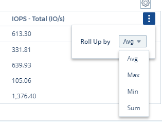
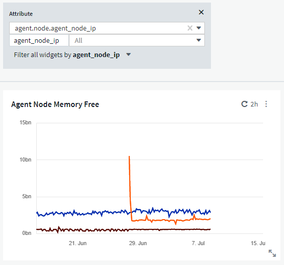
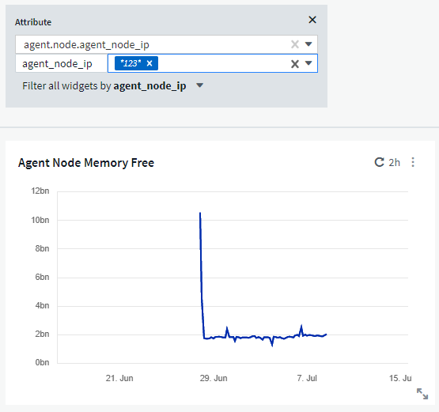

= Dashboard Features
:toc: macro
:hardbreaks:
:nofooter:
:toclevels: 1
:icons: font
:linkattrs:
:imagesdir: ./media/

[.lead]
Dashboards and widgets allow great flexibility in how data is displayed. Here are some concepts to help you get the most from your custom dashboards. 

toc::[]

== Widget Naming

Widgets are automatically named based on the object, metric, or attribute selected for the first widget query. If you also choose a grouping for the widget, the "Group by" attributes are included in the automatic naming (aggregation method and metric).

image:WidgetNamingExample-C.png[Widget Naming Example]

Selecting a new object or grouping attribute updates the automatic name.

If you do not want to use the automatic widget name, you can simply type a new name. 

==	Widget Placement and Size
All dashboard widgets can be positioned and sized according to your needs for each particular dashboard.

== Duplicating a Widget

In dashboard Edit mode, click the menu on the widget and select *Duplicate*. The widget editor is launched, pre-filled with the original widget's configuration and with a “copy” suffix in the widget name. You can easily make any necessary changes and Save the new widget. The widget will be placed at the bottom of your dashboard, and you can position it as needed. Remember to Save your dashboard when all changes are complete.

== Displaying Widget Legends

Most widgets on dashboards can be displayed with or without legends. Legends in widgets can be turned on or off on a dashboard by either of the following methods:

* When displaying the dashboard, click the *Options* button on the widget and select *Show Legends* in the menu.

As the data displayed in the widget changes, the legend for that widget is updated dynamically.

When legends are displayed, if the landing page of the asset indicated by the legend can be navigated to, the legend will display as a link to that asset page. If the legend displays "all", clicking the link will display a query page corresponding to the first query in the widget.

== Transforming Metrics 

Data Infrastructure Insights provides different *transform* options for certain metrics in widgets (specifically, those metrics called "Custom" or Integration Metrics, such as from Kubernetes, ONTAP Advanced Data, Telegraf plugins, etc.), allowing you to display the data in a number of ways. When adding transformable metrics to a widget, you are presented with a drop-down giving the following transform choices:

None::
Data is displayed as is, with no manipulation.

Rate::
Current value divided by the time range since the previous observation.

Cumulative::
The accumulation of the sum of previous values and the current value.

Delta::
The difference between the previous observation value and the current value. 

Delta rate::
Delta value divided by the time range since the previous observation.

Cumulative Rate::
Cumulative value divided by the time range since the previous observation.

Note that transforming metrics does not change the underlying data itself, but only the way that data is displayed.
 

== Dashboard widget queries and filters

=== Queries
The Query in a dashboard widget is a powerful tool for managing the display of your data. Here are some things to note about widget queries.

Some widgets can have up to five queries. Each query will plot its own set of lines or graphs in the widget. Setting rollup, grouping, top/bottom results, etc. on one query does not affect any other queries for the widget.

You can click on the eye icon to temporarily hide a query. The widget display updates automatically when you hide or show a query. This allows you to check your displayed data for individual queries as you build your widget.

The following widget types can have multiple queries:

* Area chart
* Stacked area chart
* Line chart
* Spline chart
* Single value widget

The remaining widget types can have only a single query:

* Table
* Bar chart
* Box plot
* Scatter plot

=== Filtering in dashboard widget queries

Here are some things you can do to get the most out of your filters.

==== Exact Match Filtering

If you enclose a filter string in double quotes, Insight treats everything between the first and last quote as an exact match. Any special characters or operators inside the quotes will be treated as literals. For example, filtering for "*" will return results that are a literal asterisk; the asterisk will not be treated as a wildcard in this case. The operators AND, OR, and NOT will also be treated as literal strings when enclosed in double quotes.

You can use exact match filters to find specific resources, for example hostname. If you want to find only the hostname 'marketing' but exclude 'marketing01', 'marketing-boston', etc., simply enclose the name "marketing" in double quotes. 

==== Wildcards and Expressions

When you are filtering for text or list values in queries or dashboard widgets, as you begin typing you are presented with the option to create a *wildcard filter* based on the current text. Selecting this option will return all results that match the wildcard expression. You can also create *expressions* using NOT or OR, or you can select the "None" option to filter for null values in the field.

image:Type-Ahead-Example-ingest.png[Wildcard Filter]

Filters based on wildcards or expressions (e.g. NOT, OR, "None", etc.) display in dark blue in the filter field. Items that you select directly from the list are displayed in light blue.

image:Type-Ahead-Example-Wildcard-DirectSelect.png[Wildcard Filter Results]

Note that Wildcard and Expression filtering works with text or lists but not with numerics, dates or booleans.

==== Advanced Text Filtering with Contextual Type-Ahead Suggestions

Filtering in widget queries is _contextual_; when you select a filter value or values for a field, the other filters for that query will show values relevant to that filter.
For example, when setting a filter for a specific object _Name_, the field to filter for _Model_ will only show values relevant to that object Name.

Contextual filtering also applies to dashboard page variables (text-type attributes or annotations only). When you select a filer value for one variable, any other variables using related objects will only show possible filter values based on the context of those related variables.

Note that  only Text filters will show contextual type-ahead suggestions. Date, Enum (list), etc. will not show type-ahead suggestions. That said, you _can_ set a filter on an Enum (i.e. list) field and have other text fields be filtered in context. For example, selecting a value in an Enum field like Data Center, then other filters will show only the models/names in that data center), but not vice-versa.

The selected time range will also provide context for the data shown in filters.

==== Choosing the filter units

As you type a value in a filter field, you can select the units in which to display the values on the chart. For example, you can filter on raw capacity and choose to display in the deafult GiB, or select another format such as TiB. This is useful if you have a number of charts on your dashboard showing values in TiB and you want all your charts to show consistent values.

image:Filter_Unit_Format.png[selecting units in a filter]

==== Additional Filtering Refinements

The following can be used to further refine your filters.

* An asterisk enables you to search for everything. For example,
[listing]
vol*rhel
+
displays all resources that start with "vol" and end with "rhel".
+
* The question mark enables you to search for a specific number of characters. For example,
[listing]
BOS-PRD??-S12
+
displays _BOS-PRD12-S12_, _BOS-PRD13-S12_, and so on.
+
* The OR operator enables you to specify multiple entities. For example,
[listing]
FAS2240 OR CX600 OR FAS3270
+
finds multiple storage models.
+
* The NOT operator allows you to exclude text from the search results. For example,
[listing]
NOT EMC*
+
finds everything that does not start with "EMC". You can use
[listing]
NOT *
+
to display fields that contain no value.

=== Identifying objects returned by queries and filters

The objects returned by queries and filters look similar to those shown in the following illustration. Objects with 'tags' assigned to them are annotations while the objects without tags are performance counters or object attributes.

image:ObjectsReturnedByFilters.png[Objects returned by filters]

== Grouping and Aggregation

=== Grouping (Rolling Up)

Data displayed in a widget is grouped (sometimes called rolled-up) from the underlying data points collected during acquisition. For example, if you have a line chart widget showing Storage IOPS over time, you might want to see a separate line for each of your data centers, for a quick comparison. You can choose to group this data in one of several ways:

* *Average*: displays each line as the _average_ of the underlying data.
* *Maximum*: displays each line as the _maximum_ of the underlying data.
* *Minimum*: displays each line as the _minimum_ of the underlying data.
* *Sum*: displays each line as the _sum_ of the underlying data.
* *Count*: displays a _count_ of objects that have reported data within the specified time frame. You can choose the _Entire Time Window_ as determined by the dashboard time range.

// You can choose to include _all_ objects that have reported data, or only those objects whose data is reported as _Not Null_. 

.Steps

To set the grouping method, do the following.

. In your widget's query, choose an asset type and metric (for example, _Storage_) and metric (such as _Performance IOPS Total_).

. For *Group*, choose a roll up method (such as _Average_) and select the attributes or metrics by which to roll up the data (for example, _Data Center_).
+
The widget updates automatically and shows data for each of your data centers.

You can also choose to group _all_ of the underlying data into the chart or table. In this case, you will get a single line for each query in the widget, which will show the average, min, max, sum, or count of the chosen metric or metrics for all of the underlying assets.

Clicking the legend for any widget whose data is grouped by "All" opens a query page showing the results of the first query used in the widget.

If you have set a filter for the query, the data is grouped based on the filtered data.

Note that when you choose to group a widget by any field (for example, _Model_), you will still need to Filter by that field in order to properly display the data for that field on the chart or table.

=== Aggregating data

You can further align your time-series charts (line, area, etc.) by aggregating data points into minute, hour, or day buckets before that data is subsequently rolled up by attribute (if chosen). You can choose to aggregate data points according to their _Average, Maximum, Minimum, Sum_, or _Count_. 

A small interval combined with a long time range may result in an "Aggregation interval resulted in too many data points." warning. You might see this if you have a small interval and increase the dashboard time frame to 7 days. In this case, Insight will temporarily increase the aggregation interval until you select a smaller time frame.

You can also aggregate data in the bar chart widget and single-value widget.

Most asset counters aggregate to _Average_ by default. Some counters aggregate to _Max, Min_, or _Sum_ by default. For example, port errors aggregate to _Sum_ by default, where storage IOPS aggregate to _Average_.

== Showing Top/Bottom Results

In a chart widget, you can show either the *Top* or *Bottom* results for rolled up data, and choose the number of results shown from the drop-down list provided. In a table widget, you can sort by any column.

=== Chart widget top/bottom

In a chart widget, when you choose to rollup data by a specific attribute, you have the option of viewing either the top N or bottom N results. Note that you cannot choose the top or bottom results when you choose to rollup by _all_ attributes.

You can choose which results to display by choosing either *Top* or *Bottom* in the query's *Show* field, and selecting a value from the list provided.

=== Table widget show entries

In a table widget, you can select the number of results shown in the table results. You are not given the option to choose top or bottom results because the table allows you to sort ascending or descending by any column on demand.

You can choose the number of results to show in the table on the dashboard by selecting a value from the query's *Show entries* field.

== Grouping in Table Widget

Data in a table widget can be grouped by any available attribute, allowing you to see an overview of your data, and to drill-down into it for more detail. Metrics in the table are rolled up for easy viewing in each collapsed row.

Table widgets allow you to group your data based on the attributes you set. For example, you might want your table to show total storage IOPS grouped by the data centers in which those storages live. Or you might want to display a table of virtual machines grouped according to the hypervisor that hosts them. From the list, you can expand each group to view the assets in that group.

Grouping is only available in the Table widget type.

=== Grouping example (with rollup explained)

Table widgets allow you to group data for easier display.

In this example, we will create a table widget showing all VMs grouped by Data Center.

.Steps
. Create or open a dashboard, and add a *Table* widget.
. Select _Virtual Machine_ as the asset type for this widget.
. Click on the Column Selector and choose _Hypervisor name_ and _IOPS - Total_.
+
Those columns are now displayed in the table.

. Let's disregard any VM's with no IOPS, and include only VMs that have total IOPS greater than 1. Click the *Filter by* *[+]* button and select _IOPS - Total_. Click on _Any_, and in the *from* field, type *1*. Leave the *to* field empty. Hit Enter ot click off the filter field to apply the filter.
+
The table now shows all VMs with Total IOPS greater than or equal to 1. Notice that there is no grouping in the table. All VMs are shown.
. Click the *Group by [+]* button.
+
You can group by any attribute or annotation shown. Choose _All_ to display all VMs in a single group.
+
Any column header for a performance metric displays a "three dot" menu containing a *Roll up* option. The default roll up method is _Average_. This means that the number shown for the group is the average of all the Total IOPS reported for each VM inside the group. You can choose to roll this column up by _Average, Sum, Minimum_ or _Maximum_. Any column that you display that contains performance metrics can be rolled up individually.
+

. Click _All_ and select _Hypervisor name_.
+
The VM list is now grouped by Hypervisor. You can expand each hypervisor to view the VMs hosted by it.

. Click *Save* to save the table to the dashboard. You can resize or move the widget as desired.

. Click *Save* to save the dashboard.

=== Performance data roll up

If you include a column for performance data (for example, _IOPS - Total_) in a table widget, when you choose to group the data you can then choose a roll up method for that column. The default roll up method is to display the average (_avg_) of the underlying data in the group row. You can also choose to display the sum, minimum, or maximum of the data.

== Dashboard time range selector

You can select the time range for your dashboard data. Only data relevant to the selected time range will be displayed in widgets on the dashboard.  You can select from the following time ranges:

* Last 15 Minutes
* Last 30 Minutes
* Last 60 Minutes
* Last 2 Hours
* Last 3 Hours (this is the default)
* Last 6 Hours
* Last 12 Hours
* Last 24 Hours
* Last 2 Days
* Last 3 Days
* Last 7 Days
* Last 30 Days
* Custom time range
+
The Custom time range allows you to select up to 31 consecutive days. You can also set the Start Time and End Time of day for this range. The default Start Time is 12:00 AM on the first day selected and the default End Time is 11:59 PM on the last day selected. Clicking *Apply* will apply the custom time range to the dashboard.

== Overriding Dashboard Time in Individual widgets

You can override the main dashboard time range setting in individual widgets. These widgets will display data based on their set time frame, not the dashboard time frame.

To override the dashboard time and force a widget to use its own time frame, in the widget's edit mode choose the deisired time range, and Save the widget to the dashboard.

The widget will display its data according to the time frame set for it, regardless of the time frame you select on the dashboard itself.

The time frame you set for one widget will not affect any other widgets on the dashboard.

image:OverrideTimeOnWidget.png[overriding the dashboard time range for a widget]

== Primary and Secondary Axis

Different metrics use different units of measurements for the data they report in a chart. For example, when looking at IOPS, the unit of measurement is the number of I/O operations per second of time (IO/s), while Latency is purely a measure of time (milliseconds, microseconds, seconds, etc.). When charting both metrics on a single line chart using a single set a values for the Y-Axis, the latency numbers (typically a handful of milliseconds) are charted on the same scale with the IOPS (typically numbering in the thousands), and the latency line gets lost at that scale.

But it is possible to chart both sets of data on a single meaningful graph, by setting one unit of measurement on the primary (left-side) Y-axis, and the other unit of measurement on the secondary (right-side) Y-axis. Each metric is charted at its own scale.

.Steps

This example illustrates the concept of Primary and Secondary axes in a chart widget.

. Create or open a dashboard. Add a line chart, spline chart, area chart or stacked area chart widget to the dashboard.

. Select an asset type (for example _Storage_) and choose _IOPS - Total_ for your first metric. Set any filters you like, and choose a roll-up method if desired.
+
The IOPS line is displayed on the chart, with its scale shown on the left.

. Click *[+Query]* to add a second line to the chart. For this line, choose _Latency - Total_ for the metric.
+
Notice that the line is displayed flat at the bottom of the chart. This is because it is being drawn _at the same scale_ as the IOPS line.

. In the Latency query, select *Y-Axis: Secondary*.
+
The Latency line is now drawn at its own scale, which is displayed on the right side of the chart.

image::SecondaryAxisExplained.png[Secondary Axis example]

== Expressions in widgets

In a dashboard, any time series widget (line, spline, area, stacked area) bar chart, column chart, pie chart, or table widget allows you to build expressions from metrics you choose, and show the result of those expressions in a single graph (or column in the case of the <<expressions-in-a-table-widget,table widget>>). The following examples use expressions to solve specific problems. In the first example, we want to show Read IOPS as a percentage of Total IOPS for all storage assets on your tenant. The second example gives visibility into the "system" or "overhead" IOPS that occur on your tenant--those IOPS that are not directly from reading or writing data.

You can use variables in expressions (for example, _$Var1 * 100_)

=== Expressions Example: Read IOPS percentage

In this example, we want to show Read IOPS as a percentage of Total IOPS. You can think of this as the following formula:

    Read Percentage = (Read IOPS / Total IOPS) x 100

This data can be shown in a line graph on your dashboard. To do this, follow these steps:

.Steps

. Create a new dashboard, or open an existing dashboard in edit mode.

. Add a widget to the dashboard. Choose *Area chart*.
+
The widget opens in edit mode. By default, a query is displayed showing _IOPS - Total_ for _Storage_ assets. If desired, select a different asset type.

. Click the *Convert to Expression* link on the right.
+
The current query is converted to Expression mode. Notice that you cannot change the asset type while in Expression mode. While you are in Expression mode, the link changes to *Revert to Query*. Click this if you wish to switch back to Query mode at any time. Be aware that switching between modes will reset fields to their defaults.
+
For now, stay in Expression mode.

. The *IOPS - Total* metric is now in the alphabetic variable field "*a*". In the "*b*" variable field, click *Select* and choose *IOPS - Read*.
+
You can add up to a total of five alphabetic variables for your expression by clicking the + button following the variable fields. For our Read Percentage example, we only need Total IOPS ("*a*") and Read IOPS ("*b*").

. In the *Expression* field, you use the letters corresponding to each variable to build your expression. We know that Read Percentage = (Read IOPS / Total IOPS) x 100, so we would write this expression as:

 (b / a) * 100

. The *Label* field identifies the expression. Change the label to "Read Percentage", or something equally meaningful for you.

. Change the *Units* field to "%" or "Percent".
+
The chart displays the IOPS Read percentage over time for the chosen storage devices. If desired, you can set a filter, or choose a different rollup method. Be aware that if you select Sum as the rollup method, all percentage values are added together, which potentially may go higher than 100%.

. Click *Save* to save the chart to your dashboard.

=== Expressions example: "System" I/O

Example 2: Among the metrics collected from data sources are read, write, and total IOPS. However, the total number of IOPS reported by a data source sometimes includes "system" IOPS, which are those IO operations that are not a direct part of data reading or writing. This system I/O can also be thought of as "overhead" I/O, necessary for proper system operation but not directly related to data operations.

To show these system I/Os, you can subtract read and write IOPS from the total IOPS reported from acquisition. The formula might look like this:

    System IOPS = Total IOPS - (Read IOPS + Write IOPS)

This data can then be shown in a line graph on your dashboard. To do this, follow these steps:

.Steps

. Create a new dashboard, or open an existing dashboard in edit mode.

. Add a widget to the dashboard. Choose *Line chart*.
+
The widget opens in edit mode. By default, a query is displayed showing _IOPS - Total_ for _Storage_ assets. If desired, select a different asset type.
. In the *Roll Up* field, choose _Sum_ by _All_.
+
The Chart displays a line showing the sum of total IOPS.

. Click the _Duplicate this Query_ icon to create a copy of the query.
+
A duplicate of the query is added below the original.

. In the second query, click the *Convert to Expression* button.
+
The current query is converted to Expression mode. Click *Revert to Query* if you wish to switch back to Query mode at any time. Be aware that switching between modes will reset fields to their defaults.
+
For now, stay in Expression mode.

. The _IOPS - Total_ metric is now in the alphabetic variable field "*a*". Click on _IOPS - Total_ and change it to _IOPS - Read_.

. In the "*b*" variable field, click *Select* and choose _IOPS - Write_.

. In the *Expression* field, you use the letters corresponding to each variable to build your expression. We would write our expression simply as:

  a + b
+
In the Display section, choose *Area chart* for this expression.

. The *Label* field identifies the expression. Change the label to "System IOPS", or something equally meaningful for you.
+
The chart displays the total IOPS as a line chart, with an area chart showing the combination of read and write IOPS below that. The gap between the two shows the IOPS that are not directly related to data read or write operations. These are your "system" IOPS.

. Click *Save* to save the chart to your dashboard.

To use a variable in an expression, simply type the variable name, for example, _$var1 * 100_. Only numeric variables can be used in expressions.

=== Expressions in a Table Widget

Table widgets handle expressions a little differently. You can have up to five expressions in a single table widget, each of which is added as a new column to the table. Each expression can include up to five values on which to perform its calculation. You can easily name the column something meaningful.

image:ExpressionExample.png[Expression in a Table Widget]

== Variables

Variables allow you to change the data displayed in some or all widgets on a dashboard at once. By setting one or more widgets to use a common variable, changes made in one place cause the data displayed in each widget to update automatically.  

////
.Before you begin
The example below requires the *City* annotation (also called City attribute) to be set on multiple storage assets. For best results, set different cities on different storages. See the link:https://docs.netapp.com/us-en/cloudinsights/task_defining_annotations.html[Annotations] topics for more information on using annotations.

.About this task
Variables provide a quick and simple way of filtering the data shown in some or all of the widgets on a custom dashboard. The following steps will guide you to creating widgets that use variables, and show you how to use them on your dashboard.

.Steps
. Click on *Dashboards > +New Dashboard*.
. Before adding widgets, you must define the variables we will use to filter the dashboard data. Click on the *Add Variable* button.
+
The list of attributes is displayed.
. Let's say we want to set the dashboard to filter based on City. Select the _City_ attribute from the list.
+
The $city variable field is created and added to the dashboard. Variables used by the dashboard are displayed above any widgets.

. Next, we must tell our widgets to use this variable. The simplest way to illustrate this is to add a table widget showing the _City_ column. Click on the *Add Widget* button and select the _Table_ widget.
. First, add the _City_ column to the table by selecting it from the "gear" button.
+
City is a list-type attribute, so it contains a list of previously-defined choices. You may also choose text, boolean, or date-type attributes.
. Next, click the *Filter by +* button and choose _City_.
. Click _Any_ to view the possible filter choices for City. Notice that the list now includes "*$city*" at the top, in addition to any previously-available choices. Select _$city_ to use this dashboard variable.
+
The _$city_ choice only appears here if it was defined previously on the main dashboard page. If the variable was not previously defined, only the existing choices for the filter will be shown. Only variables that are applicable to the selected attribute type will be displayed in the drop-down for that filter.
. *Save* the widget.
. On the dashboard page, click on _Any_ next to the _$city_ variable, and select the city or cities you want to see.
+
Your table widget updates to show only the cities you selected. You can change the values in the _$city_ variable at will, and all widgets on your dashboard that are set to use the $city variable will refresh automatically to show only data for the values you selected.

Be sure to *Save* your dashboard when you have it configured as you want it.
////

//=== More on dashboard variables

Dashboard variables come in several types, can be used across different fields, and must follow rules for naming. These concepts are explained here.

=== Variable types

A variable can be one the following types:

* *Attribute*: Use an object's attributes or metrics to filter
* *Annotation*: Use a pre-defined link:task_defining_annotations.html[Annotation] to filter widget data.
* *Text*: An alphanumeric string. 
* *Numerical*: A number value. Use by itself, or as a "from" or "to" value, depending on your widget field.
* *Boolean*: Use for fields with values of True/False, Yes/No, etc. For the boolean variable, the choices are Yes, No, None, Any.
* *Date*: A date value. Use as a "from" or "to" value, depending on your widget's configuration.

//image:Variables_Drop-Down.png[Variable Types]
image:Variables_Drop_Down_Showing_Annotations.png[Variable Types]

==== Attribute  variables

Selecting an Attribute type variable allows you to filter for widget data containing the specified attribute value or values. The example below shows a line widget displaying free memory trends for Agent nodes. We have created a variable for Agent Node IPs, currently set to show all IPs:

But if you temporarily want to see only nodes on individual subnets on your tenant, you can set or change the variable to a specific Agent Node IP or IPs. Here we are viewing only the nodes on the "123" subnet:

You can also set a variable to filter on _all_ objects with a particular attribute regardless of object type, for example objects with an attribute of "vendor", by specifying _*.vendor_ in the variable field. You do not need to type the "*."; Data Infrastructure Insights will supply this if you select the wildcard option.

image:Variables_Attribute_Vendor_Example.png[Attribute Variable for Vendor]

When you drop-down the list of choices for the variable value, the results are filtered so show only the available vendors based on the objects on your dashboard.

image:Variables_Attribute_Vendor_Filtered_List.png[Attribute Variable showing only available vendors]

//image:Variables_Attribute_Name_List.png[Variable list showing all *.name attributes]

If you edit a widget on your dashboard where the attribute filter is relevant (meaning, the widget's objects contain any _*.vendor attribute_), it shows you that the attribute filter is automatically applied.

image:Variables_Attribute_inWidgetQuery.png[Attribute variable automatically applied]

Applying variables is as easy as changing the attribute data of your choice.

==== Annotation variables

Choosing an Annotation variable allows you to filter for objects associated with that annotation, for example, those belonging to the same Data Center.

image:Variables_Annotation_Filtering.png[Annotation Filtering with Variable]

==== Text, Number, Date, or Boolean variable

You can create generic variables that are not associated with a particular attribute by selecting a variable type of _Text_, _Number_, _Boolean_, or _Date_. Once the variable has been created, you can select it in a widget filter field. When setting a filter in a widget, in addition to specific values that you can select for the filter, any variables that have been created for the dashboard are displayed in the list--these are grouped under the "Variables" section in the drop-down and have names starting with "$". Choosing a variable in this filter will allow you to search for values that you enter in the variable field on the dashboard itself. Any widgets using that variable in a filter will be updated dynamically. 

image:Variables_in_a_Widget_Filter.png[Selecting a variable in a widget]

==== Variable Filter Scope

When you add an Annotation or Attribute variable to your dashboard, the variable can be applied to _all_ widgets on the dashboard, meaning that all widgets on your dashboard will display results filtered according to the value you set in the variable. 

image:Variables_Automatic_Filter_Button.png[Automatic Filter]

Note that only Attribute and Annotation variables can be filtered automatically like this. Non-Annotation or -Attribute variables cannot be automatically filtered. Individual widgets must each be configured to use variables of these types.

To disable automatic filtering so that the variable only applies to the widgets where you have specifically set it, click the "Filter automatically" slider to disable it.

To set a variable in an individual widget, open the widget in edit mode and select the specific annotation or attribute in the _Filter By_ field. With an Annotation variable, you can select one or more specific values, or select the Variable name (indicated by the leading "$") to allow typing in the variable at the dashboard level. The same applies to Attribute variables. Only those widgets for which you set the variable will show the filtered results.

Filtering in variables is _contextual_; when you select a filter value or values for a variable, the other variables on your page will show only values relevant to that filter.
For example, when setting a variable filter to a specific storage _Model_, any variables set to filter for storage _Name_ will only show values relevant to that Model.

//You can configure widgets to use non-Annotation or -Attribute variables (Number, Date, Boolean) in the same way. 

To use a variable in an expression, simply type the variable name as part of the expression, for example, _$var1 * 100_. Only Numeric variables can be used in expressions. You cannot use numeric Annotation or Attribute variables in expressions.

Filtering in variables is _contextual_; when you select a filter value or values for a variable, the other variables on your page will show only values relevant to that filter.
For example, when setting a variable filter to a specific storage _Model_, any variables set to filter for storage _Name_ will only show values relevant to that Model.

==== Variable naming

Variables names:

//* Must always be prefixed with a "$". This is added automatically when you configure a variable.
* Must include only the letters a-z, the digits 0-9, period (.), underscore (_), and space ( ).
* Cannot be longer than 20 characters.
* Are case-sensitive: $CityName and $cityname are different variables.
* Cannot be the same as an existing variable name.
* Cannot be empty.

== Formatting Gauge Widgets

The Solid and Bullet Gauge widgets allow you to set thresholds for _Warning_ and/or _Critical_ levels, providing clear representation of the data you specify. 

image:GaugeWidgetFormatting.png[Format settings for Gauge Widget]

To set formatting for these widgets, follow these steps:

. Choose  whether you want to highlight values greater than (>) or less than (<) your thresholds. In this example, we will highlight values greater than (>) the threshold levels.

. Choose a value for the "Warning" threshold. When the widget displays values greater than this level, it displays the gauge in orange. 

. Choose a value for the "Critical" threshold. Values greater than this level will cause the gauge to display in red.

You can optionally choose a minimum and maximum value for the gauge. Values below minimum will not display the gauge. Values above maximum will display a full gauge. If you do not choose minimum or maximum values, the widget selects optimal min and max based on the widget's value.

image:Gauge-Solid.png[Solid/Traditional Gauge, width=374]
image:Gauge-Bullet.png[Bullet Gauge, width=374]

== Formatting Single-Value Widget

in the Single-Value widget, in addition to setting Warning (orange) and Critical (red) thresholds, you can choose to have "In Range" values (those below Warning level) shown with either green or white background.

image:Single-ValueWidgets.png[Single-Value Widget with and without Formatting]

Clicking the link in either a single-value widget or a gauge widget will display a query page corresponding to the first query in the widget.

== Formatting Table Widgets

Like single-value and gauge widgets, you can set conditional formatting in table widgets, allowing you to highlight data with colors and/or special icons.

Conditional Formatting allows you to set and highlight Warning-level and Critical-level thresholds in table widgets, bringing instant visibility to outliers and exceptional data points.

image:ConditionalFormattingExample.png[Conditional Formatting Example]

Conditional formatting is set separately for each column in a table. For example, you can choose one set of thresholds for a capacity column, and another set for a throughput column. 

If you change the Unit Display for a column, the conditional formatting remains and reflects the change in values. The images below show the same conditional formatting even though the display unit is different.

image:ConditionalFormatting_GiB.png[Conditional Formatting - GiB]    image:ConditionalFormatting_TiB.png[Conditional Formatting - TiB]

You can choose whether to display condition formatting as color, icons, or both.

== Choosing the Unit for Displaying Data

Most widgets on a dashboard allow you to specify the Units in which to display values, for example _Megabytes_, _Thousands_, _Percentage_, _Milliseconds (ms)_, etc. In many cases, Data Infrastructure Insights knows the best format for the data being acquired. In cases where the best format is not known, you can set the format you want.

In the line chart example below, the data selected for the widget is known to be in _bytes_ (the base IEC Data unit: see the table below), so the Base Unit is automatically selected as 'byte (B)'. However, the data values are large enough to be presented as gibibytes (GiB), so Data Infrastructure Insights by default auto-formats the values as GiB. The Y-axis on the graph shows 'GiB' as the display unit, and all values are displayed in terms of that unit.

//image:WidgetBaseUnitKnown.png[Widget with known base unit]
image:used_memory_in_bytes.png[Base Unit Byte shown in Gigabytes,width=640]

If you want to display the graph in a different unit, you can choose another format in which to display the values. Since the base unit in this example is _byte_, you can choose from among the supported "byte-based" formats: bit (b), byte (B), kibibyte (KiB), mebibyte (MiB), gibibyte (GiB). The Y-Axis label and values change according to the format you choose.

//image:WidgetBaseUnitKnown-Formatted.png[Choosing to display values as 'thousand']
image:used_memory_in_bytes_gb.png[Choosing a display unit,width=640]

In cases where the base unit is not known, you can assign a unit from among the link:#available-units[available units], or type in your own. Once you assign a base unit, you can then select to display the data in one of the appropriate supported formats. 

//image:WidgetBaseUnitNotKnown.png[Base unit unknown]
image:bits_per_second.png[Choose your own base unit,width=320] 

To clear out your settings and start again, click on *Reset Defaults*.  

=== A word about Auto-Format

Most metrics are reported by data collectors in the smallest unit, for example as a whole number such as 1,234,567,890 bytes. By default, Data Infrastructure Insights will automatically format the value for the most readable display. For example a data value of 1,234,567,890 bytes would be auto formatted to 1.23 _Gibibytes_. You can choose to display it in another format, such as _Mebibytes_. The value will display accordingly.

NOTE: Data Infrastructure Insights uses American English number naming standards. American "billion" is equivalent to "thousand million".

////
Depending on the widget and the range of values displayed, Data Infrastructure Insights will typically use the highest value as the basis for auto-formatting the units. So if your range goes from one million (1,000,000) to one billion (1,000,000,000), your chart might auto-format to the billion (bn) level, which means lower values might display as .001bn.
////

=== Widgets with multiple queries

If you have a time-series widget (i.e. line, spline, area, stacked area) that has two queries where both are plotted the primary Y-Axis, the base unit is not shown at the top of the Y-Axis.  However, if your widget has a query on the primary Y-Axis and a query on the secondary Y-Axis, the base units for each are shown.

image:UnitsOnPrimaryAndSecondaryYAxis.png[Units on both Y-Axes]

If your widget has three or more queries, base units are not shown on the Y-Axis.

=== Available Units

The following table shows all the available units by category. 

|===
*Category*|*Units*
|Currency|cent
dollar
|Data(IEC)|bit
byte
kibibyte
mebibyte
gibibyte
tebibyte
pebibyte
exbibyte
|DataRate(IEC)|bit/sec
byte/sec
kibibyte/sec
mebibyte/sec
gibibyte/sec
tebibyte/sec
pebibyte/sec
|Data(Metric)|kilobyte
megabyte
gigabyte
terabyte
petabyte
exabyte
|DataRate(Metric)|kilobyte/sec
megabyte/sec
gigabyte/sec
terabyte/sec
petabyte/sec
exabyte/sec
|IEC|kibi
mebi
gibi
tebi
pebi
exbi
|Decimal|whole number
thousand
million
bilion
trillion
|Percentage|percentage
|Time|nanosecond
microsecond
millisecond
second
minute
hour
|Temperature|celsius
fahrenheit
|Frequency|hertz
kilohertz
megahertz
gigahertz
|CPU|nanocores
microcores
millicores
cores
kilocores
megacores
gigacores
teracores
petacores
exacores
|Throughput|I/O ops/sec
ops/sec
requests/sec
reads/sec
writes/sec
ops/min
reads/min
writes/min
|===

== TV Mode and Auto-Refresh

Data in widgets on Dashboards and Asset Landing Pages auto-refresh according a refresh interval determined by the Dashboard Time Range selected. The refresh interval is based on whether the widget is time-series (line, spline, area, stacked area chart) or non-time-series (all other charts).

|===
|Dashboard Time Range|Time-Series Refresh Interval|Non-Time-Series Refresh Interval
|Last 15 Minutes|10 Seconds|1 Minute
|Last 30 Minutes|15 Seconds|1 Minute
|Last 60 Minutes|15 Seconds|1 Minute
|Last 2 Hours|30 Seconds|5 Minutes
|Last 3 Hours|30 Seconds|5 Minutes
|Last 6 Hours|1 Minute|5 Minutes
|Last 12 Hours|5 Minutes|10 Minutes
|Last 24 Hours|5 Minutes|10 Minutes
|Last 2 Days|10 Minutes|10 Minutes
|Last 3 Days|15 Minutes|15 Minutes
|Last 7 Days|1 Hour|1 Hour
|Last 30 Days|2 Hours|2 Hours
|===

Each widget displays its auto-refresh interval in the upper-right corner of the widget.

Auto-refresh is not available for Custom dashboard time range.

When combined with *TV Mode*, auto-refresh allows for near-real-time display of data on a dashboard or asset page. TV Mode provides an uncluttered display; the navigation menu is hidden, providing more screen real estate for your data display, as is the Edit button. TV Mode ignores typical Data Infrastructure Insights timeouts, leaving the display live until logged out manually or automatically by authorization security protocols.

NOTE: Because NetApp BlueXP has its own user login timeout of 7 days, Data Infrastructure Insights must log out with that event as well. You can simply log in again and your dashboard will continue to display.

* To activate TV Mode, click the TV Mode button.
* To disable TV Mode, click the *Exit* button in the upper left of the screen. 

You can temporarily suspend auto-refresh by clicking the Pause button in the upper right corner. While paused, the dashboard time range field will display the paused data's active time range. Your data is still being acquired and updated while auto-refresh is paused. Click the Resume button to continue auto-refreshing of data.

image:AutoRefreshPaused.png[Auto-Refresh paused]

== Dashboard Groups

Grouping allows you to view and manage related dashboards. For example, you can have a dashboard group dedicated to the storage on your tenant. Dashboard groups are managed on the *Dashboards > Show All Dashboards* page.

image:DashboardGroupNoPin.png[Dashboard Grouping]

Two groups are shown by default:

* *All Dashboards* lists all the dashboards that have been created, regardless of owner.
* *My Dashboards* lists only those dashboards created by the current user.

The number of dashboards contained in each group is shown next to the group name.

To create a new group, click the *"+" Create New Dashboard Group* button. Enter a name for the group and click *Create Group*. An empty group is created with that name. 

To add dashboards to the group, click the _All Dashboards_ group to show all dashboards on your tenant, of click _My Dashboards_ if you only want to see the dashboards you own, and do one of the following:

* To add a single dashboard, click the menu to the right of the dashboard and select _Add to Group_.
* To add multiple dashboards to a group, select them by clicking the checkbox next to each dashboard, then click the *Bulk Actions* button and select _Add to Group_.

Remove dashboards from the current group in the same manner by selecting _Remove From Group_. You can not remove dashboards from the _All Dashboards_ or _My Dashboards_ group. 

NOTE: Removing a dashboard from a group does not delete the dashboard from Data Infrastructure Insights. To completely remove a dashboard, select the dashboard and click _Delete_. This removes it from any groups to which it belonged and it is no longer available to any user.

== Pin your Favorite Dashboards

You can further manage your dashboards by pinning favorite ones to the top of your dashboard list. To pin a dashboard, simply click the thumbtack button displayed when you hover over a dashboard in any list. 

// Pinning a dashboard pins it to the top of the current group, as well as any other groups containing that dashboard, including _All Dashboards_.

Dashboard pin/unpin is an individual user preference and independent of the group (or groups) to which the dashboard belongs.

image:DashboardPin.png[Pinned Dashboards]

== Dark Theme

You can choose to display Data Infrastructure Insights using either a light theme (the default), which displays most screens using a light background with dark text, or a dark theme which displays most screens using a dark background with light text.

To switch between light and dark themes, click the username button in the upper right corner of the screen and choose the desired theme.

image:DarkThemeSwitch.png[Switch between light and dark themes]

Dark Theme Dashboard view:
image:DarkThemeDashboardExample.png[Dark Theme Dashboard Example]

Light Theme Dashboard view:
image:LightThemeDashboardExample.png[Light Theme Dashboard Example]

NOTE: Some screen areas, such as certain widget charts, still show light backgrounds even while viewed in dark theme. 

== Line Chart interpolation

Different data collectors often poll their data at different intervals. For example, data collector A may poll every 15 minutes while data collector B polls every five minutes. When a line chart widget (also spline, area, and stacked area charts) is aggregating this data from multiple data collectors into a single line (for example, when the widget is grouping by "all"), and refreshing the line every five minutes, data from collector B may be shown accurately while data from collector A may have gaps, thus affecting the aggregate until collector A polls again.

To alleviate this, Data Infrastructure Insights interpolates data when aggregating, using the surrounding data points to take a "best guess" at data until data collectors poll again. You can always view each data collector's object data individually by adjusting the widget's grouping.

=== Interpolation Methods

When creating or modifying a line chart (or spline, area, or stacked area chart), you can set the interpolation method to one of three types. In the "Group by" section, choose the desired Interpolation.

image:Interpolation_Methods.png[Grouping section of the widget editor showing the three interpolation methods]

* *None*: Do nothing, i.e. do not generate points in between. 

image:Interpolation_None.png[Simple straight angled line showing no interpolation between data points]

* *Stair*: A point is generated from the value of previous point. In a straight line, this would display as a typical "stair" layout.

image:Interpolation_Stair.png[Simple straight line showing stair interpolation]

* *Linear*: a point is generated as the value in between connecting the two points. Generates a line that looks like the line connecting the two points, but with additional (interpolated) data points.

image:Interpolation_Linear.png[Simple straight line showing linear interpolation with additional data points between each original point]

