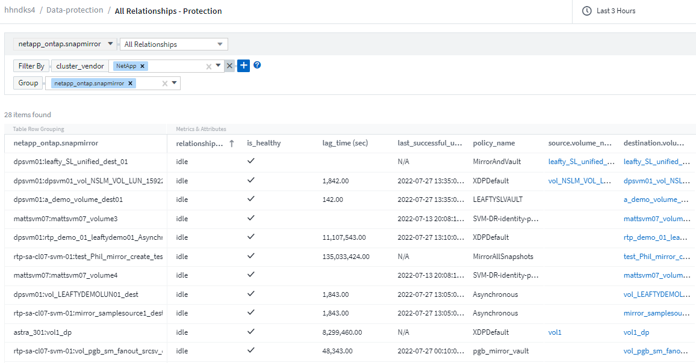
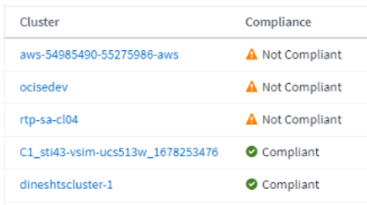
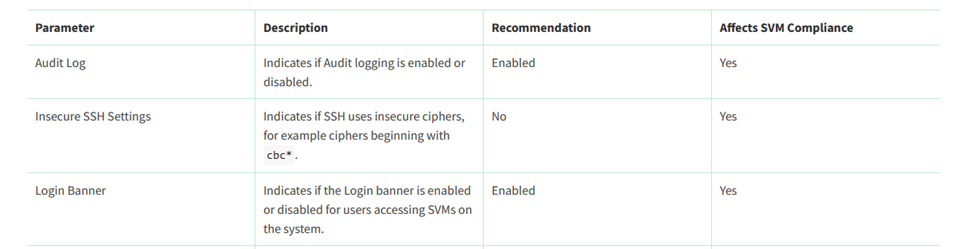
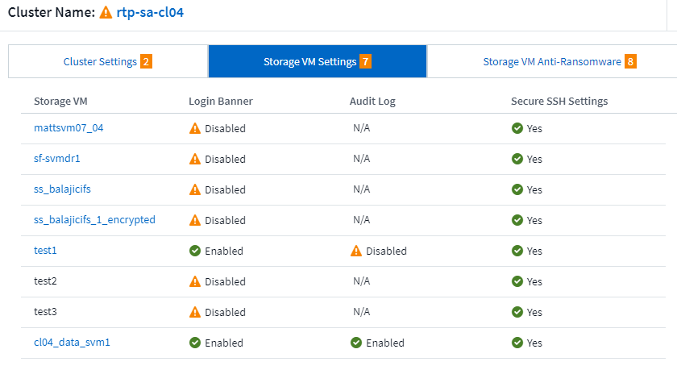
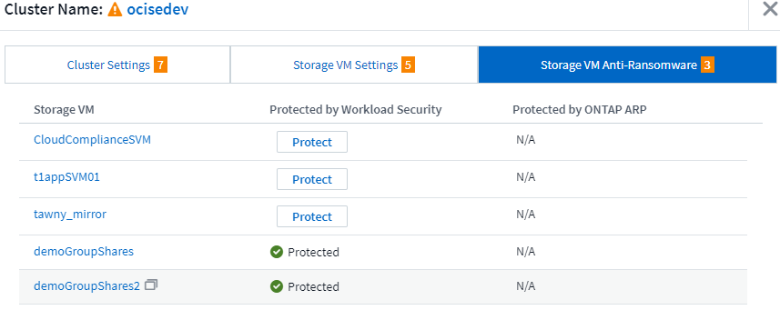
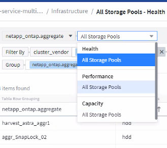

= ONTAP Essentials

:toc: macro
:hardbreaks:
:toclevels: 2
:nofooter:
:icons: font
:linkattrs:
:imagesdir: ./media/

[.lead]
ONTAP Essentials is a set of dashboards and workflows that provide detailed overviews of your ONTAP inventories and workloads. You may see the following terms used when working in ONTAP Essentials: 

* Infrastructure/Inventory: Objects that provide storage/networking services to user data
* Workloads: Objects that provide interface to users to read/write data.
* Data Protection: Objects that can be protected using NetApp data protection technologies

For additional terms and definitions related to ONTAP, see the link:task_dc_na_cdot.html[ONTAP Data Collector] documentation.

ONTAP Essentials requires at least one working ONTAP data collector with data collected within the last seven days. 

== Overview 

To begin exploring, select *ONTAP Essentials* from the main Cloud Insights menu.

//image:ONTAP_Essentials_Overview_Sept.png[Overview dashboard for ONTAP Essentials]
image:OE_Overview.png[Overview dashboard for ONTAP Essentials]

The *Overview* dashboard displays useful information like the number of clusters in your environment with their overall capacity and performance percentages. You will also see predictive data regarding the number of expected days until storage capacity or performance capacity runs out of space. Additionally, if any controllers in your infrastructure are running with their CPU at more than 65%--potentially putting your cluster at risk in case of failover--ONTAP Essentials shows those as "Hot" controllers.

Informative graphs give you a look into performance over time as well as breakdowns of capacity usage. Each of these graphs or data points can be used as a starting point for exploration or investigation. 

Note: A "days to full" number of "0" (zero) indicates that days to full is estimated at greater than 90 days. In other words, your systems aren't in danger of running out of space any time soon.

== Data Protection

Select the *Data Protection* page to view SnapMirror relationships. Click through to source or destination volume information, or click the gear icon to add columns for the data you wish to view.

//
image:OE_DataProtection.png[SnapMirror Relationships list page]

== Security

The Security Dashboard gives you an instant view of your current security situation, showing charts for hardware and software volume encryption, anti-ransomware status, and cluster authentication methods. Security criteria is evaluated based on recommendations defined in the link:https://www.netapp.com/pdf.html?item=/media/10674-tr4569.pdf[*NetApp Security Hardening Guide for ONTAP 9*].

Select any of the encryption or anti-ransomware counts to dive into your environment.

image:OE_SecurityDashboard.png[ONTAP Essentials Security Dashboard]

The ONTAP Essentials Security dashboard monitors your environment to determine cluster compliance status. Refer to these link:https://docs.netapp.com/us-en/active-iq-unified-manager/health-checker/reference_cluster_compliance_categories.html[Cluster Compliance Categories] to learn more.  ONTAP Essentials uses the following monitors to determine compliance:

|Monitor Name	|Attribute Name (Displayed in Cluster Details)	|Attribute Compliant Value
|FIPS Mode Disabled	|FIPS mode	|Enabled
|Cluster Insecure ciphers for SSH	|Secure SSH Settings	|Yes
|Telnet Protocol Enabled	|Telnet	|Disabled
|Remote Shell Enabled	|Remote Shell	|Disabled
|Default Local Admin User Enabled|Default Admin User	|Disabled
|MD5 Hashed password	|MD5 in use	|No
|Cluster Peer Communication Not Encrypted	|Cluster Peering	|Encrypted/ No Peer
|AutoSupport HTTPS Transport Disabled	|AutoSupport using HTTPS	|Yes
|No NTP Servers are Configured	|Network Time Protocol	|Configured
|NTP Server Count is Low	|Network Time Protocol	|Configured
|Cluster Login Banner Disabled	|Login Banner	|Enabled
|Log Forwarding Not Encrypted	|Log Forwarding Encrypted	|Yes

Note that if a monitor above is disabled, the cluster details will show the value as ‘Not checked’ for the corresponding security compliance attribute.

For SVMs, the Security dashboard also looks at the three link:https://docs.netapp.com/us-en/active-iq-unified-manager/health-checker/reference_svm_compliance_categories.html[parameters] below to determine security status.

The Security Dashboard displays a list of the clusters in your environment. Select the _View Details_ link for a cluster to open a "slideout" panel showing you the current settings for the cluster. Select from Cluster, Storage VM, or Anti-Ransomware Settings.

Cluster details include connection status, certificate information, and more:
image:OE_Cluster_Slideout.png[Cluster Detail Slideout Panel]

Storage VM details show audit and SSH information:

Anti-Ransomware details show whether a storage VM is protected by ONTAP's Anti-Ransomware Protection or Cloud Insights Workload Security:

== Alerts

Here you can view the Active alerts in your environment and quickly drill down into potential problems. Select the _Resolved_ tab to view alerts that have been resolved.

//image:ONTAP_Essentials_Alerts_Menu.png[ONTAP Alerts Menu]
//image:ONTAP_Essentials_Alerts_Page.png[ONTAP Alerts page example showing active alerts]
image:OE_Alerts.png[ONTAP Essentials Alerts List]

== Infrastructure

The ONTAP Essentials *Infrastructure* page gives you a view of cluster health and performance, using pre-built (yet further customizable) queries on all the basic ONTAP objects. Select the object type you wish to explore (cluster, storage pool, etc.) and choose whether to view health or performance information. Set filters to dive deeper into individual systems.  

Infrastructure page showing cluster health:
image:ONTAP_Essentials_Infrastructure_A.png[Infrastructure objects to explore]

== Networking

ONTAP Essentials Networking gives you views into your FC, NVME FC, Ethernet, and iSCSI infrastructure. On these pages you can explore things like ports in your clusters and their nodes.

image:ONTAP_Essentials_Alerts_Menu.png[ONTAP Essentials Networking Menu]
image:ONTAP_Essentials_Alerts_Page.png[ONTAP Essentials Networking FC page showing ports into cluster nodes]

== Workloads

View and explore workloads on LUNs/Volumes, NFS or SMB Shares, or Qtrees in your environment. 

image:ONTAP_Essentials_Workloads_Menu.png[Workloads Menu]

image:ONTAP_Essentials_Workloads_Page.png[Workloads list page]

