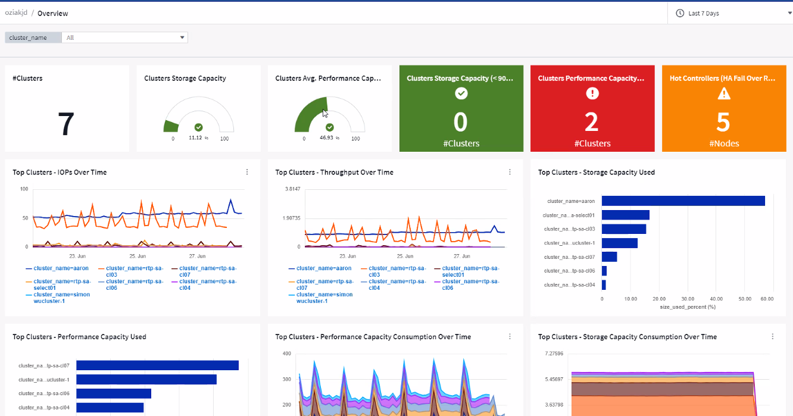

= Dashboards Overview

:toc: macro
:hardbreaks:
:toclevels: 2
:nofooter:
:icons: font
:linkattrs:
:imagesdir: ./media/

[.lead]
ONTAP Essentials is a set of dashboards and workflows that provide detailed overviews of your inventories and workloads. You may see the following terms used when working in ONTAP Essentials: 

* Inventories: List view of objects that provide storage/networking services to user data
* Workloads: List view of objects that provide interface to users to read/write data.
* Data Protection: List view of various objects that can be protected using NetApp data protection technologies

To begin exploring, select *ONTAP Essentials* from the main Cloud Insights menu.

