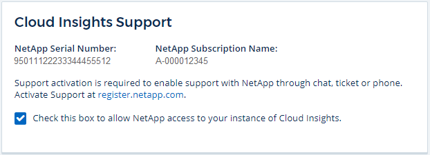
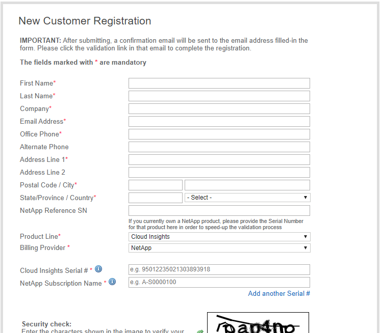

= Requesting Support
:hardbreaks:
:toclevels: 2
:nofooter:
:icons: font
:linkattrs:
:imagesdir: ./media/

[.lead]

toc::[] 

You can access support options in Data Infrastructure Insights by clicking on *Help > Support*. The support options available to you depend on your Data Infrastructure Insights Edition.

image:SupportPageWithLearningCenter.png[Support page]

== Activating support entitlement

Data Infrastructure Insights offers self-service and email support when running in trial mode. Once you have subscribed to the service, it is strongly recommended that you activate support entitlement. Activating support entitlement enables you to access technical support over the online chat, the web ticketing system, and the phone. The default support mode is self-service until registration is completed. See <<obtaining-support-information,details>> below.

During the initial subscription process, your Data Infrastructure Insights instance will generate a 20-digit NetApp serial number starting with "950". This NetApp serial number represents the Data Infrastructure Insights subscription associated with your account. You must register the NetApp serial number to activate support entitlement. We offer two options for support registration: 

. User with pre-existing NetApp Support Site (NSS) SSO account (e.g. current NetApp customer)
. New NetApp customer with no pre-existing NetApp Support Site (NSS) SSO account 

=== Option 1: Steps for a user with a pre-existing NetApp Support Site (NSS) SSO account 

.Steps

. Navigate to the NetApp registration website https://register.netapp.com

. Select “I am already registered as NetApp Customer” and choose _Data Infrastructure Insights_ as the Product Line. Select your Billing Provider (NetApp or AWS) and provide your Serial Number and your NetApp Subscription Name or AWS Customer ID by referring to the “Help > Support” menu within the Data Infrastructure Insights user interface:
+

. Complete the Existing Customer Registration form and click *Submit*.
+
image:ExistingCustomerRegExample.png[existing customer form]

. If no errors occur, user will be directed to a “Registration Submitted Successfully” page. The email address associated with the NSS SSO username used for registration will receive an email within a couple minutes stating “your product is now eligible for support”.

. This is a onetime registration for the Data Infrastructure Insights NetApp serial number. 

=== Option 2: Steps for a new NetApp customer with no pre-existing NetApp Support Site (NSS) SSO account

.Steps

. Navigate to the NetApp registration website https://register.netapp.com

. Select “I am not a registered NetApp Customer” and complete the required information in example form below:

. Select _Data Infrastructure Insights_ as the Product Line. Select your Billing Provider (NetApp or AWS) and provide your Serial Number and your NetApp Subscription Name or AWS Customer ID by referring to the “Help > Support” menu within the Data Infrastructure Insights user interface:
+

. If no errors occur, user will be directed to a “Registration Submitted Successfully” page. The email address associated with the NSS SSO username used for registration will receive an email within a few hours stating “your product is now eligible for support”. 

. As a new NetApp customer, you will also need to create a NetApp Support Site (NSS) user account for future registrations and access to support portal for technical support chat and web ticketing. This link is located at https://mysupport.netapp.com/eservice/public/now.do. You can provide your newly registered Data Infrastructure Insights serial number to expedite the process.

. This is a one-time registration for the Data Infrastructure Insights NetApp serial number. 

== Obtaining Support Information

NetApp provides support for Data Infrastructure Insights in a variety of ways. Extensive free self-support options are available 24x7, such as knowledgebase (KB) articles or the NetApp community. For users who are subscribed* to Data Infrastructure Insights, technical support is available via phone or web ticketing. A NetApp Support Site (NSS) SSO account is required for web ticket along with case management.

*Support is available with Basic Edition as long as all your NetApp storage systems are covered at least at the Premium Support level.

Many NetApp offerings include Data Infrastructure Insights Basic Edition as part of the package. If you would like to upgrade to Premium Edition, contact your sales representative.

=== Self-Service Support:

These support options are available in Trial mode and are available for free 24x7:

* *https://kb.netapp.com/Special:Search?query=cloud+insights[KnowledgeBase]*

// * *link:https://mysupport.netapp.com/site/search?q=cloud%20insights&offset=0&searchType=Manual&autocorrect=true&origin=CI_Suppport_KB&filter=%28content_type%3D%3D%22knowledgebase%22;product%3D%3D%22Cloud%20Insights%22%29[Knowledgebase]*
+
Clicking the links in this section takes you to the NetApp Knowledgebase, where you can search through relevant articles, how-to's, and more.

* *link:https://docs.netapp.com/us-en/cloudinsights/[Documentation]*
+
Clicking on the Documentation link takes you to this documentation center.

* *link:https://community.netapp.com/t5/Cloud-Insights/bd-p/CloudInsights[Community]*
+
Clicking on the community link takes you to the NetApp Data Infrastructure Insights community, where you can connect with peers and experts.

There is also a link to provide link:mailto:ng-cloudinsights-customerfeedback@netapp.com[*Feedback*] to help us improve Data Infrastructure Insights.

=== Subscription Support

In addition to the self-support options above, if you have a Data Infrastructure Insights subscription or paid support for monitored NetApp products or services, you can work with a NetApp Support Engineer to resolve your problem.  

NOTE: You must register in order to <<activating-support-entitlement,activate support>> for NetApp Cloud products. To register, go to NetApp's link:https://register.netapp.com[Cloud Data Services Support Registration].

It is highly recommended that you check the box to allow a NetApp Support Engineer access to your Data Infrastructure Insights tenant during your support session. This will allow the engineer to troubleshoot the problem and help you resolve it quickly. When your issue is resolved or your support session has ended, you can un-check the box. 

You can request support by any of the following methods. You must have an active Data Infrastructure Insights subscription to use these support options:

* link:https://www.netapp.com/us/contact-us/support.aspx[*Phone*]
* link:https://mysupport.netapp.com/portal?_nfpb=true&_st=initialPage=true&_pageLabel=submitcase[*Support Ticket*]
* *Chat* - You will be connected with NetApp support personnel for assistance (weekdays only). Chat is available in the *Help > Live Chat* menu option in the upper right of any Data Infrastructure Insights screen.

You can also request sales support by clicking on the link:https://www.netapp.com/us/forms/sales-inquiry/cloud-insights-sales-inquiries.aspx[*Contact Sales*] link.

Your Data Infrastructure Insights serial number is visible within the service from the *Help > Support* menu. If you are experiencing issues accessing the service and have registered a serial number with NetApp previously, you can also view your list of Data Infrastructure Insights serial numbers from the NetApp Support Site as follows:

*	Login to mysupport.netapp.com
*	From the Products > My Products menu tab, use Product Family “SaaS Data Infrastructure Insights” to locate all your registered serial numbers:

image:Support_View_SN.png[View Support SN]

== Data Infrastructure Insights Data Collector Support Matrix

You can view or download information and details about supported Data Collectors in the link:reference_data_collector_support_matrix.html[*Data Infrastructure Insights Data Collector Support Matrix*, role="external"].

=== Learning Center

Regardless of your subscription, *Help > Support* links to several NetApp University course offerings to help you get the most out of Data Infrastructure Insights. Check them out!

