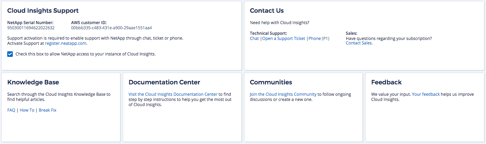

= Requesting Support

:toc: macro
:hardbreaks:
:toclevels: 1
:nofooter:
:icons: font
:linkattrs:
:imagesdir: ./media/

[.lead]
NetApp provides support for Cloud Insights in a variety of ways. Extensive free self-support options are available 24x7, such as knowledgebase (KB) articles or the NetApp community. Customers with a paid Cloud Insights subscription can contact our knowledgeable Support Engineers via chat, phone, or web ticket.

You can access support options in Cloud Insights by clicking on *Help > Support*. The support options available to you depend on whether you are in Trial mode or Subscription mode.

== Self-support:

These options are available in Trial mode and are available for free 24x7:

* *link:https://kb.netapp.com[Knowledgebase]*
+
Clicking the links in this section takes you to the NetApp Knowledgebase, where you can search for articles, link:https://kb.netapp.com/app/browse/a_status/published/channelRecordID/HOW_TO/currentSelectedID/RN_PRODUCT_473/isProductSelected/true/isRecommendationAllowed/true/pageSize/10/productRecordID/RN_PRODUCT_473/sortColumn/publishDate/sortDirection/DESC/truncate/200/type/browse[How-to's], link:https://kb.netapp.com/app/browse/a_status/published/channelRecordID/FAQ/currentSelectedID/RN_PRODUCT_473/isProductSelected/true/isRecommendationAllowed/true/pageSize/10/productRecordID/RN_PRODUCT_473/sortColumn/publishDate/sortDirection/DESC/truncate/200/type/browse[FAQ's], or link:https://kb.netapp.com/app/browse/a_status/published/channelRecordID/BREAK_FIX/currentSelectedID/RN_PRODUCT_473/isProductSelected/true/isRecommendationAllowed/true/pageSize/10/productRecordID/RN_PRODUCT_473/sortColumn/publishDate/sortDirection/DESC/truncate/200/type/browse[Break Fix] information related to your Cloud Insights.

* *link:https://docs.netapp.com/us-en/cloudinsights/[Documentation]*
+
Clicking on the Documentation link takes you to this documentation center.

* *link:https://community.netapp.com/t5/Cloud-Data-Services/ct-p/CDS[Community]*
+
Clicking on the community link takes you to the Netapp Cloud Insights community, where you can connect with peers and experts.

There is also a link to provide link:mailto:ng-cloudinsights-customerfeedback@netapp.com[*Feedback*] to help us improve Cloud Insights.

== Subscription Support

In addition to the self-support options above, if you have a Cloud Insights paid subscription, you can work with a NetApp Support Engineer to resolve your problem.  

NOTE: You must register in order to activate support for NetApp Cloud products. To register, go to NetApp's link:https://register.netapp.com[Cloud Data Services Support Registration].
+
It is highly recommended that you check the box to allow a NetApp Support Engineer access to your Cloud Insights environment during your support session. This will allow the engineer to troubleshoot the problem and help you resolve it quickly. When your issue is resolved or your support session has ended, you can un-check the box. 

You can request support by any of the following methods. You must have an active Cloud Insights subscription to use these support options:

* link:https://mysupport.netapp.com/gchat/cloudinsights[*Chat*]
* link:https://www.netapp.com/us/contact-us/support.aspx[*Phone*]
* link:https://mysupport.netapp.com/portal?_nfpb=true&_st=initialPage=true&_pageLabel=submitcase[*Support Ticket*]

You can also request sales support by clicking on the link:https://www.netapp.com/us/forms/sales-contact.aspx[*Contact Sales*] link.

== Cloud Insights Data Collector Support Matrix

You can view or download information and details about supported Data Collectors in the link:CloudInsightsDataCollectorSupportMatrix.pdf[*Cloud Insights Data Collector Support Matrix*, role="external"].
