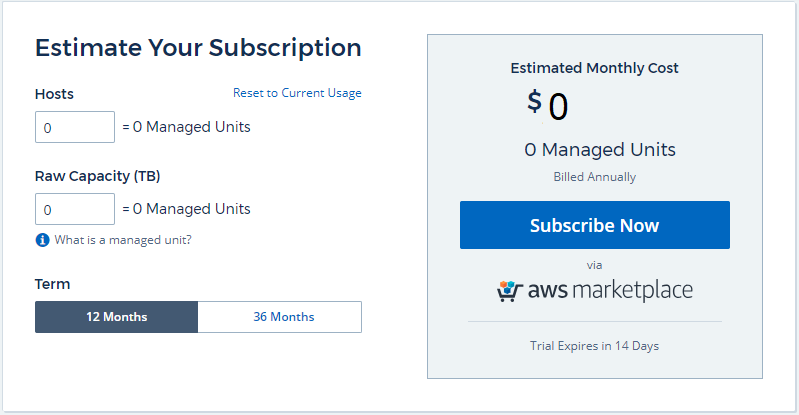

= Making the Move from Trial to Subscription

:toc: macro
:hardbreaks:
:toclevels: 2
:nofooter:
:icons: font
:linkattrs:
:imagesdir: ./media/
:keywords: OnCommand, Insight, documentation, help, onboarding, getting started

[.lead]

Cloud Insights gives you a free 14-day trial so you can explore the features in your own environment before subscribing. Subscribing to Cloud Insights ensures uninterrupted access to your data as well as extended product link:https://docs.netapp.com/us-en/cloudinsights/concept_requesting_support.html[support] options. You can subscribe to Cloud Insights at any point during your free trial.

== Trial Version
When you sign up for Cloud Insights and your environment is active, you enter into a free, 14-day Trial of Cloud Insights. During this trial you can explore all the features that Cloud Insights has to offer. 

At any time during your trial period, you can subscribe to Cloud Insights. When you subscribe, you will be taken to the Amazon Web Services (AWS) Marketplace link:https://aws.amazon.com/marketplace/pp/B07HM8QQGY[product page] for Cloud Insights.

NOTE: You must be an Account Owner or Administrator in order to subscribe to Cloud Insights. Additionally, you must have an Amazon Web Services (AWS) account.

Cloud Insights will display a banner when your free trial is nearing its end. Within that banner is a link to the *Admin > Subscribe* page. Non-Admin users will see the banner but will not be able to go to the Subscription page.

NOTE: If you need additional time to evaluate Cloud Insights, you can extend your trial for an additional 14 days. You can extend the trial only once.

==== What if My Trial has Expired?

If your free trial has expired and you have not yet subscribed to Cloud Insights, you will have limited functionality until you subscribe.  

To subscribe, go to *Admin > Subscribe*. In addition to the *Subscribe Now* button, you will be able to see your installed data collectors and calculate your estimated pricing.

=== Pricing
Cloud Insights is priced by *Managed Unit*. Managed Unit use is calculated based on the number of *hosts* and amount of *raw storage capacity* being managed in your infrastructure environment.

* 1 Managed Unit = 1 host (any virtual or physical machine)
* 1 Managed Unit = 2 TB of raw storage capacity

=== Estimate Your Subscription Cost
The Subscription Calculator gives you an estimated monthly Cloud Insights cost based on the number of hosts and amount of raw storage capacity being reported by your data collectors. The current values are pre-populated in the _Hosts_ and _Raw Capacity_ fields. You can enter different values to assist you with planning for estimated future growth.

Your estimated cost will change based on whether you select a subscription term of 12 months or 36 months. The 36-month term includes a discounted cost per Managed Unit.

NOTE: The calculator is for estimation only. Your final pricing will be set in the AWS Marketplace page. 

// Can extend only once.

== How Do I Subscribe?

You must have an existing Cloud Insights trial environment before subscribing in AWS, in order to complete the subscription process successfully. 

Clicking on the link:https://aws.amazon.com/marketplace/pp/B07HM8QQGY[*Subscribe Now*] button opens the AWS Cloud Insights subscription page, where you can complete your subscription. Note that values you entered in the calculator are not populated in the AWS subscription page; you will need to enter the total Managed Units count on this page.

After you have entered the total Managed Units count and chosen either 12-month or 36-month subscription term, click on *Set Up Your Account* to finish the subscription process.

After the AWS subscription process is complete, you will be taken back to your Cloud Insights environment. Or, if the environment is no longer active (for example, you have logged out), you will be taken to the Cloud Central sign-in page. When you sign in to Cloud Insights again, your subscription will be active. 

NOTE: After clicking on *Set Up Your account* on the AWS Marketplace page, you must complete the AWS subscription process within one hour. If you do not complete it within one hour, you will need to click on *Set Up Your Account* again to complete the process.

If there is a problem and the Subscription process fails to complete correctly, you will still see the "Trial Version" banner when you log into your environment. In this event, you can go to *Admin > Subscribe* and go through the subscription process again.

== Subscription Mode
Once your subscription is active, you can view your subscription status and Managed Unit usage on the *Admin > Subscription* page.

image:Subscription_Status.png[Subscription Status]

The Subscription status page displays the following:

* Total subscribed Managed Unit count
* Contract term (12 or 36 months), including expiration date
* Managed Unit current usage, including breakdown counts for hosts and raw storage capacity

NOTE: Storage capacity Managed Unit count is rounded up to the nearest Managed Unit.

=== What Happens if I Exceed My Subscribed Usage?

Warnings are displayed when your Managed Unit usage exceeds 80%, 90%, and 100% of your total subscribed amount:

|===
*When usage exceeds:* | *This happens / Recommended action:*
|*80%* | An informational banner is displayed. No action is necessary.
| *90%* | A warning banner is displayed. You may want to increase your subscribed Managed Unit count.
| *100%*| An error banner is displayed and you will have limited functionality until you do one of the following:
* Modify your subscribtion to increase the subscribed Managed Unit count
* Remove Data Collectors so that your Managed Unit usage is at or below your subscribed amount
|===

=== Installed Data Collectors

Click on the *View Data Collectors* button to expand the list of installed Data Collectors. 

image:Subscription_Data_Collectors.png[Data Collectors]

The Data Collectors section shows the Data Collectors installed in your environment and the count of Managed Units for each.

NOTE: The sum of Managed Units may differ slightly from the Data Collectors count in the status section. This is because Managed Unit counts are rounded up to the nearest Managed Unit. The sum of these numbers in the Data Collectors list may be slightly higher than the total Managed Units in the status section. The Status section reflects your actual Managed Unit count for your subscription.

In the event that your usage is nearing or exceeding your subscribed amount, you can delete data collectors in this list by clicking on the "three dots" menu and selecting *Delete*.

