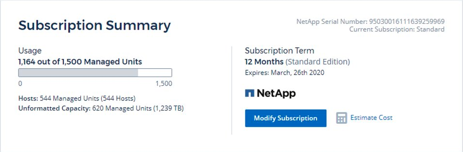

= Subscribing to Data Infrastructure Insights
:hardbreaks:
:toclevels: 2
:nofooter:
:icons: font
:linkattrs:
:imagesdir: ./media/

[.lead]
Getting started with Data Infrastructure Insights is as easy as three simple steps:

* Sign up for an account on link:https://bluexp.netapp.com//[*NetApp BlueXP*] to get access to all of NetApp's Cloud offerings.
* Register for a link:https://cloud.netapp.com/cloud-insights[*free trial*] of Data Infrastructure Insights to explore the features available.
* *Subscribe* to Data Infrastructure Insights for on-going, uninterrupted access to your data via link:https://www.netapp.com/us/forms/sales-inquiry/cloud-insights-sales-inquiries.aspx[NetApp Sales] direct or link:https://aws.amazon.com/marketplace/pp/prodview-pbc3h2mkgaqxe[AWS Marketplace].

During the registration process, you can choose the global region to host your Data Infrastructure Insights environment. 
For more information, read about Data Infrastructure Insights link:security_information_and_region.html[Information and Region].

For a full comparison of the features available in Data Infrastructure Insights Basic and Premium Editions, see the link:https://www.netapp.com/cloud-services/cloud-insights/editions-pricing[Data Infrastructure Insights Pricing] page.

WARNING: Inactive Data Infrastructure Insights Basic Edition environments are deleted and their resources are reclaimed. An environment is considered inactive if there is no user activity for 30 consecutive days, of if there is no data ingested for 7 consecutive days. Data Infrastructure Insights will send a notification and provide a grace period of four days before an environment is deleted.

While using Data Infrastructure Insights, if you see a padlock icon image:padlock.png[Padlock], it means the feature is not available in your current Subscription, or is available in a limited form. Subscribe to that feature for full access. Some features are available as a <<module-evaluation, Module Evaluation>> prior to subscribing.

== Trial Edition
When you sign up for Data Infrastructure Insights and your environment is active, you enter into a free, 30-day trial of Data Infrastructure Insights. During this trial you can explore the features that Data Infrastructure Insights has to offer, in your own environment.   

At any time during your trial period, you can subscribe to Data Infrastructure Insights. Subscribing to Data Infrastructure Insights ensures uninterrupted access to your data as well as extended link:https://docs.netapp.com/us-en/cloudinsights/concept_requesting_support.html[*product support*] options. 

Data Infrastructure Insights displays a banner when your free trial is nearing its end. Within that banner is a _View Subscription_ link, which opens the *Admin -> Subscription* page. Non-Admin users will see the banner but will not be able to go to the Subscription page.

NOTE: If you need additional time to evaluate Data Infrastructure Insights and your trial is set to expire in 4 days or less, you can extend your trial for an additional 30 days. You can extend the trial only once. You cannot extend if your trial has expired.

=== Trial through AWS Marketplace

You may also sign up for a free trial through the AWS Marketplace. The AWS Marketplace free trial gives you access to Data Infrastructure Insights for a trial period of 33 days, and allows up to 499 <<observability-metering, Managed Units>> (MUs). 

Note: If you configure more than 499 MUs, you will enter "breached" state. While your trial is in breached state, you will lose access to some Data Infrastructure Insights functionality until the breach is resolved, either by reducing the number of MUs configured, or by subscribing to Data Infrastructure Insights.

The AWS Marketplace free trial cannot be extended. At any time during your trial, you can downgrade to a Data Infrastructure Insights Basic Edition subscription or change to a paid Data Infrastructure Insights subscription by visiting the *Admin -> Subscription* page.

=== What if My Trial has Expired?

If your free trial has expired and you have not yet subscribed to Data Infrastructure Insights, you will have limited functionality until you subscribe. Data ingestion may cease, and after a few weeks, your data will be deleted per our data retention policy.

== What if my Subscription has expired?

If you have a subscription to Data Infrastructure Insights, but that subscription has expired, you will have a grace period of five days in order to renew your subscription. All Data Infrastructure Insights functionality will remain active during this grace period.

After the grace period has elapsed, Data Infrastructure Insights functionality is suspended until you renew. To renew, see the *Admin > Subscription* page, or contact NetApp Sales.

NOTE: Your Data Infrastructure Insights data collected through the end of the grace period remains intact for 30 days following the grace period. If you renew your subscription within this time, all of your data up until the time the grace period elapsed will be available to you.

== What if my *Subscription* has expired?

If you have a subscription to Data Infrastructure Insights, but that subscription has expired, you will have a grace period of five days in order to renew your subscription. All Data Infrastructure Insights functionality will remain active during this grace period.

After the grace period has elapsed, Data Infrastructure Insights functionality is suspended until you renew. To renew, see the *Admin > Subscription* page, or contact NetApp Sales.

NOTE: Your Data Infrastructure Insights data remains intact for 30 days following the grace period. If you renew your subscription within this time, all of your data up until the time the grace period elapsed will be available to you.

== Module Evaluation

You may also take advantage of *Module Evaluations*. For example, if you are already subscribed to Infrastructure Observability but are adding Kubernetes to your environment, you will automatically enter into a 30-day evaluation of Kubernetes Observability, starting from when you install the NetApp Kubernetes Monitoring Operator. You will only be charged for your Kubernetes Observability managed unit usage at the end of the evaluation period.

NOTE: Keep in mind that you will be charged for new managed unit (MU) usage following the evaluation, so be sure to plan accordingly. When your module evaluation is ending, you will be notified if you will need to add more MUs to avoid service interruption.

You can monitor your managed unit usage on the *Admin > Subscription* page in the *Usage* tab.

image:Module_Trials_UsageTab.png[MU Usage Screen]

NOTE: A _Module Evaluation_ is not a _Trial_ - we use the term trial when we provide customers a free trial period of using the Data Infrastructure Insights service to confirm fit and enable purchase. A module evaluation is different - this is when we allow a paid customer to try out a module of Data Infrastructure Insights that they have not used in recent months of their paid subscription. When evaluation is active, charges for just the newly configured module are waived. The customers working environment is still under subscription and has not reverted to free trial. The subscription has not changed. 

=== Estimator

During a module evaluation, you are not charged MU usage for resources consumed for the module, but you can open the *Estimator* (on the _Summary_ tab) to see how MUs will be charged following the evaluation, as well as play with "What if" scenarios with the number of MUs you may need in the future. Reset the numbers by exiting the Estimator.

image:Module_Trials_Estimator.png[Estimator]

Select the checkbox next to a module to add or remove the entire module's MU's from the estimated cost.

The Estimator also allow you to see how the numbers stack up for either an Add On - where you keep your current subscription term and increase the number of managed units licensed - or a Renew option for a the renewal subscription you would purchase when your current subscription term ends.

Note that customers are only eligible for a module evaluation once per subscription. 

== Subscription Options

To subscribe, go to *Admin -> Subscription*. In addition to the *Subscribe* buttons, you will be able to see your installed data collectors and calculate your estimated metering. For a typical environment, you can click the self-serve AWS Marketplace button. If your environment includes or is expected to include 1,000 or more Managed Units, you are eligible for Volume Pricing. 

//image:SubscriptionCompareTable-2.png[Subscription Options]

=== Observability Metering
[#pricing]

Data Infrastructure Insights Observability is metered in one of two ways:

* Capacity Metering
* Managed Unit Metering (Legacy)

Your subscription will be metered by one of these methods, depending on whether you have an existing subscription, or are launching a new subscription.

==== Capacity Metering
[#effective-entitlement]

Data Infrastructure Insights Observability meters usage according to the tier of storages on your tenant. You may have storages that fall into one or more of these categories:

* Primary Raw 
* Object Raw
* Cloud Consumed

Each tier is metered at a different rate, with the whole calculated together to give you an _effective entitlement_. The formula for calculating effective usage is as follows:

 Effective usage = Raw TiB + (0.1 x Object Tier Raw TiB) + (0.25 x Cloud Tier Provisioning TiB)

NOTE: The sum of Managed Units may differ slightly from the Data Collectors count in the summary section. This is because Managed Unit counts are rounded up to the nearest Managed Unit. The sum of these numbers in the Data Collectors list may be slightly higher than the total Managed Units in the status section. The summary section reflects your actual Managed Unit count for your subscription.
To facilitate this, DII calculates a single *effective entitlement* number based on _subscribed_ quantities; it then calculates that same number based on _discovered_ storage and only declares breach if the effective discovered capacity is greater than the effective entitlement. This gives you flexibility to monitor quantities that vary from the subscribed amounts for each tier, which DII allows as long as total discovered storage is within the subscribed effective entitlement. 

//image:TBD[Table showing discovered capacity and effective entitlement]

==== Managed Unit Metering (Legacy)

Data Infrastructure Insights Infrastructure Observability and Kubernetes Observability meter usage per *Managed Unit*. Usage of your Managed Units is calculated based on the number of *hosts or virtual machines* and amount of *unformatted capacity* being managed in your infrastructure environment. 

* 1 Managed Unit = 2 hosts (any virtual or physical machine)
* 1 Managed Unit = 4 TiB of unformatted capacity of physical or virtual disks
* 1 Managed Unit = 40 TiB of unformatted capacity of select secondary storage: AWS S3, Cohesity SmartFiles, Dell EMC Data Domain, Dell EMC ECS, Hitachi Content Platform, IBM Cleversafe, NetApp StorageGRID, Rubrik.
* 1 Managed Unit = 4 vCPUs of Kuberentes. 
** 1 Managed Unit K8s Adjustment = 2 Nodes or Hosts also monitored by infrastructure.

If your environment includes or is expected to include 1,000 or more Managed Units, you are eligible for *Volume Pricing* and will be prompted to Contact NetApp Sales to subscribe. See <<how-do-i-subscribe,below>> for more details.

=== Workload Security Metering

Workload Security is metered by Cluster using the same approach as Observability metering.

You can view your Workload Security usage in the *Admin > Subscription* page on the *Workload Security* tab.

image:ws_metering_example_page.png['Admin > Subscription > Workload Security tab showing high-end, mid-range, and entry-level node counts']

NOTE: Existing Workload Security subscriptions have their MU usage adjusted so that node usage does not consume managed units. Data Infrastructure Insights meters usage to ensure compliance with licensed usage.

== How Do I Subscribe?

If your Managed Unit count is less than 1,000, you can subscribe via NetApp Sales, or <<self-subscribe-through-aws-marketplace,self-subscribe>> via AWS Marketplace.

=== Subscribe through NetApp Sales direct

If your expected Managed Unit count is 1,000 or greater, click on the link:https://www.netapp.com/us/forms/sales-inquiry/cloud-insights-sales-inquiries.aspx[*Contact Sales*] button to subscribe though the NetApp Sales Team. 

You must provide your Data Infrastructure Insights *Serial Number* to your NetApp sales representative so that your paid subscription can be applied to your Data Infrastructure Insights environment. The Serial Number uniquely identifies your Data Infrastructure Insights trial environment and can be found on the *Admin > Subscription* page.

=== Self-Subscribe through AWS Marketplace

NOTE: You must be an Account Owner or Administrator in order to apply an AWS Marketplace subscription to your existing Data Infrastructure Insights trial account. Additionally, you must have an Amazon Web Services (AWS) account.  

Clicking on the Amazon Marketplace link opens the AWS https://aws.amazon.com/marketplace/pp/prodview-pbc3h2mkgaqxe[Data Infrastructure Insights] subscription page, where you can complete your subscription. Note that values you entered in the calculator are not populated in the AWS subscription page; you will need to enter the total Managed Units count on this page.

After you have entered the total Managed Units count and chosen either 12-month or 36-month subscription term, click on *Set Up Your Account* to finish the subscription process.

Once the AWS subscription process is complete, you will be taken back to your Data Infrastructure Insights environment. Or, if the environment is no longer active (for example, you have logged out), you will be taken to the NetAPp BlueXP sign-in page. When you sign in to Data Infrastructure Insights again, your subscription will be active. 

NOTE: After clicking on *Set Up Your account* on the AWS Marketplace page, you must complete the AWS subscription process within one hour. If you do not complete it within one hour, you will need to click on *Set Up Your Account* again to complete the process.

If there is a problem and the subscription process fails to complete correctly, you will still see the "Trial Version" banner when you log into your environment. In this event, you can go to *Admin > Subscription* and repeat the subscription process.

== View Your Subscription Status

Once your subscription is active, you can view your subscription status and Managed Unit usage from the *Admin > Subscription* page.

// 
//image:Subscription_Status_Usage.png[Viewing your subscription ststus]

The Subscription *Summary* tab displays things like the following:

* Current Edition 
* Subscription Serial Number
* Current MU entitlement

The *Usage* tab shows you your current MU usage and how that usage breaks down by data collector.

image:SubscriptionUsageByModule.png[MU usage by module]

The *History* tab gives you insight into your MU usage over the past 7 to 90 days. Hovering over a column in the chart gives you a breakdown by module (i.e. Observability, Kubernetes).

image:Subscription_Usage_History.png[MU Usage History]

== View your Usage Management

The Usage Management tab shows an overview of Managed Unit usage, as well as tabs breaking down Managed Unit consumption by collector or Kubernetes Cluster.

NOTE: The Unformatted Capacity Managed Unit count reflects a sum of the total raw capacity in the environment and is rounded up to the nearest Managed Unit. 

NOTE: The sum of Managed Units may differ slightly from the Data Collectors count in the summary section. This is because Managed Unit counts are rounded up to the nearest Managed Unit. The sum of these numbers in the Data Collectors list may be slightly higher than the total Managed Units in the status section. The summary section reflects your actual Managed Unit count for your subscription.

In the event that your usage is nearing or exceeding your subscribed amount, you can reduce usage by deleting data collectors or stopping monitoring of Kubernetes Clusters. Delete an item in this list by clicking on the "three dots" menu and selecting _Delete_.

=== What Happens if I Exceed My Subscribed Usage?

Warnings are displayed when your Managed Unit usage exceeds 80%, 90%, and 100% of your total subscribed amount:

[cols=2*a,2*a]
|===
|*When usage exceeds:* | *This happens / Recommended action:*

|*80%* | An informational banner is displayed. No action is necessary.
| *90%* | A warning banner is displayed. You may want to increase your subscribed Managed Unit count.
| *100%*| An error banner is displayed until you do one of the following:

* Remove Data Collectors so that your Managed Unit usage is at or below your subscribed amount
* Modify your subscription to increase the subscribed Managed Unit count
|===

== Subscribe Directly and Skip the Trial

You can also subscribe to Data Infrastructure Insights directly from the https://aws.amazon.com/marketplace/pp/prodview-pbc3h2mkgaqxe[AWS Marketplace], without first creating a trial environment. Once your subscription is complete and your environment is set up, you will immediately be subscribed.

== Adding an Entitlement ID

If you own a valid NetApp product that is bundled with Data Infrastructure Insights, you can add that product serial number to your existing Data Infrastructure Insights subscription. For example, if you have purchased NetApp Astra Control Center, the Astra Control Center license serial number can be used to identify the subscription in Data Infrastructure Insights. Data Infrastructure Insights refers to this an _Entitlement ID_.

To add an entitlement ID to your Data Infrastructure Insights subscription, on the *Admin > Subscription* page, click _+Entitlement ID_.

image:Subscription_AddEntitlementID.png[Add an entitlement ID to your subscription]

