= What\'s New with Cloud Insights 
:hardbreaks:
:toclevels: 2
:nofooter:
:icons: font
:linkattrs:
:imagesdir: ./media/

[#whats-new]
[.lead]
NetApp is continually improving and enhancing its products and services. Here are some of the latest features and functionalities available in the commercial Editions of Cloud Insights.  

== May 2024

=== Automatically resolve alerts based on time

Log alerts can now be resolved based on time; if the alert condition stops occurring, Cloud Insights can resolve the alert automatically after a specified time has passed. You can choose to resolve the alert in minutes, hours, or days.

image:alerts_resolve_based_on_time.png[Resolve an alert based on time passed]

'''

== April 2024

=== iSCSI support for Kubernetes

Cloud Insights now has support to map the iSCSI storage associated with Kubernetes, allowing faster troubleshooting using the Kubernetes network map and the ability to provide chargeback or showback reports via Reporting.

image:pod-to-storage.png[Pod-to-storage example]

=== Operating System support

The following operating systems are supported with Cloud Insights Acquisition Units, in addition to those link:https://docs.netapp.com/us-en/cloudinsights/concept_acquisition_unit_requirements.html[already supported]:

* Oracle Enterprise Linux 8.8
* Red Hat Enterprise Linux 8.8
* Rocky 9.3
* OpenSUSE Leap 15.1 through 15.5
* SUSE Enterprise Linux Server 15, 15 SP2 through 15 SP5

'''
== March 2024

=== Workload Security Agent Details

Each of your Workload Security Agents has its own landing page, where you can easily see summary information about the Agent as well as the installed Data and User Directory Collectors associated with that Agent. 

image:Agent_Detail_Page.png[Agent Detail Landing Page example]

=== Chart more data more quickly

When analyzing data on an asset's landing page, adding additional data to the Expert View charts is a snap. For each table on the landing page, if an object type has relevant data, hover over that object to display the "Add to Expert View" icon. Selecting this icon adds that object to the Additional Resources and displays it in the Expert View charts.

image:AddToChartIcon.png[Add table data to expert view]

Or maybe you want to see a landing page table's data in its own chart. Simply select the _Show Chart_ icon to open the chart below the table:

image:LPTableShowChartIcon.png[Show Chart icon]

'''

== February 2024

=== Usability Improvements

Save a *snapshot* of your current dashboard by selecting _Export as Image_ from the right-corner drop-down. Cloud Insights creates a .PNG of the current widget states.

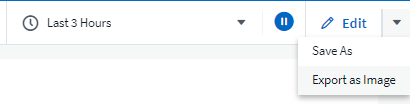

*Object and Metric selection* is easier than ever for Widgets, Monitors, etc.  Choose the object type you want, and then select a metric relevant to that object in the separate drop-down.

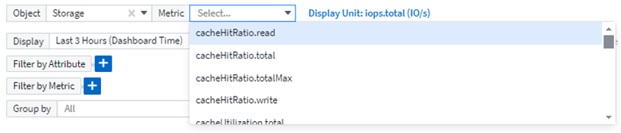

*Export Data Collector and Acquisition Unit* lists to .CSV by selecting the icon at the top of those pages. 

We’ve *re-organized the Help > Support* page so it’s easier to find what you’re looking for, and because you asked for them, we added direct links on this page to *API Swagger* and user documentation.

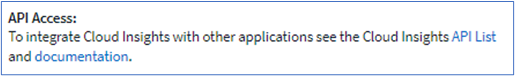

*Links* in the “triggeredOn” column on the Alerts list page will navigate to the appropriate Landing Page, if a Landing Page is available for that object.

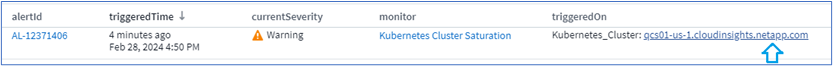

=== See all changes in your namespace

Kubernetes Change Analysis now allows you to see a timeline of changes when selecting Cluster and Namespace. Previously, Workload must also have been selected.  When filtering on Cluster and Namespace, the timeline of all workload changes in that namespace are shown on one line.

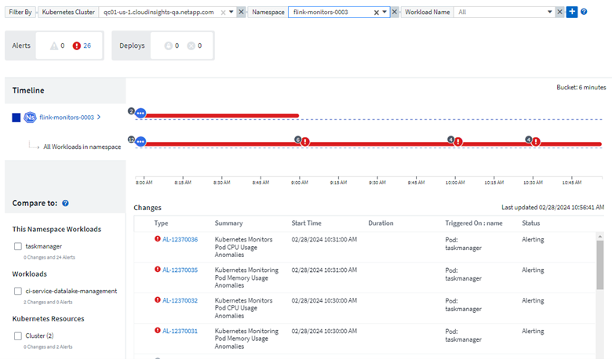
 

=== Related Logs for Alerts

When viewing a log alert, related log entries are shown in a new table.  A log entry is related if it occurs in the same source and timeframe as the alert, and is subject to the same conditions. Select “Analyze Logs” to explore further.

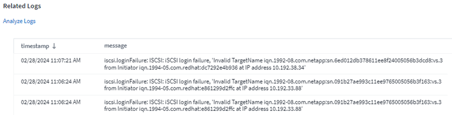

=== Collect ONTAP Switch Data

Cloud Insights can collect data from the ONTAP system’s back-end switches; simply enable the collection in the data collector’s _Advanced Configuration_ section, and ensure the ONTAP system is configured to provide link:https://docs.netapp.com/us-en/ontap-cli-98/system-switch-ethernet-create.html[switch information] and has the appropriate link:task_dc_na_cdot.html#a-note-about-permissions[permissions] set.

=== Workload Security Data Collector API

In large environments, you can automate Workload Security collector creation using the new Data Collectors API. Navigate to *Admin > API Access > API Documentation* and select the _Workload Security_ API type to learn more.

'''

== January 2024

=== Try Cloud Insights Features you haven’t used yet

In addition to your initial trial of Cloud Insights, you may also take advantage of link:concept_subscribing_to_cloud_insights.html#module-evaluation[Module Evaluations]. For example, if you are subscribed to Cloud Insights and have been monitoring storage and virtual machines, when you add Kubernetes to your environment, you will automatically enter into a 30-day trial of Kubernetes Observability. Kubernetes Observability managed unit usage will not count against your subscribed entitlement until after the trial period ends.

=== How healthy are my workloads?

Workload health is available at a glance on the *Kubernetes > Explore > Workloads* page, so you can quickly see which workloads are performing well and which may need some help. Easily identify if the health issue is related to infrastructure, network, or configuration changes, and drill down to analyze the root cause.

image:WorkloadHealth.png[Workload Health at a glance]

=== Data Collector Updates

==== Data Domain Identification

The Data Domain collector has been improved to better identify HA systems for durability across failover events This change will cause a *one time* re-identification of Data Domain appliances in HA systems, which will subsequently cause any annotations on those assets to be removed (because these arrays will be re-identified). You will need to re-attach annotations to your Data Domain objects.

=== Enhanced Ransomware Detection ML Algorithm

Workload Security includes a new 2nd-generation ransomware detection ML algorithm to detect the most sophisticated attacks faster and more accurately.

"Seasonality" of behaviors: weekend behavior may follow different patterns from weekday, or morning behavior from afternoon. Workload Security algorithms take this seasonality into account.

// * Faster analytics: The forensics user interface has been improved to analyze more data more quickly.

=== Deprecated Functionality

Occasionally functionality is deprecated as features evolve. Here are some of the features and functionalities which have been deprecated in Cloud Insights:

==== Workload Secure REST cloudsecure_forensics.activities.v1 API is deprecated

The _cloudsecure_forensics.activities.v1_ API is deprecated. This API returns information on activities associated with entities in the Storage Workload Security environment. This API has been replaced with cloudsecure_forensics.activities.*v2*_.  

GET for this API previously returned the following: 

----
{ 
  "count": 24594, 
  "limit": 1000, 
  "offset": 0, 
  "results": [ 
    { 
      "accessLocation": 
----

This API now returns:

----
{ 
  "limit": 1000, 
  "meta": { 
    "page": { 
      "after": "lvlvk3pp.4cpzcg4kpybl", 
      "before": "lvlxy3dz.4cq5ajdnl9fk", 
      "size": 1000 
    } 
  }, 
  "results": [ 
    { 
      "accessLocation": "10.249.6.220", 
----

//There was a change in the backend for performance optimization. Hence in order to accommodate the change the response body had to be changed as maintaining the previous response would have affected the performance. Count & limit are replaced with meta. 

For more details see the Swagger documentation at “Admin > API Access > API Documentation > Workload Security”. 

//This API is no longer supported from Jan 2024 in all regions. 

'''

== December 2023

=== Change Analytics at a glance

Kubernetes link:kubernetes_change_analytics.html[Change Analytics] provide you with an all-in-one view of recent changes to your Kubernetes environment. Alerts and deployment status are at your fingertips. With Change Analytics, you can track every deployment and configuration change, and correlate it with the health and performance of K8s services, infrastructure, and clusters.

image:ChangeAnalytitcs_Main_Screen.png[Change Analytics Dashboard]

=== Kubernetes Workload Performance Dashboard

Workload performance is available at a glance in the comprehensive Kubernetes Workload Performance dashboard. Quickly view graphs of Volume, Throughput, Latency, and Retransmission trends, as well as a table of workload traffic for each namespace in your environment. Filters allow easy focus into areas of interest.

image:K8s_Workload_performance.png[Workload Performance Menu, width=400]

image:K8s_Workload_performance_dashboard.png[Workload Performance Dashboard]

=== Query Details on one screen

In a query, selecting a row opens a side panel showing attribute, annotation, and metric details for the selected row, providing helpful information without needing to drill into the object's landing page. Links in the row or side panel allow for easy navigation.

image:MetricQuerySlideoutPanel.png[Slideout Panel for Metric Query]

=== Data Collector updates:

* *Brocade FOS REST*:  This collector is moved out of "Preview" and is now generally available. Some things to note:
** FOS introduced their REST API with FOS 8.2. But some features like routing only received REST API capabilities with 9.0.
** If you have a fabric consisting of mixed FOS assets 8.2 higher, as well as some < 8.2, the Cloud Insights FOS REST collector will fail to discover those older assets. You can edit the FOS REST collector and build a comma-delimited list of the IPv4 address of those devices for exclusion from that collector.

* *SELinux*:  Cloud Insights includes enhancements to the Linux Acquisition Unit initial installation to ensure robustness of operation within Linux environments with SELinux enforcement enabled. These enhancements only impact _new_ AU deployments; if you have any SELinux issues relating to AU upgrades, contact NetApp Support to remediate your SELinux configuration.

'''

== November 2023

=== Workload Security: Pause/Resume a Collector

In Workload Security, you can Pause a Data Collector if the collector is in _Running_ state. Open the "three dots" menu for the collector and select PAUSE. While the collector is paused, no data is gathered from ONTAP, and no data is sent from the collector to ONTAP. Select Resume to begin collecting again.

=== Storage Node Support Information

On a storage node landing page, the _User Data_ section provides at-a-glance information about your support offering, current status, support status, and warranty end date. Note that Cloud Insights currently only auto-publishes this information for NetApp devices. Note also that these support fields are annotations, so they can be used in queries and dashboards.

image:StorageNodeSupportData.png[Storage Node Support Information]

=== Map VMWare tags to Cloud Insights annotations

The link:task_dc_vmware.html#mapping-vmware-tags-to-cloud-insights-annotations[VMWare] data collector allows you to populate Cloud Insights text annotations with same-name tags that are configured on VMWare. 

=== Brocade CLI collector reliability enhancements for FOS 9.1.1c and higher firmware

On some Brocade Fibre Channel switches running 9.1.1c firmware, certain CLI commands’ output may be prepended with the “motd” login banner text, or warnings for users to change default passwords. The Brocade CLI collector has been enhanced to ignore these two types of extraneous text.

Prior to this enhancement, only FOS 9.1.1c switches without Virtual Fabrics present were likely discoverable with this collector type.

'''

== October 2023

=== Enhanced Workload Security 

Workload Security has been improved with the following:

* *Access Denied*: Workload Security integrates with ONTAP to receive link:concept_ws_integration_with_ontap_access_denied.html["Access Denied" events] and provide an additional analytics and automatic responses layer.
* *Allowed File Types*: If a ransomware attack is detected for a known file extension, that file extension can be added to an link:ws_allowed_file_types.html[allowed file types] list to prevent unnecessary alerting. 

=== Module Trials

In addition to your initial trial of Cloud Insights, you may also take advantage of link:concept_subscribing_to_cloud_insights.html#module-evaluation[Module Evaluations]. For example, if you are already subscribed to Infrastructure Observability but are adding Kubernetes to your environment, you will automatically enter into a 30-day trial of Kubernetes Observability. You will only be charged for your Kubernetes Observability managed unit usage at the end of the evaluation period.

=== Restrict access to specified domains

Admins and Account Owners now have the ability to link:concept_user_roles.html#restricting-access-by-domain[restrict Cloud Insights access] to email domains they specify. Go to *Admin > User Management* and select the _Restrict Domains_ button.  

image:Restrict_Domains_Modal.png[Restrict Domains Modal]

=== Data Collector Updates

The following Data Collector/Acquisition Unit changes are in place:

* *Isilon / PowerScale REST*: Various new attributes and metrics have been added to Cloud Insights enhanced analytics capabilities under the _emc_isilon.node_pool.*_ name. These counters and attributes will empower users to build dashboards and monitors for _node_pool_ capacity consumption; users with Isilon clusters built from dissimilar hardware node models will have multiple node pools, and understanding your HDD/SSD/total capacity consumption at a node pool level is useful for both monitoring and planning.

* *Rubrik* “Service account” authentication support: Cloud Insights' Rubrik collector now supports both traditional HTTP Basic Authentication (username and password), and Rubrik’s Service Account approach, which requires a username + secret + Organization ID. 

'''

== September 2023

=== Easily Find What You Want in the Logs

Log Query (*Observability > Log Queries > +New Log Query*) includes a number of link:concept_log_explorer.html#advanced-filtering[enhancements] to make log exploration easier and more informative. 

==== Include/Exclude

When filtering for a value, you can easily choose whether to *Include* or *Exclude* results matching the filter. Selecting "Exclude" creates a "NOT <value>" filter. You can combine Include and Exclude values in a single filter.

image:Log_Query_Exclude_Filter.png[Filter showing Exclude radio button]

==== Advanced Query

*Advanced Querying* gives you the opportunity to create "free form" filters, combining or excluding values using AND, NOT, OR, wildcards, etc.

image:Log_Advanced_Query_Example.png[Example Log Query illustrating AND, NOT and OR functions]

The "Filter By" and Advanced Query are "AND"ed together to form a single query. The results are displayed in the results list and the chart.

==== Grouping in the Chart

When you select a log attribute to *Group By*, the list and chart show the results of the current filter. In the chart, columns grouped into colors. Hovering over a column in the chart will display details about the specific entries, similar to the overall information shown when you expand the chart Legend.  In the legend, you can also choose to set an Include or Exclude filter for a specific grouping.

image:Log_Query_Group_By_Chart.png[Log Query Group By example showing stacked columns in the chart] 

=== "Floating" Log Detail Panel

When exploring logs using the Log Query, selecting an entry in the list opens a detail panel for that entry. You can now choose to display that slideout panel "Floating" (i.e. displayed over the rest of the screen) or 'In Page" (i.e. displayed as its own frame within the page). To switch between these views, select the "In Page / Floating" button in the upper-right corner of the panel.

image:Log_Query_Floating_Detail_Panel.png["In-Page" slideout panel with button highlighted]

=== Collapse the Menu

You can collapse the left-side Cloud Insights navigation menu by selecting the "Minimize" button below the menu. While the menu is minimized, hover over an icon to see which section it opens; selecting the icon opens the menu and takes you directly to that section.

image:CI_Menu_Minimize_Button.png[Minimize the menu]

=== Data Collector Improvements

Cloud Insights has made it easier to show and find data collector information:

* *Processing of data collector lists* is more efficient, which means the time it takes to display and navigate these lists is greatly reduced. If you have a large environment with many data collectors, you will see a significant improvement when listing your data collectors.

//=== .HTML-based Data Collector Support Matrix

* The *Data Collector Support Matrix* has moved from a .PDF file to an .HTML-based page, quicker to navigate and easier to maintain. Check out the new Matrix here: https://docs.netapp.com/us-en/cloudinsights/reference_data_collector_support_matrix.html 

'''

== August 2023

=== Collecting Isilon/PowerScale Logs and Advanced Analytics Data

The Isilon REST and PowerScale REST collectors contain the following improvements:

* Isilon log events are available for use in queries and alerts

* Isilon Advanced Analytic attributes are available for use in queries, dashboards, and alerts:
** emc_isilon.cluster
** emc_isilon.node
** emc_isilon.node_disk
** emc_isilon.net_iface

These are enabled by default for users of the Isilon REST and/or PowerScale REST collectors. NetApp strongly encourages users of the Isilon CLI-based collector to migrate to the new REST API-based collector to receive enhancements such as the above.

=== Improved Workload Map

The workload map is more usable and less noisy; it groups all similar external services into one node if they communicate with the same workloads, reducing the complexity of the graph and making it easier to understand how services are interconnected.

Choosing a grouped node will display a detailed table with the network traffic metrics for each external service relevant to that node.

=== Kubernetes Managed Unit usage adjustment

In the event of a compute resource in your Kubernetes cluster environment being counted by both the NetApp Kubernetes Monitoring Operator and an underlying infrastructure data collector (for example, VMware), your usage of these resources will be adjusted to ensure the most efficient counting of managed units. You can view the Kubernetes MU adjustments on the Admin > Subscription page, in both the Summary and Usage tabs.

Summary tab:
image:MU_Adjustments_K8s.png[k8s MU Adjustment shown on the estimation calculator]

Usage tab:
image:MU_Adjustments_K8s_Usage_Tab.png[k8s MU Adjustment shown on the Usage tab]

=== Collector/Acquisition changes:

The following Data Collector/Acquisition Unit changes are in place:

* Acquisition Units now support RHEL 8.7.

=== Improved Menus

We have updated the left hand navigation menu to better support our customers' workflows. New top level items such as _Kubernetes_ provide accelerated access to what the customer needs, and a consolidated administrators console supports the tenant owner role. 

Here are some additional examples of the changes:

* The top level _Observability_ menu showcases data discovery, alerting and log queries
*	‘API Access’ functionality for Observability and Workload Security are under one menu
*	Likewise for Observability and Workload Security ‘Notifications’ functionality, also now under one menu

image:NewLeftNavMenu.png[Updated Left Navigation Menu]

Here is a brief list of the features you can find under each menu:

Observability:

* Explore (Dashboards, Metric Queries, Infrastructure Insights)

* Alerts (Monitors and Alerting)

* Collectors (Data Collectors and Acquisition Units)

* Log Queries 

* Enrich (Annotations and Annotation Rules, Applications, Device Resolution)

* Reporting

Kubernetes:

* Cluster Exploration and Network Map

Workload Security:

* Alerts
* Forensics
* Collectors
* Policies

ONTAP Essentials:

* Data Protection
* Security
* Alerts
* Infrastructure
* Networking
* Workloads
 *VMware

Admin:

* API Access
* Auditing
* Notifications
* Subscription Information
* User Management

== July 2023

=== Show Recent Changes

Data Collector landing pages now include a list of recent changes. Simply click the "Recent Changes" button at the bottom of any data collector landing page to display recent data collector changes.

image:Recent_Changes_Example.png[Recent Changes Example]

=== Operator Improvements

The following improvements have been made to link:telegraf_agent_k8s_config_options.html[Kubernetes Operator] deployment:

* Option to bypass docker metric collection
* Ability to add and customize tolerations to telegraf Daemonsets and Replicasets
//Eliminate need to generate agent IDs server-side

=== Insight: Reclaim Cold Storage 

The link:insights_reclaim_ontap_cold_storage.html[Reclaim ONTAP Cold Storage Insight] now supports FlexGroups, and is now available to all customers.

=== Operator Image Signature

For customers who use a private repository for their NetApp Kubernetes Monitoring Operator, you can now copy the Image Signature Public Key during Operator installation, allowing you to confirm authenticity of the downloaded software. Select the _Copy Image Signature Public Key_ button during the optional step to _Upload the operator image to your private repository_.

image:Operator_Public_Image_Key.png[Download the Public Key]

=== Aggregation, Conditional Formatting, and more for Queries

Aggregation, Unit Selection, Conditional Formatting, and Column Renaming are among the most useful features of a dashboard table widget, and now those same features are available for link:task_create_query.html[Queries]. 

image:Query_Page_Aggregation_etc.png[Query Page results showing Aggregation, Conditional Formatting, Unit Display, and Column Renaming]

These features are available now for integration-type data (Kubernetes, ONTAP Advanced Metrics, etc.), and will be coming soon for Infrastructure objects (storage, volume, switch, etc.).

=== API for Audit

You can now use an API to query or export Audited events. Go to Admin > API Access and select the _API Documentation_ link for  information.

image:Audit_API_Swagger.png[API Swagger for Audit, width=400]

=== Data Collector: Trident Economy

Cloud Insights now supports the Trident Economy Driver, realizing these benefits: 

* Get visibility into pod-to-ONTAP Qtree mapping and performance metrics. 
* Provide seamless troubleshooting and easy navigation from Kubernetes pods to backend storage
* Proactively detect backend performance issues with monitors

'''

== June 2023

=== Check out your Usage

Beginning in June, 2023, Cloud Insights provides a breakdown of Managed Unit usage based on Feature Set. Now you can quickly view and monitor managed unit (MU) usage for your Infrastructure as well as MU usage tied to Kubernetes. 

image:Metering_Usage.png[Metering Usage Breakdowns]

=== Kubernetes Network Monitoring and Map is available for all

The link:concept_kubernetes_network_monitoring_and_map.html[_Kubernetes Network Performance and Map_] simplifies troubleshooting by mapping dependencies between Kubernetes workloads, providing real-time visibility into Kubernetes network performance latencies and anomalies to identify performance issues before they affect users. Many customers found it helpful during Preview, and now it's available for everyone to enjoy. 

=== Collector/Acquisition changes:

The following Data Collector/Acquisition Unit changes are in place:

* Data Domain and Cohesity MUs are metered at 40 TiB : 1 MU.
* Acquisition Units now support RHEL and Rocky 9.0 and 9.1.

=== New ONTAP Essentials dashboards 

The following ONTAP Essentials dashboards have been available in Preview environments, and now they are available for everyone:

* Security Dashboard
* Data Protection Dashboard (includes Local and Remote Protection overviews)

=== Additional System Monitors

The following System Monitors are included with Cloud Insights:

* Storage VM FCP Service Unavailable
* Storage VM iSCSI Service Unavailable

////
=== Qtree full path data for Pod-to-Storage

Qtree full path information is available for 'pod-to-storage' if it is available, either set manually or via Trident.
////

'''

== May 2023

=== Improved Kubernetes Monitoring Operator Installation

Installation and configuration of the link:task_config_telegraf_agent_k8s.html[NetApp Kubernetes Monitoring Operator] is easier than ever with the following improvements:

* Environment link:telegraf_agent_k8s_config_options.html[configuration settings] are held in a single, self-documented config file.
* Step-by step instructions for uploading Kubernetes Monitoring Operator images to your private repository.
* Simple to upgrade with a single command to upgrade your Kubernetes Monitoring while keeping custom configurations.
* More secured: API keys are securely managing secrets.
* Easy to integrate and deploy with your CI/CD automation tools.

=== Storage Virtualization

Cloud Insights can differentiate between a storage array having local storage or virtualization of other storage arrays. This gives you the ability to relate cost and distinguish performance from the front-end all the way to the back-end of your infrastructure.

image:StorageVirtualization_StorageSummary.png[Storage Landing Page showing Virtual and backed storage information]

=== New Webhook Parameters

When creating a link:task_create_webhook.html[Webhook] notification, you can now include these parameters in your webhook definition:

* %%TriggeredOnKeys%%
* %%TriggeredOnValues%%

=== Reporting on Kubernetes data

//Cloud Insights can now do Reporting on all Kubernetes data including PV, PVC, Workload, Cluster, and Namespace.

Kubernetes data collected by Cloud Insights--including Persistent Volumes (PV), PVC, Workloads, Clusters, and Namespaces--is now available for use in Reporting, enabling chargeback, trending, forecasting, TTF calculations, and other business reporting on metrics for Kubernetes.

//Kubernetes persistent volume (PV) information collected by Cloud Insights is now available for use in Reporting, enabling chargeback, trending, forecasting, TTF calculations, and other business reporting on metrics for Kubernetes clusters, namespaces, workloads, and more.

//Kubernetes persistent volume (PV) information collected by Cloud Insights is now available for use in Reporting, enabling visibility of K8S clusters from the physical host to the backend storage for chargeback/showback and migrations.

=== Default ONTAP System Monitors Enabled for New Customers

Many ONTAP System Monitors are enabled (i.e. _Resumed_) by default in new Cloud Insights environments. Previously, most monitors defaulted to _Paused_ state. Because business needs vary from company to company, we always recommend taking a look at the link:task_system_monitors.html[system monitors] in your environment and pausing or resuming each based on your alerting needs.

//=== Cold Data Customer 

////
=== Improved Workload Security navigation

Cloud Insights now has faster navigation between Observability and Workload Security applications. Note that Workload Security page URLs have changed. Previous URLs will automatically redirect to the new URLs.
////

'''

== April 2023

=== Kubernetes Performance Monitoring and Map

The link:concept_kubernetes_network_monitoring_and_map.html[_Kubernetes Network Performance and Map_] feature simplifies troubleshooting by mapping dependencies between Kubernetes workloads. It provides real-time visibility into Kubernetes network performance latencies and anomalies to identify performance issues before they affect users.
This capability helps organizations reduce overall costs by analyzing and auditing Kubernetes traffic flows.
 
Key Features:
•	The Workload Map presents Kubernetes workload dependencies and flows and highlights network and performance issues.
•	Monitor network traffic between Kubernetes pods, workloads, and nodes; identifies the source of traffic and latency problems.
•	Reduce overall costs by analyzing ingress, egress, cross-region, and cross-zone network traffic. 

Workload Map showing "Slideout" details:

image:Workload Map Example_withSlideout.png[Workload Map example showing "Slideout" panel with details]

Kubernetes Performance Monitoring and Map is available as a link:concept_preview_features.html[Preview] feature.

=== ONTAP Essentials Security Dashboard

The link:concept_ontap_essentials.html#security[Security Dashboard] gives you an instant view of your current security situation, showing charts for hardware and software volume encryption, anti-ransomware status, and cluster authentication methods. The Security Dashboard is available as a link:concept_preview_features.html[Preview] feature.

image:OE_SecurityDashboard.png[ONTAP Essentials Security Dashboard]

=== Reclaim ONTAP Cold Storage

The _Reclaim ONTAP Cold Storage_ Insight provides data about cold capacity, potential cost/power savings, and recommended action items for volumes on ONTAP systems. 

image:Cold_Data_Example_1.png[Cold Data Insight example recommednations]

With this Insight, you can answer such questions as:

* What amount of cold data on a storage cluster are sitting on (a) high-cost SSD disks, (b) HDD disks, and (c) virtual disks?
* What workloads are the highest contributors in regards of the non-optimized storage?
* What is the duration (in days) the data has been cold on a given workload?

_Reclaim ONTAP Cold Storage_ is considered a link:concept_preview_features.html[_Preview_] feature and is therefore subject to change.

=== Subscription Notification also controls banner messages

Setting recipients for Subscription Notifications (Admin > Notifications) now also controls who will see subscription-related in-product banner notifications. 

image:Subscription_Expiring_Banner.png[Subscription Expiring in 2 Days banner example]

=== Reporting has a new look 

You will notice that Cloud Insights Reporting screens have a new look, and that some of the menu navigation have changed. These screens and navigation changes have been updated in the current link:reporting_overview.html[Reporting Documentation]. 

image:Reporting_Menu.png[New Reporting Menu look]

=== Monitors Paused by Default

For new Cloud Insights environments, be aware that link:task_system_monitors.html[system-defined monitors] do not send alert notifications by default. You will need to enable notifications for any monitor that you want alerting you, by adding one or more delivery methods for the monitor.
For existing Cloud Insights environments, the default _global_ notification recipient list has been removed for any system-defined monitors currently in _Paused_ state. User-defined notifications remain unchanged, as do notification settings for currently active system-defined monitors.

=== Looking for the API Metering tab?

API Metering has moved from the Subscription page to the *Admin > API Access* page.

'''

== March 2023

=== Cloud Connection for ONTAP 9.9+ deprecated

The Cloud Connection for ONTAP 9.9+ data collector is being deprecated.  Starting April 4, 2023, Cloud Connection data collectors in your environment will no longer collect data, and will instead present an error when polling. The Cloud Connection data collector will be removed altogether from Cloud Insights in a subsequent update.

Prior to April 4, 2023, it is mandatory to configure a new NetApp ONTAP Data Management Software data collector for any ONTAP systems currently collected by Cloud Connection. link:https://kb.netapp.com/Advice_and_Troubleshooting/Cloud_Services/Cloud_Insights/How_to_transition_from_NetApp_Cloud_Connection_to_AU_based_data_collector[Learn More].

'''

== January 2023

=== New Log Monitors

We've added almost two dozen link:task_system_monitors.html[additional system monitors] to alert for broken interconnect links, heartbeat problems, and more. Additionally, three new Data Protection log monitors have been added, to alert on SnapMirror Auto Resync, MetroCluster Mirroring, and FabricPool Mirror Resync changes.

Note that some of these monitors will be _enabled_ by default; you must _pause_ them if you do not wish to alert on them. Also note that these monitors are not configured to deliver notifications; you must configure notification recipients on these monitors if you want to send alerts via email or webhook.

=== .CSV Export for all Dashboard Table Widgets

Ensuring accessibility to your data is essential, so we've made .CSV export available for all metric queries, dashboard table widgets, and object landing pages, regardless of the type of data (asset or integration) you're querying. 

Data customizations like column selection, renaming columns, and unit conversions are also now included in the new export functionality.

'''

== December 2022

=== Explore Ransomware Protection and other security features during Cloud Insights Trial

Starting today, signing up for a new Trial of Cloud Insights allows you to explore Security features such as Ransomware detection and automated user-blocking response policy. If you haven't signed up for your Trial, do it today!

=== Kubernetes Workloads have their own landing page

Workloads are a key part of your Kubernetes environment, so Cloud Insights now provides landing pages for those workloads. From here, you can view, explore, and troubleshoot issues that affect your Kubernetes workloads.

image:Kubernetes_Workload_LP.png[Kubernetes Workload Landing Page Example]

=== Check your Checksums

You asked us to provide you with checksum values during installation of the agent for Windows and Linux and we think that's a great idea. So here they are:

image:Agent_Checksum_Instructions.png[Agent Checksum values shown during installation]

=== Log Alerting Improvements

==== Group By
When creating or editing a Log Monitor, you can now set "Group By" attributes to allow for more focused alerting. Look for the "Group By" attributes below the "filter" settings in your monitor definition.

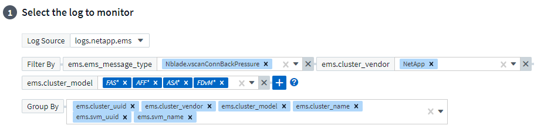

This change brings Metric Monitors and Log Monitors into feature parity by normalizing the “Group By” aspect of Monitor Definitions. This parity will allow customers to clone/duplicate *all* system-defined default Monitors for further customization.

==== Duplicating
You can now clone (duplicate) the Change Log, Kubernetes Log, and Data Collector Log monitors. This creates a new custom log monitor that you can modify to your specific definitions.

image:Log_Monitor_Duplicate.png[Duplicating a Log Monitor]

=== 11 New Default ONTAP Monitors covering SnapMirror for Business Continuity 

We've added almost a dozen new link:task_system_monitors.html#snapmirror-for-business-continuity-smbc-mediator-log-monitors[system monitors] for SnapMirror for Business Continuity (SMBC), which alert on changes to SMBC certificates and ONTAP Mediators.

'''

== November 2022

=== More than 40 new Security, Data Collection, and CVO monitors!

We've added dozens of new system-defined monitors to alert you to potential issues with Cloud Volumes, Security, and Data Protection. Read more about these monitors link:task_system_monitors.html#security-monitors[here].

'''

== October 2022

=== Better and more accurate Ransomware detection with ONTAP Autonomous Ransomware Protection integration

Cloud Secure improves ransomware detection through integration with ONTAP link:concept_cs_integration_with_ontap_arp.html[Autonomous Ransomware Protection] (ARP). 

Cloud Secure receives ONTAP ARP events on potential volume file encryption activity, and

•	Correlates volume encryption events with user activity to identify who is causing the damage,
•	Implements automatic response policies to block the attack, 
•	Identifies which files were affected, helping to recover faster and conduct data breach investigations.

'''

== September 2022 

=== Monitors available in Basic Edition

ONTAP link:task_system_monitors.html[Default monitors] now available to use in Cloud Insights Basic Edition. This includes more than 70 infrastructure monitors and 30 workload examples. 

////
Monitors and Alerting is now available in all Cloud Insights Editions, including Basic Edition. Basic Edition is subject to the following:

* You may have up to five custom monitors active at a time. Any monitors beyond five will be created in or moved to _Paused_ state.
* VMDK, Virtual Machine, Host, and DataStore metrics monitors are not supported. If you have monitors created for these metrics, they will be paused and cannot be resumed when downgrading to Basic Edition.
* The following performance metrics are collected for VM, VMDK, and Datastore, for use in dashboards and queries:
** latency
** throughput
** IOPS
////

=== ONTAP Power and StorageGRID dashboards

The dashboard gallery includes a new dashboard for ONTAP Power and Temperature as well as four dashboards for StorageGRID. If your environment is collecting ONTAP power metrics and/or StorageGRID data, import these dashboards by selecting *+From Gallery*. 

=== At-a-glance threshold visibility in tables 

Conditional Formatting allows you to set and highlight Warning-level and Critical-level thresholds in table widgets, bringing instant visibility to outliers and exceptional data points.

image:ConditionalFormattingExample.png[Conditional Formatting Example]

=== Security Monitor

Cloud Insights can alert you when it detects that FIPS mode is disabled on the ONTAP system. Read more about link:task_system_monitors.html#security-monitors[System Monitors], and watch this space for more Security Monitors, coming soon!

=== Chat from Anywhere

Chat with a NetApp Support specialist from any Cloud Insights screen by selecting the new *Help > Live Chat* link. Help is available from the "?" icon in the upper right of the screen.

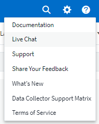

=== More visible Insights

If your environment is experiencing an link:insights_overview.html[Insight] such as _Shared resources Under Stress_ or _Kubernetes Namespaces Running Out of Space_, asset landing pages for resources affected now include links to the Insight itself, providing quicker exploration and troubleshooting. 

=== New Data Collectors

* Amazon S3 (available in Preview)
* Brocade FOS 9.0.x
* Dell/EMC PowerStore 3.0.0.0 

=== Other Data Collector Updates

All data sources are now optimized to resume performance polling after Acquisition Unit updates and/or patches.

=== Operating System support

The following operating systems are supported with Cloud Insights Acquisition Units, in addition to those link:https://docs.netapp.com/us-en/cloudinsights/concept_acquisition_unit_requirements.html[already supported]:

* Red Hat Enterprise Linux 8.5, 8.6

'''

== August 2022

=== Cloud Insights has a new look!

Starting this month, "Monitor and Optimize" has been renamed *Observability*. You'll find all your favorite features like Dashboards, Queries, Alerts, and Reporting here. In addition, look for Cloud Secure under the new *Security* menu. Note that only the menus have changed; feature functionality remains the same.

[.thumb]
image:New_CI_Menu_2022.png[New CI Menu]

Looking for the *Help* menu?  

Help now lives in the upper right of the screen.

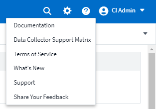

=== Not sure where to start? Check out ONTAP Essentials!

link:concept_ontap_essentials.html[*ONTAP Essentials*] is a set of dashboards and workflows that provide detailed views into your NetApp ONTAP inventories, workloads, and data protection, including days-to-full predictions for storage capacity and performance. You can even see if any controllers are running at high utilization. ONTAP Essentials is your ideal place for all of your NetApp ONTAP monitoring needs! 

ONTAP Essentials--available in all Editions--is designed to be intuitive to existing ONTAP operators and administrators, easing the transition from ActiveIQ Unified Manager to service-based management tools. 

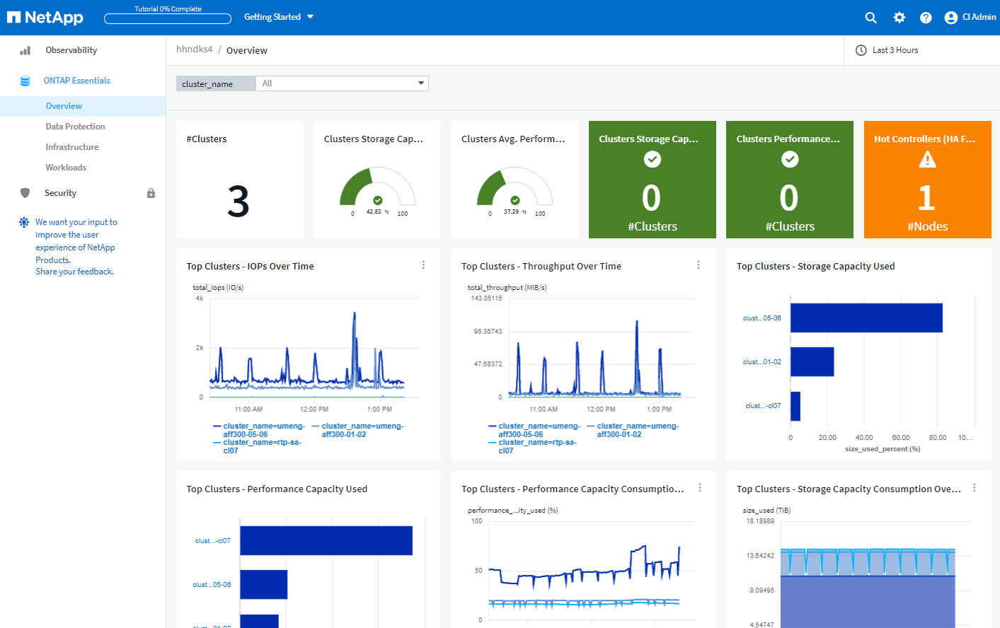

=== Storage Data families are merged

You asked for it, and now you've got it. Storage base-2 and base-10 data units are now combined into one family, from bits and bytes to tebibits and terabytes, making it easier to display data your way on your dashboards. Data Rates are also now one big family of their own. 

image:DataFamilyMerged.png[drop-dow showing merge of base-2 and base-10 data families]

=== How much power is my storage using?

Display and monitor your ONTAP storage shelf and node power consumption, temperature, and fan speed, using the netapp_ontap.storage_shelf, netapp_ontap.system_node and  netapp_ontap.cluster (power consumption only) metrics.

image:ONTAP_Power_Metrics_1.png[Storage Power Consumption metrics]

=== Features graduated from Preview

The following features have moved out of Preview and are now available to all customers:

|===

|*Feature* |*Description*

|Kubernetes Namespaces Running out of Space
|The _Kubernetes Namespaces Running Out of Space_ Insight gives you a view into workloads on your Kubernetes namespaces that are at risk of running out of space, with an estimate for the number of days remaining before each space becomes full. 
link:https://docs.netapp.com/us-en/cloudinsights/insights_k8s_namespaces_running_out_of_space.html[Read More]

|Shared Resource Under Stress
|The _Shared Resource Under Stress_ insight uses AI/ML to automatically identify where resource contention is causing performance degradation in your environment, highlights any workloads impacted by it, and provides recommended actions to remediate, letting you solve performance issues more quickly.
link:https://docs.netapp.com/us-en/cloudinsights/insights_shared_resources_under_stress.html[Read More]

|Cloud Secure – Block user access on attack
|Greater protection for your business-critical data with the ability to block user access when an attack is detected. 
Access can be blocked automatically, using Automated Response Policies, or manually from the alert or user details pages.
link:https://docs.netapp.com/us-en/cloudinsights/cs_automated_response_policies.html[Read More]

|===

=== How's my data collection health?

Cloud Insights provides two new heartbeat monitors for your Acquisition Units, as well as two monitors to alert you to data collector failures. These can be used to alert you quickly to data collection issues.

The following monitors are now available in the _Data Collection_ monitor group:

* Acquisition Unit Heartbeat-Critical
* Acquisition Unit Heartbeat-Warning
* Collector Failed
* Collector Warning

Note that these monitors are in _Paused_ state by default. Activate them to be alerted about data collection issues.

=== Auto-Renewing API Tokens

API Access Tokens can now be set for auto-renewal. By enabling this feature, new/refreshed API Access Tokens will automatically be generated for expiring tokens. Cloud Insights agents using an expiring token will automatically be updated to use the corresponding new/refreshed API Access Token, allowing them to continue to operate seamlessly. Simply check the “Renew token automatically” box when creating your token. This feature is currently supported on Cloud Insights agents running on the Kubernetes platform with the latest NetApp Kubernetes Monitoring Operator. 

=== Basic Edition gives you more than before

Your trial is ending but you're not yet sure whether a subscription is right for you? Basic Edition has always given you a chance to continue using Cloud Insights with your current ONTAP data collector, but now you can continue capturing VMWare version, topology, and IOPS/Throughput/Latency data as well. NetApp customers with premium support on their storage systems will also be entitled to support for Cloud Insights.

=== Ready to learn more?

Check out the *Learning Center* section of the Help > Support page for links to NetApp University Cloud Insights course offerings!

=== Operating System support

The following operating system is supported with Cloud Insights Acquisition Units, in addition to those link:https://docs.netapp.com/us-en/cloudinsights/concept_acquisition_unit_requirements.html[already supported]:

* Windows 11

'''

== June 2022

=== Kubernetes cluster saturation and other details

Cloud Insights makes it easier than ever to explore your Kubernetes environment, with an improved cluster detail page that provides Saturation details as well as a cleaner view into Namespaces and Workloads. 

image:Kubernetes_Detail_Page_new.png[Cluster detail page]

The Cluster list page also gives you a quick view of saturation, in addition to Node, Pod, Namespace, and Workload counts:

image:Kubernetes_List_Page_new.png[Cluster list page showing saturation numbers]

=== How old is your Kubernetes cluster?

Is your cluster just starting in the world, or has it experienced a long digital life? _Age_ has been added as a time metric collected for Kubernetes Nodes. 

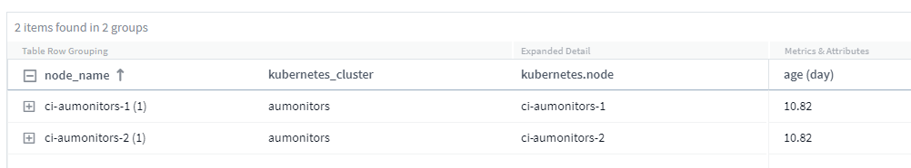

=== Capacity Time-to-Full forecasting	

Cloud Insights provides a dashboard to forecast the number of days until capacity runs out for each Internal Volume monitored. These values can help to significantly reduce the risk of an outage. 

image:Internal Volume - Time to Full dashboard example.png[Internal Volume TTF forecasting dashboard]

TTF counters are also available for Storage, Storage Pool, and Volume. Keep watching this space for additional dashboards for these objects. 

Note that Time-to-Full forecasting is moving out of _Preview_ and will be rolled out to all customers.

=== What's changed in my environment?

ONTAP change log entries can be viewed in the log explorer.

image:ChangeLogEntries.png[image showing change log entry examples]

=== Operating System support

The following operating systems are supported with Cloud Insights Acquisition Units, in addition to those link:https://docs.netapp.com/us-en/cloudinsights/concept_acquisition_unit_requirements.html[already supported]:

* CentOS Stream 9
* Windows 2022

=== Updated Telegraf Agent

The agent for ingestion of telegraf integration data has been updated to version *1.22.3*, with performance and security improvements.
Users wishing to update can refer to the appropriate upgrade section of the link:task_config_telegraf_agent.html[Agent Installation] documentation.
Previous versions of the agent will continue to function with no user action required.

=== Preview Features

Cloud Insights regularly highlights a number of exciting new preview features. If you are interested in previewing one or more of these features, contact your link:https://www.netapp.com/us/forms/sales-inquiry/cloud-insights-sales-inquiries.aspx[NetApp Sales Team] for more information.

|===

|*Feature* |*Description*

|Kubernetes Namespaces Running out of Space
|The _Kubernetes Namespaces Running Out of Space_ Insight gives you a view into workloads on your Kubernetes namespaces that are at risk of running out of space, with an estimate for the number of days remaining before each space becomes full. 
link:https://docs.netapp.com/us-en/cloudinsights/insights_k8s_namespaces_running_out_of_space.html[Read More]

|Cloud Secure – block user access on attack
|Greater protection for your business-critical data with the ability to block user access when an attack is detected. 
Access can be blocked automatically, using Automated Response Policies or manually from the alert or user details pages.
link:https://docs.netapp.com/us-en/cloudinsights/cs_automated_response_policies.html[Read More]

|Shared Resource Under Stress
|The _Shared Resource Under Stress_ insight uses AI/ML to automatically identify where resource contention is causing performance degradation in your environment, highlights any workloads impacted by it, and provides recommended actions to remediate, letting you solve performance issues more quickly.
link:https://docs.netapp.com/us-en/cloudinsights/insights_shared_resources_under_stress.html[Read More]

|===

'''

== May 2022

=== Chat live with NetApp Support

You can now chat live with NetApp Support personnel!  On the Help > Support page, simply click the Chat icon or click _Chat_ in the "Contact Us" section to start a chat session. Chat support is available US weekdays for Standard and Premium Edition users.

image:ChatIcon.png[Chat Icon showing the blue NetApp "N" above a smile]

=== Kubernetes Operator 

We’ve made it easier to get you up and running with Cloud Insights’ advanced Kubernetes monitoring and cluster explorer.

The link:task_config_telegraf_agent_k8s.html[Kubernetes Monitoring Operator] (NKMO) is the preferred method for installing Kubernetes for Cloud Insights Insights, for more flexible configuration of monitoring in fewer steps, as well as enhanced opportunities for monitoring other software running in the K8s cluster.

Click the link above for more information and pre-requisites

=== Manage Users and Invites with API

You can now manage users and invites using Cloud Insights' powerful API. Read more in the link:https://docs.netapp.com/us-en/cloudinsights/API_Overview.html[API Swagger Documentation].

=== Data Collection Alerts

Don’t miss out on critical metrics due to a failed collector!

It’s easier than ever to keep track of your data collectors with new link:task_system_monitors.html#data-collection-monitors[alerts] for data collector and acquisition unit failures.
Note that these Monitors are _Paused_ by default. To enable, navigate to your monitors page and locate and resume “Acquisition Unit Shutdown” and “Collector Failed” 

=== Alert on ONTAP storage changes

Don’t let unexpected storage changes lead to outages!

You can now configure Cloud Insights to alert when modification or removal of FlexVols, nodes and SVMs are detected on ONTAP systems.

//Find out how <here>

=== Preview Features

Cloud Insights regularly highlights a number of exciting new preview features. If you are interested in previewing one or more of these features, contact your link:https://www.netapp.com/us/forms/sales-inquiry/cloud-insights-sales-inquiries.aspx[NetApp Sales Team] for more information.

|===

|*Feature* |*Description*

|Kubernetes Namespaces Running out of Space
|The _Kubernetes Namespaces Running Out of Space_ Insight gives you a view into workloads on your Kubernetes namespaces that are at risk of running out of space, with an estimate for the number of days remaining before each space becomes full. 
link:https://docs.netapp.com/us-en/cloudinsights/insights_k8s_namespaces_running_out_of_space.html[Read More]

|Internal Volume and Volume Capacity Time-to-Full forecasting	
|Cloud Insights is able to prognose the number of days until capacity runs out for each Internal Volume and Volume monitored. This value can help to significantly reduce the risk of an outage. 

|Cloud Secure – block user access on attack
|Greater protection for your business-critical data with the ability to block user access when an attack is detected. 
Access can be blocked automatically, using Automated Response Policies or manually from the alert or user details pages.
link:https://docs.netapp.com/us-en/cloudinsights/cs_automated_response_policies.html[Read More]

|Shared Resource Under Stress
|The _Shared Resource Under Stress_ insight uses AI/ML to automatically identify where resource contention is causing performance degradation in your environment, highlights any workloads impacted by it, and provides recommended actions to remediate, letting you solve performance issues more quickly.
link:https://docs.netapp.com/us-en/cloudinsights/insights_shared_resources_under_stress.html[Read More]

|===

'''

== April 2022

=== Share your Feedback!

We want your input to help shape Cloud Insights. Earn points and prizes by participating in NetApp's *Insights to Action* program. link:https://netapp.co1.qualtrics.com/jfe/form/SV_2aVWcE58J7oIDs1[*Sign up now*]! 

=== Updated Dashboard Editor

We’ve overhauled our dashboard creation tools to make it easier for you to visualize your data even more quickly. Navigate to the “Dashboards” page of Cloud Insights to edit an existing dashboard, add one from our dashboard gallery, or create a new dashboard of your own to check it out.

image:DashboardWidgetEditorScreen.png[Widget Editor Improved Layout]

A new Count aggregation method has also been introduced.  When grouping data in bar chart, column chart, and pie chart widgets, you can quickly and easily show the number of relevant objects for the selected metric.

image:CountAggregationExample1.png[aggregation drop-down showing Count]

Additionally, line charts now allow you to select one of three link:concept_dashboard_features.html#line-chart-interpolation[interpolation] methods:

* None - No interpolation is done
* Linear - Interpolates a data point between the existing points
* Stair - Uses the previous data point as the interpolated data point

=== Enhanced Monitoring for Your Kubernetes Infrastructure

Cloud Insights keeps you on top of changes in your Kubernetes environment by alerting you when pods, daemonsets, and replicasets are created or removed, as well as when new deployments are created. Kubernetes monitors default to _paused_ state, so you should enable only the specific ones you need.

=== Preview Features

Cloud Insights regularly highlights a number of exciting new preview features. If you are interested in previewing one or more of these features, contact your link:https://www.netapp.com/us/forms/sales-inquiry/cloud-insights-sales-inquiries.aspx[NetApp Sales Team] for more information.

|===

|*Feature* |*Description*

|Internal Volume and Volume Capacity Time-to-Full forecasting	
|Cloud Insights is able to prognose the number of days until capacity runs out for each Internal Volume and Volume monitored. This value can help to significantly reduce the risk of an outage. 

|Cloud Secure – block user access on attack
|Greater protection for your business-critical data with the ability to block user access when an attack is detected. 
Access can be blocked automatically, using Automated Response Policies or manually from the alert or user details pages.
link:https://docs.netapp.com/us-en/cloudinsights/cs_automated_response_policies.html[Read More]

|Shared Resource Under Stress
|The Shared Resource Under Stress insight uses AI/ML to automatically identify where resource contention is causing performance degradation in your environment, highlights any workloads impacted by it, and provides recommended actions to remediate, letting you solve performance issues more quickly.
link:https://docs.netapp.com/us-en/cloudinsights/insights_shared_resources_under_stress.html[Read More]

|===

=== New Data Collector
 
* *Cohesity SmartFiles* - This REST API-based collector will acquire a Cohesity cluster, discovering the “Views” (as CI Internal Volumes), the various nodes, as well as collecting performance metrics. 
 
 
=== Other Data Collector Updates
 
Collection and display of performance data has been improved on the following data collectors:
 
•	Brocade CLI
•	Dell/EMC VPlex, PowerStore, Isilon/PowerScale, VNX Block/Clariion CLI, XtremIO, Unity/VNXe
•	Pure FlashArray 
 
These performance enhancements are already available in all NetApp data collectors as well as VMware and Cisco, and will be rolled out to all other data collectors over the next few months.

'''

== March 2022

=== Cloud Connection for ONTAP 9.9+ 

The link:task_dc_na_cloud_connection.html[NetApp Cloud Connection for ONTAP 9.9+] data collector eliminates the need to install an external acquisition unit, thereby simplifying troubleshooting, maintenance, and initial deployment. 

=== New FSx for NetApp ONTAP Monitors

Monitoring your FSx for NetApp ONTAP environment is easy with new link:task_system_monitors.html[system-defined monitors] for both infrastructure (metrics) and workloads (logs).

image:FSx_System_Monitors_Metrics.png[FSx monitors for infrastructure] 
image:FSx_System_Monitors_Workloads.png[FSx monitors for workloads]

=== New Cloud Secure features available to all

Your environment is more secure than ever with the following Cloud Secure features now generally available:

|===

|*Feature* |*Description*

|Data Destruction – File Deletion attack detection
|Detect abnormal large-scale file deletion activity, block malicious file access by malicious users, and take automatic snapshots with automatic response policies.

|Separate notifications for Warnings and Alerts
|Warning and Alert notifications can be sent to separate recipients, ensuring the right team can stay informed

|===

=== Updated Telegraf Agent

The agent for ingestion of telegraf integration data has been updated to version *1.21.2*, with performance and security improvements.
Users wishing to update can refer to the appropriate upgrade section of the link:task_config_telegraf_agent.html[Agent Installation] documentation.
Previous versions of the agent will continue to function with no user action required.

=== Data Collector Updates

* The Broadcom Fibre Channel Switches data collector has been optimized to reduce the number of CLI commands issued with each inventory poll.

'''

== February 2022

=== Cloud Insights addresses Apache Log4j vulnerabilities

Customer security is a top priority at NetApp. Cloud Insights includes updates to its software libraries to address the recent Apache Log4j vulnerabilities.

Please refer to the following on NetApp’s Product Security Advisory website:

link:https://security.netapp.com/advisory/ntap-20211210-0007/[CVE-2021-44228]
link:https://security.netapp.com/advisory/ntap-20211215-0001/[CVE-2021-45046]
link:https://security.netapp.com/advisory/ntap-20211218-0001/[CVE-2021-45105]

You can read more about these vulnerabilities and NetApp's response at the link:https://www.netapp.com/newsroom/netapp-apache-log4j-response/[NetApp Newsroom].

=== Kubernetes Namespace Detail Page
 
Exploring your Kubernetes environment is now better than ever, with informative detail pages for your cluster’s namespaces. The namespace detail page provides a summary of all the assets used by a namespace, including all the backend storage resources and their capacity utilizations.

image:Kubernetes_Namespace_Detail_Example_2.png[Kubernetes Namespace Detail Page]

'''

== December 2021

=== Deeper integration for ONTAP systems

Simplify alerting for ONTAP hardware failures and more with new integration with NetApp Event Management System (EMS).
link:task_system_monitors.html[Explore and alert] on low-level ONTAP messages in Cloud Insights to inform and improve troubleshooting workflows and further reduce reliance on ONTAP element management tooling.

=== Querying Logs

For ONTAP systems, Cloud Insights Queries include a powerful link:concept_log_explorer.html[Log Explorer], allowing you to easily investigate and troubleshoot EMS log entries. 

image:LogQueryExplorer.png[Log Queries]

=== Data Collector-level notifications.

In addition to system-defined and custom-created Monitors for alerting, you can also set alert notifications for ONTAP data collectors, allowing you to specify recipients for collector-level alerts, independent of other monitor alerts.

=== Greater flexibility of Cloud Secure roles

Users can be granted access to Cloud Secure features based on link:concept_user_roles.html#permission-levels[roles] set by an administrator:

|===
|Role	|Cloud Secure	Access
|Administrator	
|Can perform all Cloud Secure functions, including those for Alerts, Forensics, data collectors, automated response policies, and APIs for Cloud Secure.
An Administrator can also invite other users but can only assign Cloud Secure roles.
|User	
|Can view and manage Alerts and view Forensics. User role can change alert status, add a note, take snapshots manually, and block user access.
|Guest	
|Can view Alerts and Forensics. Guest role cannot change alert status, add a note, take snapshots manually, or block user access.

|===

=== Operating System support

CentOS 8.x support is being replaced with *CentOS 8 Stream* support. CentOS 8.x will reach End-of-Life on December 31, 2021.

=== Data Collector Updates

A number of Cloud Insights data collector names have been added to reflect vendor changes:

|===
|Vendor/Model|Previous Name
|Dell EMC PowerScale|Isilon
|HPE Alletra 9000 / Primera|3PAR
|HPE Alletra 6000|Nimble
|===

'''

== November 2021

=== Adaptive Dashboards

_New variables for attributes and the ability to use variables in widgets_.

Dashboards are now more powerful and flexible than ever. Build adaptive dashboards with attribute variables to quickly filter dashboards on the fly. Using these and other pre-existing link:concept_dashboard_features.html#variables[variables] you can now create one high level dashboard to see metrics for your entire environment, and seamlessly filter down by resource name, type, location, and more. Use number variables in widgets to associate raw metrics with costs, for example cost per GB for storage as a service. 

image:Variables_Drop_Down_Showing_Annotations.png[Drop-Down annotations in a variable]
image:Variables_Attribute_Filtering.png[attribute filtering in a variable]

=== Access the Reporting Database via API

Enhanced capabilities for integration with third party reporting, ITSM, and automation tools: Cloud Insights' powerful link:API_Overview.html[API] allows users to query the Cloud Insights Reporting database directly, without going through the Cognos Reporting environment.

=== Pod tables on VM Landing Page

Seamless navigation between VMs and the Kubernetes Pods using them: for improved troubleshooting and performance headroom management, a table of associated Kubernetes Pods will now appear on VM landing pages.

image:Kubernetes_Pod_Table_on_VM_Page.png[Kubernetes Pod table on a VM landing page]

=== Data Collector Updates

* ECS now reports firmware for storage and node
* Isilon has improved prompt detection
* Azure NetApp Files collects performance data more quickly
* StorageGRID now supports Single Sign-On (SSO)
* Brocade CLI properly reports model for X&-4

=== Additional Operating Systems supported

The Cloud Insights Acquisition Unit supports the following operating systems, in addition to those already supported:

* Centos (64-bit) 8.4
* Oracle Enterprise Linux (64-bit) 8.4
* Red Hat Enterprise Linux (64-bit) 8.4

'''

== October 2021

=== Filters on K8S Explorer pages

link:kubernetes_landing_page.html[Kubernetes Explorer] page filters give you focused control of the data displayed for your Kubernetes cluster, node, and pod exploration. 

image:Filter_Kubernetes_Explorer.png[Kubernetes Explorer filtering example]

=== K8s Data for Reporting

Kubernetes data is now available for use in Reporting, allowing you to create chargeback or other reports. In order for Kubernetes chargeback data to be passed to Reporting, you must have an active connection to, and Cloud Insights must be receiving data from, your Kubernetes cluster as well as its back-end storage. If there is no data received from the back-end storage, Cloud Insights can not send Kubernetes object data to Reporting.

image:Kubernetes_ETL_Example.png[Kubernetes data showin in a chargeback report]

=== Dark Theme has arrived

Many of you asked for a dark theme, and Cloud Insights has answered. To switch between light and dark theme, click the drop-down next to your user name. 
image:DarkModeSwitch.png[Switch to Dark Theme is available in the User drop-down]
image:DarkModeDashboard.png[An image of a typical dashboard shown in dark theme]
 

=== Data Collector Support

We’ve made some improvements in Cloud Insights Data Collectors. Here are some highlights:

* New collector for Amazon FSx for ONTAP

'''

== September 2021

=== Performance Policies are now Monitors

Monitors and Alerts have supplanted Performance Policies and Violations throughout Cloud Insights. link:task_create_monitor.html[Alerting with Monitors] provides greater flexibility and insight into potential problems or trends in your environment.

////
=== Support and protection for Amazon FSx for NetApp ONTAP 

Rolling out starting in September, Cloud Insights will support data collection and ransomware protection for NetApp’s *Amazon FSx for NetApp ONTAP* environment.  

Contact your sales representative for information on this new feature. 
////

=== Autocomplete Suggestions, Wildcards, and Expressions in Monitors

When creating a monitor for alerting, typing in a filter is now predictive, allowing you to easily search for and find the metrics or attributes for your monitor. Additionally, you are given the option to create a wildcard filter based on the text you type. 

image:Type-Ahead_Monitor_1.png[Type-ahead filters in Monitors]
 

=== Updated Telegraf Agent

The agent for ingestion of telegraf integration data has been updated to version *1.19.3*, with performance and security improvements.
Users wishing to update can refer to the appropriate upgrade section of the link:task_config_telegraf_agent.html[Agent Installation] documentation.
Previous versions of the agent will continue to function with no user action required.

=== Data Collector Support

We’ve made some improvements in Cloud Insights Data Collectors. Here are some highlights:

* Microsoft Hyper-V collector now uses PowerShell instead of WMI
* Azure VMs and VHD collector is now up to 10 times faster due to parallel calls
* HPE Nimble now supports federated and iSCSI configurations

And since we’re always improving Data Collection, here are some other recent changes of note: 

* New collector for EMC Powerstore 
* New collector for Hitachi Ops Center 
* New collector for Hitachi Content Platform 
* Enhanced ONTAP collector to report Fabric Pools 
* Enhanced ANF with Storage Pool and Volume performance 
* Enhanced EMC ECS with Storage Nodes and Storage performance as well as the Object Count in buckets 
* Enhanced EMC Isilon with Storage Node and Qtree metrics 
* Enhanced EMC Symetrix with volume QOS limit metrics 
* Enhanced IBM SVC and EMC PowerStore with Storage Nodes parent serial number 

////
=== Documentation Updates 
The following additional improvements are reflected in the documentation 
•	Page variables 
•	Change GB/MB to GiB/MiB 
////

'''

== August 2021

=== New Audit Page User Interface

The link:concept_audit.html[Audit page] provides a cleaner interface and now allows the export of audit events to .CSV file.

=== Enhanced User Role Management 

Cloud Insights now allows even greater freedom for assigning user roles and access controls. Users can now be assigned granular permissions for monitoring, reporting, and Cloud Secure separately.  

This means you can allow more users administrative access to monitoring, optimization, and reporting functions whilst restricting access to your sensitive Cloud Secure audit and activity data to only those that need it. 

link:https://docs.netapp.com/us-en/cloudinsights/concept_user_roles.html[Find out more] about the different levels of access in the Cloud Insights documentation. 

'''

== June 2021

=== Autocomplete Suggestions, Wildcards, and Expressions in Filters

With this release of Cloud Insights, you no longer need to know all the possible names and values on which to filter in a query or widget. When filtering, you can simply start typing and Cloud insights will suggest values based on your text. No more looking up Application names or Kubernetes attributes ahead of time just to find the ones you want to show in your widget.

As you type in a filter, the filter displays a smart list of results from which you can choose, as well as the option to create a *wildcard filter* based on the current text. Selecting this option will return all results that match the wildcard expression. You can of course also select multiple individual values that you want added to the filter.

image:Type-Ahead-Example-ingest.png[Wildcard Filter]

Additionally, you can create *expressions* in a filter using NOT or OR, or you can select the "None" option to filter for null values in the field. 

Read more about link:task_create_query.html#more-on-filtering[filtering options] in queries and widgets.

=== APIs available by Edition

Cloud Insights' powerful APIs are more accessible than ever, with Alerts APIs now available in Standard and Premium Editions.  
The following APIs are available for each Edition:

[cols="<,^s,^s,^s"]
|===
|API Category|Basic|Standard|Premium

|Acquisition Unit|image:SmallCheckMark.png[check mark]|image:SmallCheckMark.png[check mark]|image:SmallCheckMark.png[check mark]
|Data Collection|image:SmallCheckMark.png[check mark]|image:SmallCheckMark.png[check mark]|image:SmallCheckMark.png[check mark]
|Alerts| |image:SmallCheckMark.png[check mark]|image:SmallCheckMark.png[check mark]
|Assets| |image:SmallCheckMark.png[check mark]|image:SmallCheckMark.png[check mark]
|Data Ingestion| |image:SmallCheckMark.png[check mark]|image:SmallCheckMark.png[check mark]
|===

//|Data Warehouse| | |image:SmallCheckMark.png[check mark]

=== Kubernetes PV and Pod Visibility

Cloud Insights provides visibility into the back-end storage for your Kubernetes environments, giving you insight to your Kubernetes Pods and Persistent Volumes (PVs). You can now track PV counters such as IOPS, latency, and throughput from a single Pod’s usage through a PV counter to a PV and all the way to the back-end storage device. 

On a Volume or Internal Volume landing page, two new tables are displayed:

image:Kubernetes_PV_Table.png[Kubernetes PV Table]
image:Kubernetes_Pod_Table.png[Kubernetes Pod Table]

Note that to take advantage of these new tables, it is recommended to uninstall your current Kubernetes agent, and install it fresh. You must also install Kube-State-Metrics version 2.1.0 or later.

=== Kubernetes Node to VM links

On a Kubernetes Node page, you can now click to open the Node's VM page. The VM page also includes a link back to the Node itself.

image:Kubernetes_Node_Page_with_VM_Link.png[Kubernetes Node Page showing VM link]
image:Kubernetes_VM_Page_with_Node_Link.png[Kubernetes VM Page showing Node link]

=== Alert Monitors replacing Performance Policies

To enable the added benefits of multiple thresholds, webhook and email alert delivery, alerting on all metrics using a single interface, and more, Cloud Insights will be converting Standard and Premium Edition customers from *Performance Policies* to *Monitors* during the months of July and August, 2021. Learn more about link:https://docs.netapp.com/us-en/cloudinsights/task_create_monitor.html[Alerts and Monitors], and stay tuned for this exciting change.

//Some of the new and exciting things we've been working on:

////
=== ONTAP System Monitors

Cloud Insights now includes the following ONTAP monitors, in the noted monitor groups:

•	*ONTAP Infrastructure* includes monitors for infrastructure-related issues in ONTAP clusters. 
•	*ONTAP Workload Examples* includes monitors for workload-related issues. 

image:Monitors_Custom_System.png[Syetem Monitor Groups]

See the link:task_create_monitor.html[Monitors] documentation for a list of the dashboards included in each group.
////

=== Cloud Secure supports NFS

Cloud Secure now supports NFS for ONTAP data collection. Monitor SMB and NFS user access to protect your data from ransomware attacks. 
Additionally, Cloud Secure supports Active-Directory and LDAP user directories for collection of NFS user attributes.

=== Cloud Secure snapshot purge  

Cloud Secure automatically deletes snapshots based on the Snapshot Purge Settings, to save storage space and reduce the need for manual snapshot deletion.

image:CloudSecure_SnapshotPurgeSettings.png[Purge Settings]

=== Cloud Secure data collection speed

A single data collector agent system can now post up to 20,000 events per second to Cloud Secure.

'''

== May 2021

Here are some of the changes we've made in April:

=== Updated Telegraf Agent

The agent for ingestion of telegraf integration data has been updated to version 1.17.3, with performance and security improvements.
Users wishing to update can refer to the appropriate upgrade section of the link:https://docs.netapp.com/us-en/cloudinsights/task_config_telegraf_agent.html[Agent Installation] documentation.
Previous versions of the agent will continue to function with no user action required.

=== Add Corrective Actions to an Alert

You can now add an optional description as well as additional insights and/or corrective actions when creating or modifying a Monitor by filling in the *Add an Alert Description* section. The description will be sent with the alert. The _insights and corrective actions_ field can provide detailed steps and guidance for dealing with alerts and will be displayed in the summary section of the alert landing page.

image:Monitors_Alert_Description.png[Alert Corrective Actions and Description]

=== Cloud Insights APIs for All Editions

API access is now available in all editions of Cloud Insights.
Users of Basic edition can now automate actions for Acquisition Units and Data Collectors, and Standard Edition users can query metrics and ingest custom metrics.
Premium edition continues to allow full use of all API categories.

[cols="<,^s,^s,^s"]
|===
|API Category|Basic|Standard|Premium

|Acquisition Unit|image:SmallCheckMark.png[check mark]|image:SmallCheckMark.png[check mark]|image:SmallCheckMark.png[check mark]
|Data Collection|image:SmallCheckMark.png[check mark]|image:SmallCheckMark.png[check mark]|image:SmallCheckMark.png[check mark]
//|Alerts| |image:SmallCheckMark.png[check mark]|image:SmallCheckMark.png[check mark]
|Assets| |image:SmallCheckMark.png[check mark]|image:SmallCheckMark.png[check mark]
|Data Ingestion| |image:SmallCheckMark.png[check mark]|image:SmallCheckMark.png[check mark]
|Data Warehouse| | |image:SmallCheckMark.png[check mark]

|===

For details on API usage, please refer to the link:API_Overview.html#api-documentation-swagger[API documentation]. 

'''

== April 2021

=== Easier Management of Monitors

link:task_create_monitor.html#monitor-groups[Monitor Grouping] simplifies the management of monitors in your environment. Multiple monitors can now be grouped together and paused as one. For example, if you have an update occurring on a stack of infrastructure, you can pause alerts from all those devices via one click.

Monitor groups is the first part of an exciting new feature bringing improved management of ONTAP devices to Cloud Insights.

image:Monitors_GroupList.png[Monitor Grouping]

=== Enhanced Alerting Options Using Webhooks

Many commercial applications support link:task_create_webhook.html[Webhooks] as a standard input interface. Cloud Insights now supports many of these delivery channels, providing default templates for Slack, PagerDuty, Teams, and Discord, in addition to providing customizable generic webhooks to support many other applications.

image:Webhooks_Notifications_sm.png[Webhooks Notifications]

=== Improved Device Identification

To improve monitoring and troubleshooting as well as deliver accurate reporting, it is helpful to understand the names of devices rather than their IP addresses or other identifiers. Cloud Insights now incorporates an automatic way to identify the names of storage and physical host devices in the environment, using a rule-based approach called link:concept_device_resolution_overview.html[*Device Resolution*], available in the *Manage* menu.

=== You asked for more!

A popular ask by customers has been for more default options for visualizing the range of data, so we have added the following five new choices that are now available throughout the service via the time range picker:

* Last 30 Minutes
* Last 2 Hours
* Last 6 Hours
* Last 12 Hours
* Last 2 Days

=== Multiple Subscriptions in one Cloud Insights Environment

Starting April 2, Cloud Insights supports multiple subscriptions of the same edition type for a customer in a single Cloud Insights instance. This enables customers to co-term parts of their Cloud Insights subscription with infrastructure purchases. Contact NetApp Sales for assistance with multiple subscriptions.

=== Choose Your Path

While setting up Cloud Insights, you can now choose whether to start with Monitoring and Alerting or Ransomware and Insider Threat Detection. Cloud Insights will configure your starting environment based on the path you choose. You can configure the other path at any time afterward. 
 
=== Easier Cloud Secure Onboarding 
And it is easier than ever to start using Cloud Secure, with a new step-by-step setup checklist. 

image:CloudSecure_SetupChecklist.png[Cloud Secure Checklist]

As always, we love to hear your suggestions! Send them to ng-cloudinsights-customerfeedback@netapp.com.
 
////
== April 2021

=== Cloud Secure supports NFS

Cloud Secure now supports NFS event collection from ONTAP devices, which means ransomware attacks are detected on NFS in addition to SMB.
////

'''

== February 2021

=== Updated Telegraf Agent

The agent for ingestion of telegraf integration data has been updated to version 1.17.0, which includes vulnerability and bug fixes.

=== Cloud Cost Analyzer

Experience the power of Spot by NetApp with Cloud Cost, which provides a detailed cost analysis of past, present, and estimated spending, providing visibility into cloud usage in your environment. The Cloud Cost dashboard delivers a clear view of cloud expenses and a drill down into individual workloads, accounts, and services.

Cloud Cost can help with these major challenges:

* Tracking and monitoring your cloud expenses

* Identifying waste and potential optimization areas

* Delivering executable action items

Cloud Cost is focused on monitoring. Upgrade to the full Spot by NetApp account to enable automatic cost saving and environment optimization.

=== Querying for objects having null values using filters

Cloud Insights now allows searching for attributes and metrics having null/none values through the use of filters. You can perform this filtering on any attributes/metrics in the following places:

* On the Query page
* In Dashboard widgets and page variables
* On the Alerts list page
* When creating Monitors

To filter for null/none values, simply select the _None_ option when it appears in the appropriate filter drop-down.

image:Filter_Null_Example.png[Null filter in dropdown]

=== Multi-Region Support

Starting today we offer the Cloud Insights service in different regions across the globe, which facilitates performance and increases security for customers based outside the United States. Cloud Insights/Cloud Secure stores information according to the region in which your environment is created.  

Click link:http://docs.netapp.com/us-en/cloudinsights/security_information_and_region.html[here] for more information.

////
The following information is stored in the chosen region:

* Telemetry and asset/object information, including counters and performance metrics
* Acquisition Unit information
* Functional data
* Audit information on user activities inside Cloud Insights and Cloud Secure
* Cloud Secure Active Directory information imported via the data collector you configure

The following information resides in the United States, regardless of the region hosting your Cloud Insights environment:

* Environment site (sometimes called "tenant") information such as site/account owner.
* Information that allows NetApp Cloud Central to communicate with regional Cloud Insights sites, including anything to do with user Authorization.
* Information related to the relation between the Cloud Insights user and the tenant.
////

'''

== January 2021

=== Additional ONTAP Metrics Renamed

As part of our continuing effort to improve efficiency of data-gathering from ONTAP systems, the following ONTAP metrics have been renamed. 

If you have existing dashboard widgets or queries using any of these metrics, you will need to edit or re-create them to use the new metric names.

[%header, cols="1,1"]
|===
|Previous Metric Name|New Metric Name
|netapp_ontap.disk_constituent.total_transfers|netapp_ontap.disk_constituent.total_iops
|netapp_ontap.disk.total_transfers|netapp_ontap.disk.total_iops
|netapp_ontap.fcp_lif.read_data|netapp_ontap.fcp_lif.read_throughput
|netapp_ontap.fcp_lif.write_data|netapp_ontap.fcp_lif.write_throughput
|netapp_ontap.iscsi_lif.read_data|netapp_ontap.iscsi_lif.read_throughput
|netapp_ontap.iscsi_lif.write_data|netapp_ontap.iscsi_lif.write_throughput
|netapp_ontap.lif.recv_data|netapp_ontap.lif.recv_throughput
|netapp_ontap.lif.sent_data|netapp_ontap.lif.sent_throughput
|netapp_ontap.lun.read_data|netapp_ontap.lun.read_throughput
|netapp_ontap.lun.write_data|netapp_ontap.lun.write_throughput
|netapp_ontap.nic_common.rx_bytes|netapp_ontap.nic_common.rx_throughput
|netapp_ontap.nic_common.tx_bytes|netapp_ontap.nic_common.tx_throughput
|netapp_ontap.path.read_data|netapp_ontap.path.read_throughput
|netapp_ontap.path.write_data|netapp_ontap.path.write_throughput
|netapp_ontap.path.total_data|netapp_ontap.path.total_throughput
|netapp_ontap.policy_group.read_data|netapp_ontap.policy_group.read_throughput
|netapp_ontap.policy_group.write_data|netapp_ontap.policy_group.write_throughput
|netapp_ontap.policy_group.other_data|netapp_ontap.policy_group.other_throughput
|netapp_ontap.policy_group.total_data|netapp_ontap.policy_group.total_throughput
|netapp_ontap.system_node.disk_data_read|netapp_ontap.system_node.disk_throughput_read
|netapp_ontap.system_node.disk_data_written|netapp_ontap.system_node.disk_throughput_written
|netapp_ontap.system_node.hdd_data_read|netapp_ontap.system_node.hdd_throughput_read
|netapp_ontap.system_node.hdd_data_written|netapp_ontap.system_node.hdd_throughput_written
|netapp_ontap.system_node.ssd_data_read|netapp_ontap.system_node.ssd_throughput_read
|netapp_ontap.system_node.ssd_data_written|netapp_ontap.system_node.ssd_throughput_written
|netapp_ontap.system_node.net_data_recv|netapp_ontap.system_node.net_throughput_recv
|netapp_ontap.system_node.net_data_sent|netapp_ontap.system_node.net_throughput_sent
|netapp_ontap.system_node.fcp_data_recv|netapp_ontap.system_node.fcp_throughput_recv
|netapp_ontap.system_node.fcp_data_sent|netapp_ontap.system_node.fcp_throughput_sent
|netapp_ontap.volume_node.cifs_read_data|netapp_ontap.volume_node.cifs_read_throughput
|netapp_ontap.volume_node.cifs_write_data|netapp_ontap.volume_node.cifs_write_throughput
|netapp_ontap.volume_node.nfs_read_data|netapp_ontap.volume_node.nfs_read_throughput
|netapp_ontap.volume_node.nfs_write_data|netapp_ontap.volume_node.nfs_write_throughput
|netapp_ontap.volume_node.iscsi_read_data|netapp_ontap.volume_node.iscsi_read_throughput
|netapp_ontap.volume_node.iscsi_write_data|netapp_ontap.volume_node.iscsi_write_throughput
|netapp_ontap.volume_node.fcp_read_data|netapp_ontap.volume_node.fcp_read_throughput
|netapp_ontap.volume_node.fcp_write_data|netapp_ontap.volume_node.fcp_write_throughput
|netapp_ontap.volume.read_data|netapp_ontap.volume.read_throughput
|netapp_ontap.volume.write_data|netapp_ontap.volume.write_throughput
|netapp_ontap.workload.read_data|netapp_ontap.workload.read_throughput
|netapp_ontap.workload.write_data|netapp_ontap.workload.write_throughput
|netapp_ontap.workload_volume.read_data|netapp_ontap.workload_volume.read_throughput
|netapp_ontap.workload_volume.write_data|netapp_ontap.workload_volume.write_throughput
|===

=== New Kubernetes Explorer

The link:kubernetes_landing_page.html[Kubernetes Explorer] provides a simple topology view of Kubernetes Clusters, allowing even non-experts to quickly identify issues & dependencies, from the cluster level down to the container and storage.

A wide variety of information can be explored using the Kubernetes Explorer's drill-down details for status, usage, and health of the Clusters, Nodes, Pods, Containers, and Storage in your Kubernetes environment.

image:Kubernetes_Cluster_Detail_Example.png[The Kubernetes Explorer]

'''

== December 2020

=== Simpler Kubernetes Installation

Kubernetes Agent installation has been streamlined to require fewer user interactions. link:task_config_telegraf_agent_k8s.html[Installing the Kubernetes Agent] now includes Kubernetes data collection.

'''

== November 2020

=== Additional Dashboards

The following new ONTAP-focused dashboards have been added to the gallery and are available for import: 

* ONTAP: Aggregate Performance & Capacity
* ONTAP FAS/AFF - Capacity Utilization
* ONTAP FAS/AFF - Cluster Capacity
* ONTAP FAS/AFF - Efficiency
* ONTAP FAS/AFF - FlexVol Performance
* ONTAP FAS/AFF - Node Operational/Optimal Points
* ONTAP FAS/AFF - PrePost Capacity Efficiencies
* ONTAP: Network Port Activity
* ONTAP: Node Protocols Performance
* ONTAP: Node Workload Performance (Frontend)
* ONTAP: Processor
* ONTAP: SVM Workload Performance (Frontend)
* ONTAP: Volume Workload Performance (Frontend)

=== Column Rename in Table Widgets

You can rename columns in the _Metrics and Attributes_ section of a table widget by opening the widget in Edit mode and clicking the menu at the top of the column. Enter the new name and click _Save_, or click _Reset_ to set the column back to the original name.

Note that this only affects the column's display name in the table widget; the metric/attribute name does not change in the underlying data itself.

image:Table_Widget_Column_Rename.png[Table Widget Rename Column]

'''

== October 2020

=== Default Expansion of Integration Data

Table widget grouping now allows for default expansions of Kubernetes, ONTAP Advanced Data, and Agent Node metrics. For example, if you group Kubernetes _Nodes_ by _Cluster_, you will see a row in the table for each cluster. You could then expand each cluster row to see a list of the Node objects.

//CIS-10642

=== Basic Edition Technical Support

Technical Support is now available for subscribers to Cloud Insights Basic Edition in addition to Standard and Premium Editions. Additionally, Cloud Insights has simplified the workflow for creating a NetApp support ticket.

=== Cloud Secure Public API

Cloud Secure supports link:concept_cs_api.html[REST APIs] for accessing Activity and Alert information. This is accomplished through the use of API Access Tokens, created through the Cloud Secure Admin UI, which are then used to access the REST APIs. Swagger documentation for these REST APIs is integrated with Cloud Secure.

'''

== September 2020

=== Query Page with Integration Data

The Cloud Insights Query page supports integration data (i.e. from Kubernetes, ONTAP Advanced Metrics, etc.). When working with integration data, the query results table displays a "Split-Screen" view, with object/grouping on the left side, and object data (attributes/metrics) on the right. You can also choose multiple attributes for grouping integration data. 

image:QueryPageIntegrationData.png[Query showing integration data]

=== Unit Display Formatting in Table Widget

Unit display formatting is now available in Table widgets for columns that display metric/counter data (for example, gigabytes, MB/second, etc.). To change a metric's display unit, click the "three dots" menu in the column header and select "Unit Display". You can choose from any of the available units. Available units will vary according to the type of metric data in the display column.

//image:TableWidgetUnitManagement.png[Table Widget Unit Management]
image:TableWidgetUnitManagement1.png[Table Widget Unit Management]

=== Acquisition Unit Detail Page

Acquisition Units now have their own landing page, providing useful detail for each AU as well as information to help with troubleshooting. The link:task_configure_acquisition_unit.html#viewing-au-details[AU detail page] provides links to the AU's data collectors as well as helpful status information. 

=== Cloud Secure Docker Dependency Removed

Cloud Secure's dependency on Docker has been removed. Docker is no longer required for Cloud Secure agent installation.

=== Reporting User Roles

If you have Cloud Insights Premium Edition with Reporting, every Cloud Insights user in your environment also has a Single Sign-On (SSO) login to the Reporting application (i.e. Cognos); by clicking the *Reports* link in the menu, they will automatically be logged in to Reporting. 

Their user role in Cloud Insights determines their link:reporting_user_roles.html[Reporting user role]:

|===
|Cloud Insights Role|Reporting Role|Reporting Permissions
|Guest|Consumer|Can view, schedule, and run reports and set personal preferences such as those for languages and time zones. Consumers cannot create reports or perform administrative tasks.
|User|Author|Can perform all Consumer functions as well as create and manage reports and dashboards.
|Administrator|Administrator|Can perform all Author functions as well as all administrative tasks such configuration of reports and the shutdown and restart of reporting tasks.
|===

NOTE: Cloud Insights Reporting is available for environments of 500 MUs or more.

IMPORTANT: If you are a current Premium Edition customer and wish to retain your reports, read this link:reporting_user_roles.html#important-note-for-existing-customers[important note for existing customers].

=== New API Category for Data Ingestion

Cloud Insights has added a *Data Ingestion* API category, giving you greater control over custom data and agents. Detailed documentation for this and other API Categories can be found in Cloud Insights by navigating to *Admin > API Access* and clicking the _API Documentation_ link. You can also attach a comment to the AU in the Note field, which is  displayed on the AU detail page as well as the AU list page.

'''

== August 2020

=== Monitoring and Alerting

In addition to the current ability to set performance policies for storage objects, VMs, EC2, and ports, Cloud Insights Standard Edition now includes the ability to link:task_create_monitor.html[configure monitors] for thresholds on Integration data for Kubernetes, ONTAP advanced metrics, and Telegraf plugins. You simply create a monitor for each object metric you want to trigger alerts, set the conditions for warning-level or critical-level thresholds, and specify the email recipient(s) desired for each level. You can then link:task_view_and_manage_alerts.html[view and manage alerts] to track trends or troubleshoot issues.

image:define_monitor_conditions_2.png[Monitor Conditions]

'''

== July 2020

=== Cloud Secure _Take a Snapshot_ Action

Cloud Secure protects your data by automatically taking a snapshot when malicious activity is detected, ensuring that your data is safely backed up.

You can define automated response policies that take a snapshot when ransomware attack or other abnormal user activity is detected.
You can also take a snapshot manually from the alert page.

//When Cloud Secure detects risky user behavior, Alert Actions allow Administrators to trigger manual snapshots. Snapshots can also be associated with policies which can be triggered on alerts.

Automatic Snapshot taken:
image:AlertActionsAutomaticExample.png[Alert Action Screen,1000]

Manual Snapshot:
image:AlertActionsExample.png[Alert Action Screen,1000]

=== Metric/Counter updates

The following capacity counters are available for use in Cloud Insights UI and REST API. Previously these counters were only available for the Data Warehouse / Reporting. 

[%header,cols=2*]
|===
|Object Type	|Counter
|Storage	|Capacity - Spare Raw
Capacity - Failed Raw
|Storage Pool	|Data Capacity - Used
Data Capacity - Total
Other Capacity - Used
Other Capacity - Total
Capacity - Raw
Capacity - Soft Limit
|Internal Volume	|Data Capacity - Used
Data Capacity - Total
Other Capacity - Used
Other Capacity - Total
Clone Saved Capacity - Total
|===

//Additionally, Virtual Machine Peak Memory and CPU utilization values are available for use in the Data Warehouse. 

=== Cloud Secure Potential Attack Detection

Cloud Secure now detects potential attacks such as ransomware. Click on an alert in the Alerts list page to open a detail page showing the following:

* Time of attack
* Associated user and file activity
* Action taken
* Additional information to assist with tracking down possible security breaches 

Alerts page showing potential ransomware attack:
image:RansomwareAlertExample.png[Ransomware Alert Example]

Detail page for potential ransomware attack:
image:RansomwareDetailPageExample.png[Ransomware Detail Page Example]

=== Subscribe to Premium Edition through AWS

During your trial of Cloud Insights, you can link:concept_subscribing_to_cloud_insights.html[self-subscribe] through AWS Marketplace to either Cloud Insights Standard Edition or Premium Edition. Previously, you could only self-subscribe through AWS Marketplace to Standard Edition only.  

=== Enhanced Table Widget

The dashboard/asset page Table widget includes the following enhancements:

* "Split-Screen" view: Table widgets display the object/grouping on the left side, and the object data (attributes/metrics) on the right.
+
image:TableWidgetLeftRightPanes.png[Table Widget showing left and right panes]

* Multiple attribute grouping: For Integration data (Kubernetes, ONTAP Advanced Metrics, Docker, etc.), you can choose multiple attributes for grouping. Data is displayed according to the grouping attributes/you choose. 
+
Grouping with Integration Data (shown in Edit mode):
image:TableWidgetIntegrationEditMode.png[Integration Data Grouping in Table Widget]

* Grouping for Infrastructure data (storage, EC2, VM, ports, etc.) is by a single attribute as before. When grouping by an attribute which is not the object, the table will allow you to expand the group row to see all the objects within the group.
+
Grouping with Infrastructure data (shown in display mode):
image:TableWidgetPerformanceData.png[Infrastructure Data Grouping in Table Widget]

=== Metrics Filtering

In addition to filtering on an object's attributes in a widget, you can now filter on metrics as well. 

image:MetricsFiltering.png[Metrics Filtering]

//When working with integration data (Kubernetes, ONTAP Advanced Data, etc.), metric filtering works against the data samples themselves, not the objects as with infrastructure data (storage, VMs, ports, etc.).

When working with integration data (Kubernetes, ONTAP Advanced Data, etc.), metric filtering removes the individual/unmatched data points from the plotted data series, unlike infrastructure data (storage, VM, ports etc.) where filters work on the aggregated value of the data series and potentially remove the entire object from the chart.

image:IntegrationMetricFilterExample.png[Integration Metric Filtering]

=== ONTAP Advanced Counter Data

Cloud Insights takes advantage of NetApp's ONTAP-specific *Advanced Counter Data*, which provides a host of counters and metrics collected from ONTAP devices.  ONTAP Advanced Counter Data is available to all NetApp ONTAP customers. These metrics enable customized and wide-ranging visualization in Cloud Insights widgets and dashboards.

ONTAP Advanced Counters can be found by searching for "netapp_ontap" in the widget's query, and selecting from among the counters.

image:netapp_ontap counters.png[Searching for ONTAP Advanced Counters]

You can refine your search by typing additional parts of the counter name. For example:

* _lif_
* _aggregate_
* _offbox_vscan_server_
* and more

image:ONTAP_Widget_Example2.png[ONTAP Widget Example - WAFL]
image:ONTAP_Widget_Example1.png[ONTAP Widget Example - Cp Reads]

Please note the following:

* Advanced Data collection will be enabled by default for new ONTAP data collectors. To enable Advanced Data collection for your existing ONTAP data collectors, edit the data collector and expand the _Advanced Configuration_ section.

* Advanced Data collection is not available for 7-mode ONTAP.

=== Advanced Counter Dashboards

Cloud Insights comes with a variety of pre-designed dashboards to help get you started on visualizing ONTAP Advanced Counters for topics such as _Aggregate Performance_, _Volume Workload_, _Processor Activity_, and more. If you have at least one ONTAP data collector configured, these can be imported from the Dashboard Gallery on any dashboard list page.

=== Learn More

More information on ONTAP Advanced Data can be found at the following links:

* https://mysupport.netapp.com/site/tools/tool-eula/netapp-harvest (Note: You will need to sign in to NetApp Support)

* https://nabox.org/faq/ 

////
=== Advanced Data Polling

Be aware that ONTAP Advanced Data is polled at a more rapid rate than polling for traditional inventory and performance data, with the result that the Cloud Insights Data Collector list page may appear to show ONTAP devices in a state of near-constant polling. This is expected and does not indicate a problem in the Acquisition Unit, Cloud Insights, or the monitored cluster.

image:ontap_advanced_polling.png[ONTAP Advanced Data polling]
////

=== Policies and Violations Menu

Performance Policies and Violations are now found under the *Alerts* menu. Policy and Violation functionality are unchanged.

image:PoliciesMenuChange.png[Policies and Violations Menu]

=== Updated Telegraf Agent

The agent for ingestion of telegraf integration data has been updated to link:https://docs.influxdata.com/telegraf/v1.14/[version 1.14], which includes bugs fixes, security fixes, and new plugins.

Note: When configuring a Kubernetes data collector on the Kubernetes platform, you may see an "HTTP status 403 Forbidden" error in the log, due to insufficient permissions in the "clusterrole" attribute.

To work around this issue, add the following highlighted lines to the _rules:_ section of the endpoint-access clusterrole, and then restart the Telegraf pods. 

--------------------------
rules:
- apiGroups:
  - ""
  - apps
  - autoscaling
  - batch
  - extensions
  - policy
  - rbac.authorization.k8s.io
  attributeRestrictions: null
  resources:
  - nodes/metrics
  - nodes/proxy     <== Add this line
  - nodes/stats
  - pods            <== Add this line
  verbs:
  - get
  - list            <== Add this line
--------------------------

'''

== June 2020

=== Simplified Data Collector Error Reporting

Reporting a data collector error is easier with the _Send Error Report_ button on the data collector page. Clicking the button sends basic information about the error to NetApp and prompts investigation into the problem. Once pressed, Cloud Insights acknowledges that NetApp has been notified, and the Error Report button is disabled to indicate that an error report for that data collector has been sent. The button remains disabled until the browser page is refreshed.

image:DCErrorReportButton.png[Error Report Button]

=== Widget Improvements

The following improvements have been made in dashboard widgets. These improvements are considered Preview functionality and may not be available for all Cloud Insights environments.

* New object/metric chooser: Objects (Storage, Disk, Ports, Nodes, etc.) and their associated metrics (IOPS, Latency, CPU Count, etc.) are now available in widgets in a single inclusive drop-down with powerful search capability. You can enter multiple partial terms in the drop-down, and Cloud Insights will list all object metrics meeting those terms.

image:Object_Metric_Chooser.png[Object/Metric Chooser]

* Multiple tags grouping: When working with integration data (Kubernetes, etc.), you may group the data by multiple tags/attributes. For example, Sum memory usage by Kubernetes Namespace and Container name.

image:MultipleGroupsIntegrationLineChart.png[Multiple grouping when displaying integration data]

'''

== May 2020

=== Reporting User Roles

The following roles have been added for Reporting:

* Cloud Insights Consumers: can run and view reports
* Cloud Insights Authors: can perform the Consumer functions as well as create and manage reports and dashboards
* Cloud Insights Administrators: can perform the Author functions as well as all administrative tasks

=== Cloud Secure Updates

Cloud Insights includes the following recent Cloud Secure changes.

In the Forensics > Activity Forensics page, we provide two views to analyze and investigate user activity:

* Activity view, focused on user activity (What operation? Where performed?)
* Entities view, focused on what files the user accessed. 

image:CSActivityForensicsExample.png[Entities Page Example]

Additionally, the Alert email notification now contains a direct link to the alert page.

=== Dashboard Grouping

Dashboard grouping allows better link:concept_dashboard_features.html#dashboard-groups[ management of dashboards] that are relevant to you. You can add related dashboards to a group for "one-stop" management of, for example, your storage or virtual machines. 

Groups are customized per user, so one person's groups can be different from someone else's. You can have as many groups as you need, with as few or as many dashboards in each group as you like.

image:DashboardGroupNoPin.png[Dashboard Groups]

=== Dashboard Pinning

You can pin dashboards so favorites always appear at the top of the list. 

image:DashboardPin.png[Dashboard Pins]

=== TV Mode and Auto-Refresh

link:concept_dashboard_features.html#tv-mode-and-auto-refresh[TV Mode and Auto-Refresh] allow for near-real-time display of data on a dashboard or asset page:

* *TV Mode* provides an uncluttered display; the navigation menu is hidden, providing more screen real estate for your data display. 

* Data in widgets on Dashboards and Asset Landing Pages *Auto-Refresh* according a refresh interval (as little as every 10 seconds) determined by the Dashboard Time Range selected (or widget time range, if set to override the dashboard time). 

Combined, TV Mode and Auto-Refresh provide a live view of your Cloud Insights data, perfect for seamless demonstrations or in-house monitoring.

'''

== April 2020

=== New Dashboard Time Range Choices

Time range choices for dashboards and other Cloud insights pages now include _Last 1 Hour_ and _Last 15 Minutes_.

=== Cloud Secure Updates

Cloud Insights includes the following recent Cloud Secure changes.

*	Better file and folder metadata change recognition to detect if the user changed Permission, Owner, or Group Ownership.

* Export user activity report to CSV.

Cloud Secure monitors and audits all user access operations on files and folders. Activity auditing allows you to comply with internal security policies, meet external compliance requirements such as PCI, GDPR, and HIPAA, and conduct data breach and security incident investigations.

=== Default Dashboard Time

The default time range for dashboards is now 3 Hours instead of 24 hours. 

=== Optimized Aggregation Times

Optimized link:concept_dashboard_features.html#aggregating-data[time aggregation] intervals in time-series widgets (Line, Spline, Area, and Stacked Area charts) are more frequent for 3-hour and 24-hour dashboard/widget time ranges, allowing for faster charting of data. 

* 3 hour time range optimizes to a 1 minute aggregation interval. Previously this was 5 minutes.
* 24 hour time range optimizes to a 30 minute aggregation interval. Previously this was 1 hour.

You can still override the optimized aggregation by setting a custom interval.

=== Display Unit Auto-Format

In most widgets, Cloud Insights knows the base unit in which to display values, for example _Megabytes_, _Thousands_, _Percentage_, _Milliseconds (ms)_, etc., and now link:concept_dashboard_features.html#choosing-the-unit-for-displaying-data[automatically formats] the widget to the most readable unit. For example a data value of 1,234,567,890 bytes would be auto formatted to 1.23 gibibytes. In many cases, Cloud Insights knows the best format for the data being acquired. In cases where the best format is not known, or in widgets where you want to override the automatic formatting, you can choose the format you want.

image:used_memory_in_bytes_gb.png[Auto Format in Widgets,width=480]

=== Import Annotations Using API

With Cloud Insights Premium Edition's powerful API, you can now link:task_annotation_import.html[import annotations] and assign them to objects using a .CSV file. You can also import applications and assign business entities in the same way.

image:api_assets_import.png[Importing Annotations]

=== Simpler Widget Selector

Adding widgets to dashboards and asset landing pages is easier with a new widget selector that shows all widget types in a single all-at-once view, so the user no longer needs to scroll through a list of widget types to find the one they want to add. Related widgets are color-coordinated and grouped by proximity in the new selector.

image:NewWidgetPicker.png[New widget selector]

'''

== February 2020

=== API with Premium Edition

Cloud Insights Premium Edition comes with a link:API_Overview.html[powerful API] that can be used to integrate Cloud Insights with other applications, such as CMDB’s or other ticketing systems. 

Detailed, Swagger-based information is found in *Admin > API Acccess*, under the *API Documentation* link. Swagger provides a brief description and usage information for the API, and allows you to try each API out in your environment.

The Cloud Insights API uses Access Tokens to provide permission-based access to categories of API, such as ASSETS or COLLECTION. 

image:API_Documentation.png[API Documentation] 

=== Initial Polling After Adding A Data Collector

Previously, after configuring a new data collector, Cloud Insights would poll the data collector immediately to gather _inventory_ data, but would wait until the configured performance poll interval (typically 15 minutes) to gather initial _performance_ data. It would then wait for another interval before initiating the second performance poll, which meant it would take up to _30 minutes_ before meaningful data was acquired from a new data collector.

Data collector link:task_configure_data_collectors.html[polling] has been greatly improved, such that the initial performance poll occurs immediately after the inventory poll, with the second performance poll occurring within a few seconds after completion of the first performance poll. This allows Cloud Insights to begin showing useful data on dashboards and graphs within a very short time.

This poll behavior also occurs after editing the configuration of an existing data collector.

=== Easier Widget Duplication 

It is easier than ever to create a copy of a widget on a dashboard or landing page. In dashboard Edit mode, click the menu on the widget and select *Duplicate*. The widget editor is launched, pre-filled with the original widget's configuration and with a “copy” suffix in the widget name. You can easily make any necessary changes and Save the new widget. The widget will be placed at the bottom of your dashboard, and you can position it as needed. Remember to Save your dashboard when all changes are complete.

image:DuplicateWidget.png[Duplicate a widget]

=== Single Sign-On (SSO)

With Cloud Insights Premium Edition, administrators can enable *link:concept_user_roles.html#what-is-identity-federation[Single Sign-On]* (SSO) access to Cloud Insights for all users in their corporate domain, without having to invite them individually. With SSO enabled, any user with the same domain email address can log into Cloud Insights using their corporate credentials.

NOTE: SSO is only available in Cloud Insights Premium Edition, and must be configured before it can be enabled for Cloud Insights. SSO configuration includes link:https://services.cloud.netapp.com/misc/federation-support[Identity Federation] through NetApp Cloud Central. Federation allows single sign-on users to access your NetApp Cloud Central accounts using credentials from your corporate directory.

'''

== January 2020

=== Swagger documentation for REST API

Swagger explains each available REST API in Cloud Insights, as well as its usage and syntax. Information on Cloud Insights APIs is available in link:http://docs.netapp.com/us-en/cloudinsights/API_Overview.html[documentation].

=== Feature Tutorials Progress Bar

The feature tutorials checklist has been moved to the top banner and now features a progress indicator. Tutorials are available for each user until dismissed, and are always available in Cloud Insights link:concept_feature_tutorials.html[documentation].

image:TutorialProgress.png[Tutorial Checklist Progress]

=== Acquisition Unit Changes

When installing an Acquisition Unit (AU) on a host or VM that has the same name as an already-installed AU, Cloud Insights assures a unique name by appending the AU name with "_1", "_2", etc. This is also the case when uninstalling and reinstalling an AU from the same VM without first removing it from Cloud Insights. Want a different AU name altogether? No problem; AU's can be renamed after installation.

=== Optimized Time Aggregation in Widgets
 
In widgets, you can choose between an _Optimized_ time aggregation interval or a _Custom_ interval that you set. Optimized aggregation automatically selects the right time interval based on the selected dashboard time range (or widget time range, if overriding the dashboard time). The interval dynamically changes as the dashboard or widget time range is changed.

=== Simplified "Getting Started with Cloud Insights" process

The process for getting started using Cloud Insights has been simplified to make your first-time setup smoother and easier. Simply select an initial data collector and follow the instructions. Cloud Insights will walk you through configuring the data collector and any agent or acquisition unit required. In most cases it will even import one or more initial dashboards so you can start gaining insight into your environment quickly (but please allow up to 30 minutes for Cloud Insights to collect meaningful data).

Additional improvements:

* Acquisition Unit installation is simpler and runs faster.

* Alphabetical Data Collectors choices make it easier to find the one you’re looking for.

* Improved Data Collector setup instructions are easier to follow.

* Experienced users can skip the getting started process with the click of a button.

* A new Progress bar shows you where you are in the process.
+
image:Onboarding_Progress.png[Progress Bar]

'''
== December 2019

=== Business Entity can be used in filters

Business Entity annotations can be used in filters for queries, widgets, performance policies, and landing pages.

=== Drill-down available for Single-Value and Gauge widgets, and any widgets rolled to by "All"

Clicking the value in a single-value or gauge widget opens a query page showing the results of the first query used in the widget. Additionally, clicking the legend for any widget whose data is rolled up by "All" will also open a query page showing the results of the first query used in the widget.

=== Trial period extended

New users who sign up for a free trial of Cloud Insights now have 30 days to evaluate the product. This is an increase from the previous 14-day trial period.

=== Managed Unit calculation

The calculation of Managed Units (MUs) in Cloud Insights has been changed to the following:

* 1 Managed Unit = 2 hosts (any virtual or physical machine)
* 1 Managed Unit = 4 TB of unformatted capacity of physical or virtual disks

This change effectively doubles the environment capacity that you can monitor using your existing Cloud Insights subscription.

'''

== November 2019

////
 ////=== Editions Feature Comparison Table

The *Admin > Subscription* page link:concept_subscribing_to_cloud_insights.html[comparison table] has been updated to list the feature sets available in Basic, Standard, and Premium Editions of Cloud Insights. NetApp is constantly improving its Cloud Services, so check this page often to find the Edition that's right for your evolving business needs.

'''
////

== October 2019

=== Reporting

link:reporting_overview.html[*Cloud Insights Reporting*] is a business intelligence tool that enables you to view pre-defined reports or create custom reports. With Reporting you can perform the following tasks:

* Run a pre-defined report
* Create a custom report
* Customize the report format and delivery method
* Schedule reports to run automatically
* Email reports
* Use colors to represent thresholds on data

Cloud Insights Reporting can generate custom reports for areas like chargeback, consumption analysis, and forecasting, and can help answer questions such as the following:

* What inventory do I have?
* Where is my inventory?
* Who is using our assets?
* What is the chargeback for allocated storage for a business unit?
* How long until I need to acquire additional storage capacity?
* Are business units aligned along the proper storage tiers?
* How is storage allocation changing over a month, quarter, or year?

Reporting is available with Cloud Insights *Premium Edition*.

=== Active IQ Enhancements

link:concept_activeiq.html[Active IQ Risks] are now available as objects that can be queried as well as used in dashboard table widgets. The following Risks object attributes are included:
* Category
* Mitigation Category
* Potential Impact
* Risk Detail
* Severity
* Source
* Storage
* Storage Node
* UI Category

'''

== September 2019

=== New Gauge Widgets

Two new widgets are available for displaying single-value data on your dashboards in eye-catching colors based on thresholds you specify. You can display values using either a *Solid Gauge* or *Bullet Gauge*. Values that land inside the Warning range are displayed in orange. Values in the Critical range are displayed in red. Values below the Warning threshold are displayed in green.

image:Gauge-Solid.png[Solid/Traditional Gauge]
image:Gauge-Bullet.png[Bullet Gauge]

=== Conditional Color Formatting for Single Value Widget

You can now display the Single-Value widget with a colored background based on thresholds you set.

//image:SVW-Formatted.png[Single-Value Widget with Formatting]
image:Single-Value Widgets - Formatted.png[Single-Value widgets with formatting]

=== Invite Users During Onboarding

At any point during the onboarding process, you can click on Admin > User Management > +User to invite additional users to your Cloud Insights environment. Be aware that users with _Guest_ or _User_ roles will see greater benefit once onboarding is complete and data has been collected.

=== Data Collector Detail Page improvement

The data collector detail page has been improved to display errors in a more readable format. Errors are now displayed in a separate table on the page, with each error displayed on a separate line in the case of multiple errors for the data collector.

'''

== August 2019

=== All vs. Available Data Collectors

When adding data collectors to your environment, you can set a filter to show only the data collectors available to you based on your subscription level, or all data collectors. 

////

=== Business Entity Annotations

_Business Entity_ is now an annotation type provided by Cloud Insights, which can be used for monitoring and reporting of assets in your business hierarchy. An example business entity annotation might have a value of <Tenant>.<Line_of_Business>.<Business_Unit>.<Project>. An example might look like "Netapp.Cloud Services.Saas.Cloud Insights".
////

=== ActiveIQ Integration

Cloud Insights collects data from NetApp ActiveIQ, which provides a series of visualizations, analytics, and other support related services to NetApp customers and their hardware / software systems. Cloud Insights integrates with ONTAP Data Management systems. See link:concept_activeiq.html[Active IQ] for more information.

'''

== July 2019

=== Dashboard Improvements

Dashboards and Widgets have been improved with the following changes:

* In addition to Sum, Min, Max, and Avg, *Count* is now an option for roll up in Single-Value widgets. When rolling up by “Count”, Cloud Insights checks if an object is active or not, and only adds the active ones to the count. The resulting number is subject to aggregation and filters. 

* In the Single-Value widget, you now have a choice to display the resulting number with 0, 1, 2, 3, or 4 decimal places.

* Line charts show an axis label and units when a single counter is being plotted. 

* *Transform* option is available for Services integration data now in all time-series widgets for all metrics. For any services integration (Telegraf) counter or metric in time-series widgets (Line, Spline, Area, Stacked Area), you are given a choice of how you want to link:concept_telegraf_display_options.html[Transform the values]. None (display value as-is), Sum, Delta, Cumulative, etc. 

=== Downgrading to Basic Edition

Downgrade to Basic Edition fails with an error message if there is no available NetApp device configured that has successfully completed a poll in the last 7 days.

=== Collecting Kube-State-Metrics

The link:task_config_telegraf_kubernetes.html[Kubernetes Data Collector] now collects objects and counters from the kube-state-metrics plugin, greatly expanding the number and scope of metrics available for monitoring in Cloud Insights.

'''

== June 2019

=== Cloud Insights Editions

Cloud Insights is available in different Editions to fit your budget and business needs. Existing NetApp customers with an active NetApp support account can enjoy 7 days of data retention and access to NetApp data collectors with the free *Basic Edition*, or get increased data retention, access to all supported data collectors, expert technical support and more with *Standard Edition*. For more information on available features, see NetApp's link:https://cloud.netapp.com/cloud-insights[Cloud Insights] site.

=== New Infrastructure Data Collector: NetApp HCI

* link:task_dc_na_hci.html[NetApp HCI Virtual Center] has been added as an Infrastructure data collector. The HCI Virtual Center data collector collects NetApp HCI Host information and requires read-only privileges on all objects within the Virtual Center.

Note that the HCI data collector acquires from the HCI Virtual Center only. To collect data from the storage system, you must also configure the NetApp link:task_dc_na_solidfire[SolidFire] data collector.

'''
== May 2019

=== New Service Data Collector: Kapacitor

* link:task_config_telegraf_kapacitor.html[Kapacitor] has been added as a data collector for services.

=== Integration with Services via Telegraf

In addition to acquisition of data from infrastructure devices such as switches and storage, Cloud Insights now collects data from a variety of Operating Systems and Services, using link:task_config_telegraf_agent.html[Telegraf as its agent] for collection of integration data. Telegraf is a plugin-driven agent that can be used to collect and report metrics. Input plugins are used to collect the desired information into the agent by accessing the system/OS directly, by calling third-party APIs, or by listening to configured streams. 

Documentation for currently supported integrations can be found in the menu to the left under *Reference and Support*.

=== Storage Virtual Machine Assets 

* Storage Virtual Machines (SVMs) are available as assets in Cloud Insights. SVMs have their own Asset Landing Pages, and can be displayed and used in searches, queries, and filters. SVMs can also be used in dashboard widgets as well as associated with annotations.

=== Reduced Acquisition Unit System Requirements

* The system CPU and memory requirements for the Acquisition Unit (AU) software have been reduced. The new requirements are:

|===
|*Component*|*Old Requirement*|*New Requirement*
|CPU Cores|4|2
|Memory|16 GB|8 GB
|===

=== Additional Platforms Supported

* The following platforms have been added to those currently link:https://docs.netapp.com/us-en/cloudinsights/concept_acquisition_unit_requirements.html[supported for Cloud Insights]:

|===
|Linux|Windows
|CentOS 7.3 64-bit
CentOS 7.4 64-bit
CentOS 7.6 64-bit
Debian 9 64-bit
Red Hat Enterprise Linux  7.3 64-bit
Red Hat Enterprise Linux  7.4 64-bit
Red Hat Enterprise Linux  7.6 64-bit
Ubuntu Server 18.04 LTS
|Microsoft Windows 10 64-bit
Microsoft Windows Server 2008 R2
Microsoft Windows Server 2019
|===

'''

== April 2019

=== Filter Virtual Machines by Tags

When configuring the following data collectors, you can filter to include or exclude virtual machines from data collection according to their Tags or Labels. 

* link:task_dc_amazon_ec2.html#advanced-configuration[Amazon EC2]
* link:task_dc_ms_azure.html#advanced-configuration[Azure]
* link:task_dc_google_cloud.html#advanced-configuration[Google Cloud Platform]

'''

== March 2019

=== Email Notifications for Subscription-related Events

* You can select recipients for email link:concept_notifications_email.html[notifications] when subscription-related events occur, such as upcoming trial expiration or subscribed account changes. You can choose recipients for these notifications from among following:

** All Account Owners
** All Administrators
** Additional Email Addresses that you specify

=== Additional Dashboards

* The following new AWS-focused link:concept_import_from_dashboard_gallery.html[dashboards] have been added to the gallery and are available for import:
 ** AWS Admin - Which EC2 are in high demand?
 **	AWS EC2 Instance Performance by Region 

'''

== February 2019

=== Collecting from AWS Child Accounts

* Cloud Insights supports link:task_dc_amazon_ec2.html#collecting-from-aws-child-accounts[collection from AWS child accounts] within a single data collector. Your AWS environment must be configured to allow Cloud Insights to collect from child accounts.

=== Data Collector Naming 

* Data Collector names can now include periods (.), hyphens (-), and spaces ( ) in addition to letters, numbers, and underscores. Names may not begin or end with a space, period, or hyphen.

=== Acquisition Unit for Windows

* You can configure a Cloud Insights Acquisition Unit on a Windows server/VM. Review the Windows link:concept_acquisition_unit_requirements.html[pre-requisites] before installing the link:task_configure_acquisition_unit.html[Acquisition Unit software].

'''

== January 2019

=== "Owner" field is more readable

* In Dashboard and Query lists, the data for the "Owner" field was previously an authorization ID string, instead of a user-friendly owner name. The "Owner" field now shows a simpler and more readable owner name.

=== Managed Unit Breakdown on Subscription Page

* For each data collector listed on the *Admin > Subscription* page, you can now see a breakdown of Managed Unit (MU) counts for hosts and storage, as well as the total.

'''

== December 2018

=== Improvement of UI Load Time

* The initial loading time for the Cloud Insights user interface (UI) has been significantly improved. Refresh time for the UI also benefits from this improvement in circumstances where metadata is loaded.

=== Bulk Edit Data Collectors

* You can edit information for multiple data collectors at the same time. On the *Observability > Collectors* page, select the data collectors to modify by checking the box to the left of each and click the *Bulk Actions* button. Choose *Edit* and modify the necessary fields.
+
The data collectors selected must be the same vendor and model, and reside on the same Acquisition Unit.

=== Support and Subscription pages are Available During Onboarding

* During the onboarding workflow, you can navigate to the *Help > Support* and *Admin > Subscription* pages. Returning from those pages returns you to the onboarding workflow, providing you have not closed the browser tab.

'''

== November 2018

=== Subscribe through NetApp Sales or AWS Marketplace

* Cloud Insights subscription and billing is now available directly through NetApp. This is in addition to the self-serve subscription available through AWS Marketplace. A new *Contact Sales* link is presented on the *Admin > Subscription* page. For customers whose environments have or are expected to have 1,000 or more Managed Units (MUs), it is recommended to contact NetApp sales via the Contact Sales link.

=== Text Annotation Hyperlinks

* Text-type annotations can now include hyperlinks. 

=== Onboarding Walkthrough

* Cloud Insights now features an onboarding walkthrough for the first user (administrator or account owner) to log in to a new environment. The walkthrough takes you through installing an Acquisition Unit, configuring an initial data collector, and selecting one or more useful dashboards.

=== Import Dashboards from the Gallery

* In addition to selecting dashboards during onboarding, you can import dashboards via *Dashboards > Show All Dashboards* and clicking *+From Gallery*.

=== Duplicating Dashboards

* The ability to duplicate a dashboard has been added to the dashboard list page as a choice in the options menu for each dashboard, and on a dashboard's main page itself from the _Save_ menu.
 
=== Cloud Central products menu

* The menu allowing you to switch to other NetApp Cloud Central products has moved to the upper right corner of the screen.

