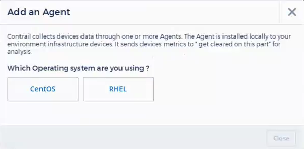
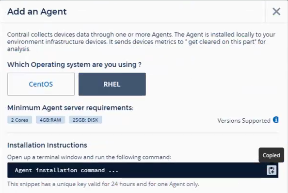

= Agent installation

:toc: macro
:hardbreaks:
:toclevels: 1
:nofooter:
:icons: font
:linkattrs:
:imagesdir: ./media/

[.lead]

CloudSecure collects device data using one or more agents. Agents connect to devices in your environment and collect data that is sent to CloudSecure for analysis. 

This topic describes the steps required to add agents to CloudSecure. 

== Adding a CloudSecure Agent

.Before you begin

* A Docker image must be installed on the VM hosting the Agent. 
** RHEL and CentOS Agent systems should always have the docker-ce package installed. Users should not install the docker-client-xx or docker-common-xx native RHEL docker packages since these do not support the docker run cli format that CloudSecure supports. 
* OpenJDK java is required. 
* The IBM-Java package, found in some RHEL versions must be uninstalled. 
* The ”sudo su –' command is required for  installation, running scripts, and uninstall.  

.Steps for Installation 

. Log in as Administrator or Account Owner to your CloudSecure environment. 
. Click *Admin > Data Collectors > Agent > +Agents*
+
The _Add Agent Operating System_ dialog is displayed.

 

. Select the operating system you are installing the agent on.
. Verify that the Agent server meets the minimum system requirements. 
. Verify that the Agent server is running a supported version of Linux, click _Versions Supported (i)_.

. Click the copy to Clipboard icon to copy the installation command. 
. Run the installation command.   

.After you finish

* Click *Admin > Data Collectors* to check the status of the Agent.
+
There is normally a delay before the agent status is displayed. 

* The installation directory is /opt/netapp/cloud-secure
* The logs directiory is /opt/netapp/cloud-secure/logs 
* Use the following script to control the CloudSecure service:
** cloud-secure-agent-service.sh --help
* Use the following script to uninstall the Agent:
** cloud-secure-agent-uninstall.sh

