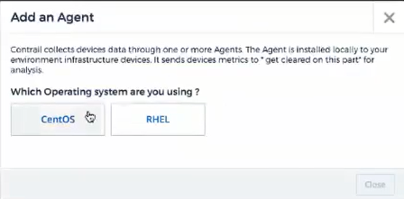

= Agent installation

:toc: macro
:hardbreaks:
:toclevels: 1
:nofooter:
:icons: font
:linkattrs:
:imagesdir: ./media/

[.lead]

Cloud Secure uses agents to collect file and user access data from devices in the data center. 

This topic describes how to add Cloud Secure agents and describes steps required when your environment uses a proxy. 

== Adding a Cloud Secure Agent

.Before you begin

* You must have an unzip program to unzip the downloaded files.
* Any other pre-requisites? 

.Steps for Installation 

. Log in as Administrator or Account Owner to your Cloud Secure environment. 
. Click *Admin > Agents >  ?
+
The system displays the _Add Agent_ dialog.

. Select the operating system you are installing the agent on.
. Verify that the Agent server meets the minimum system requirements. 
. Verify that the Agent server is running a supported version of Linux, click _Versions Supported (i)_.

. Copy the installation command displayed in the dialog into a terminal window on the Agent serverand execute the command.  

.After you finish

* Click *Admin > Data Collectors* to check the status of the Agent.
* Installation directory: /opt/netapp/cloud-secure
* You can access the logs at /opt/netapp/cloud-secure/logs 
* Use the following script to control the Cloud Secure service
** cloud-secure-agent-service.sh --help
* Use the following script to uninstall the Agent:
** cloud-secure-agent-uninstall.sh

