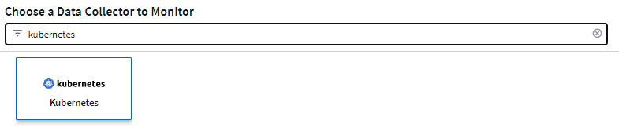

= Configuring the NetApp Kubernetes Monitoring Operator
:toc: macro
:hardbreaks:
:nofooter:
:toclevels: 2
:icons: font
:linkattrs:
:imagesdir: ./media/

[.lead]
Cloud Insights offers the *NetApp Kubernetes Monitoring Operator* (NKMO) for Kubernetes collection. When adding a data collector, simply choose the "Kubernetes" tile.

toc::[]

////
Below is a high-level illustration showing where the Operator resides in your environment. Depending on your environment, _Proxy Server_ may or may not be required. 

image:CI_Diagram_with_NKMO.png[A high-level map showing NKMO residing in the Kubernetes Cluster, with arrows showing how data travels to the cluster from the Hosts, proxy server, all rolling up to Cloud Insights]
////

The Operator and the data collectors are downloaded from the Cloud Insights Docker Registry. Once installed, NKMO then manages any Operator-compatible collectors deployed in the Kubernetes cluster nodes to acquire data, including managing the life cycle of those collectors. Following this chain, data is acquired from the collectors and sent through to Cloud Insights. 

== Before installing the NetApp Kubernetes Monitoring Operator

IMPORTANT: Read the link:pre-requisites_for_k8s_operator.html[*Before Installing or Upgrading*] documentation before installing or upgrading the NetApp Kubernetes Monitoring Operator.

== Installing the NetApp Kubernetes Monitoring Operator

//image:Kubernetes_Operator_Agent_Instructions.png[Operator-Based Install]
//image:NKMO_Install_Instructions.png[Operator-Based Install]
image:NKMO-Instructions-1.png[]
image:NKMO-Instructions-2.png[]

.Steps to install NetApp Kubernetes Monitoring Operator agent on Kubernetes:

. Enter a unique cluster name and namespace. If you are <<upgrading, upgrading>> from a previous Kubernetes Operator, use the same cluster name and namespace. 
. Once these are entered, you can copy the Download Command snippet to the clipboard.
. Paste the snippet into a _bash_ window and execute it. The Operator installation files will be downloaded. Note that the snippet has a unique key and is valid for 24 hours.

. If you have a custom or private repository, copy the optional Image Pull snippet, paste it into a _bash_ shell and execute it. Once the images have been pulled, copy them to your private repository. Be sure to maintain the same tags and folder structure. Update the paths in _operator-deployment.yaml_ as well as the docker repository settings in _operator-config.yaml_.

. If desired, review available configuration options such as proxy or private repository settings. You can read more about link:telegraf_agent_k8s_config_options.html[configuration options].

. When you are ready, deploy the Operator by copying the kubectl Apply snippet, downloading it, and executing it. 

. The installation proceeds automatically. When it is complete, click the _Next_ button.

. When installation is complete, click the _Next_ button. Be sure to also delete or securely store the _operator-secrets.yaml_ file.

Read more about <<configuring-proxy-support, configuring proxy>>.

Read more about <<using-a-custom-or-private-docker-repository, using a custom/private docker repository>>.

Kubernetes EMS log collection is enabled by default when installing the NetApp Kubernetes Monitoring Operator. To disable this collection following installation, click the *Modify Deployment* button at the top of the Kubernetes cluster detail page, and un-select "Log collection". 

image:K8s_Modify_Deployment_Screen.png[Modify Deployment screen showing checkbox for "log Collection"]

This screen also shows current Log Collection status. Below are the possible states:

* Disabled
* Enabled
* Enabled - Installation in progress
* Enabled - Offline
* Enabled - Online
* Error - API Key has insufficient permissions

== Upgrading 

////
NOTE: If you have a previously installed script-based agent, you _must_ upgrade to the NetApp Kubernetes Monitoring Operator.

=== Upgrading from script-based agent to NetApp Kubernetes Monitoring Operator

To upgrade the telegraf agent, do the following:

. Make note of your cluster name as recognized by Cloud Insights.  You can view the cluster name by running the following command. If your namespace is not the default (_ci-monitoring_), substitute the appropriate namespace:

 kubectl -n ci-monitoring get cm telegraf-conf -o jsonpath='{.data}' |grep "kubernetes_cluster ="
 

. Save the K8s cluster name for use during installation of the K8s operator-based monitoring solution to ensure data continuity.
+
If you do not remember the name of the K8s cluster in CI, it can be extracted from your saved configuration with the following command line:
+
 cat /tmp/telegraf-configs.yaml | grep kubernetes_cluster | head -2
 
. Remove the script-based monitoring 
+
To uninstall the script-based agent on Kubernetes, do the following:
+
If the monitoring namespace is being used solely for Telegraf:
+
 kubectl --namespace ci-monitoring delete ds,rs,cm,sa,clusterrole,clusterrolebinding -l app=ci-telegraf
+
 kubectl delete ns ci-monitoring
+
If the monitoring namespace is being used for other purposes in addition to Telegraf:
+
 kubectl --namespace ci-monitoring delete ds,rs,cm,sa,clusterrole,clusterrolebinding -l app=ci-telegraf

. <<installing-the-netapp-kubernetes-monitoring-operator, Install>> the current Operator. Be sure to use the same cluster name noted in step 1 above.

//image:KubernetesOperatorTile.png[Tile for Kubernetes Operator]
////

=== Upgrading to the latest NetApp Kubernetes Monitoring Operator

Determine whether an AgentConfiguration exists with the existing Operator (if your namespace is not the default _netapp-monitoring_, substitute the appropriate namespace):

 kubectl -n netapp-monitoring get agentconfiguration netapp-monitoring-configuration
 
If an AgentConfiguration exists:

* <<installing-the-netapp-kubernetes-monitoring-operator,Install>> the latest Operator over the existing Operator.

** Ensure you are <<using-a-custom-or-private-docker-repository,pulling the latest container images>> if you are using a custom repository.

If the AgentConfiguration does not exist:

* Make note of your cluster name as recognized by Cloud Insights (if your namespace is not the default netapp-monitoring, substitute the appropriate namespace):

 kubectl -n netapp-monitoring get agent -o jsonpath='{.items[0].spec.cluster-name}'

* Create a backup of the existing Operator (if your namespace is not the default netapp-monitoring, substitute the appropriate namespace):
  
 kubectl -n netapp-monitoring get agent -o yaml > agent_backup.yaml

* <<to-remove-the-netapp-kubernetes-monitoring-operator,Uninstall>> the existing Operator.
* <<installing-the-netapp-kubernetes-monitoring-operator,Install>> the latest Operator.
** Use the same cluster name.
** After downloading the latest Operator YAML files, port any customizations found in agent_backup.yaml to the downloaded operator-config.yaml before deploying.
** Ensure you are <<using-a-custom-or-private-docker-repository,pulling the latest container images>> if you are using a custom repository.

 
== Stopping and Starting the Netapp Kubernetes Monitoring Operator
 
To stop the Netapp Kubernetes Monitoring Operator:

 kubectl -n netapp-monitoring scale deploy monitoring-operator --replicas=0

To start the Netapp Kubernetes Monitoring Operator:

 kubectl -n netapp-monitoring scale deploy monitoring-operator --replicas=1

== Uninstalling

////
NOTE: If you are running on a previously-installed script-based Kubernetes agent, you must <<upgrading, upgrade>> to the NetApp Kubernetes Monitoring Operator.

=== To remove the deprecated script-based agent

Note that these commands are using the default namespace "ci-monitoring".  If you have set your own namespace, substitute that namespace in these and all subsequent commands and files.

To uninstall the script-based agent on Kubernetes (for example, when upgrading to the NetApp Kubernetes Monitoring Operator), do the following:

If the monitoring namespace is being used solely for Telegraf:

 kubectl --namespace ci-monitoring delete ds,rs,cm,sa,clusterrole,clusterrolebinding -l app=ci-telegraf
 
 kubectl delete ns ci-monitoring

//For the commands above, use “_netapp-monitoring_” if you installed using operator-based installation with the default namespace.
 
If the monitoring namespace is being used for other purposes in addition to Telegraf:

 kubectl --namespace ci-monitoring delete ds,rs,cm,sa,clusterrole,clusterrolebinding -l app=ci-telegraf
////

=== To remove the NetApp Kubernetes Monitoring Operator

Note that the default namespace for the NetApp Kubernetes Monitoring Operator is "netapp-monitoring".  If you have set your own namespace, substitute that namespace in these and all subsequent commands and files.

Newer versions of the monitoring operator can be uninstalled with the following commands:

 kubectl delete agent -A -l installed-by=nkmo-<name-space>
 kubectl delete ns,clusterrole,clusterrolebinding,crd -l installed-by=nkmo-<name-space>

If the first command returns “No resources found”, use the following instructions to uninstall older versions of the monitoring operator.

Execute each of the following commands in order. Depending on your current installation, some of these commands may return ‘object not found’ messages. These messages may be safely ignored.

  kubectl -n <NAMESPACE> delete agent agent-monitoring-netapp
  kubectl delete crd agents.monitoring.netapp.com
  kubectl -n <NAMESPACE> delete role agent-leader-election-role  
  kubectl delete clusterrole agent-manager-role agent-proxy-role agent-metrics-reader <NAMESPACE>-agent-manager-role <NAMESPACE>-agent-proxy-role <NAMESPACE>-cluster-role-privileged
  kubectl delete clusterrolebinding agent-manager-rolebinding agent-proxy-rolebinding agent-cluster-admin-rolebinding <NAMESPACE>-agent-manager-rolebinding <NAMESPACE>-agent-proxy-rolebinding <NAMESPACE>-cluster-role-binding-privileged
  kubectl delete <NAMESPACE>-psp-nkmo
  kubectl delete ns <NAMESPACE>

If a Security Context Constraint was previously-created:

 kubectl delete scc telegraf-hostaccess
 
 

== About Kube-state-metrics

The NetApp Kubernetes Monitoring Operator installs kube-state-metrics automatically; no user interaction is needed.

//NOTE: Note that with kube-state-metrics version 2.0 and above, Kubernetes object labels are not exported by default. To configure kube-state-metrics to export Kubernetes object labels, you must specify a metric labels "allow" list. Refer to the _--metric-labels-allowlist_ option in the link:https://github.com/kubernetes/kube-state-metrics/blob/master/docs/cli-arguments.md[kube-state-metrics documentation]. 

=== kube-state-metrics Counters

Use the following links to access information for these kube state metrics counters:

. https://github.com/kubernetes/kube-state-metrics/blob/master/docs/configmap-metrics.md[ConfigMap Metrics]
. https://github.com/kubernetes/kube-state-metrics/blob/master/docs/daemonset-metrics.md[DaemonSet Metrics]
. https://github.com/kubernetes/kube-state-metrics/blob/master/docs/deployment-metrics.md[Deployment Metrics]
//. https://github.com/kubernetes/kube-state-metrics/blob/master/docs/endpoint-metrics.md[Endpoint Metrics]
//. https://github.com/kubernetes/kube-state-metrics/blob/master/docs/horizontalpodautoscaler-metrics.md[Horizontal Pod Autoscaler Metrics]
. https://github.com/kubernetes/kube-state-metrics/blob/master/docs/ingress-metrics.md[Ingress Metrics]
//. https://github.com/kubernetes/kube-state-metrics/blob/master/docs/ingress-metrics.md[Job Metrics]
//. https://github.com/kubernetes/kube-state-metrics/blob/master/docs/limitrange-metrics.md[LimitRange Metrics]
. https://github.com/kubernetes/kube-state-metrics/blob/master/docs/namespace-metrics.md[Namespace Metrics]
. https://github.com/kubernetes/kube-state-metrics/blob/master/docs/node-metrics.md[Node Metrics]
. https://github.com/kubernetes/kube-state-metrics/blob/master/docs/persistentvolume-metrics.md[Persistent Volume Metrics]
. https://github.com/kubernetes/kube-state-metrics/blob/master/docs/persistentvolumeclaim-metrics.md[Persistant Volume Claim Metrics]
. https://github.com/kubernetes/kube-state-metrics/blob/master/docs/pod-metrics.md[Pod Metrics]
//. https://github.com/kubernetes/kube-state-metrics/blob/master/docs/poddisruptionbudget-metrics.md[Pod Disruption Budget Metrics]
. https://github.com/kubernetes/kube-state-metrics/blob/master/docs/replicaset-metrics.md[ReplicaSet metrics]
//. https://github.com/kubernetes/kube-state-metrics/blob/master/docs/replicationcontroller-metrics.md[ReplicationController Metrics]   
. https://github.com/kubernetes/kube-state-metrics/blob/master/docs/secret-metrics.md[Secret metrics]
. https://github.com/kubernetes/kube-state-metrics/blob/master/docs/service-metrics.md[Service metrics]
. https://github.com/kubernetes/kube-state-metrics/blob/master/docs/statefulset-metrics.md[StatefulSet metrics]

'''

 == Configuring the Operator

In newer versions of the operator, most commonly modified settings can be configured in the _AgentConfiguration_ custom resource. You can edit this resource before deploying the operator by editing the _operator-config.yaml_ file. This file includes commented out examples of some settings. See the list of link:telegraf_agent_k8s_config_options.html[available settings] for the most recent version of the operator.

You can also edit this resource after the operator has been deployed using the following command:

	kubectl -n netapp-monitoring edit AgentConfiguration

To determine if your deployed version of the operator supports AgentConfiguration, run the following command:

	kubectl get crd agentconfigurations.monitoring.netapp.com
 
If you see an “Error from server (NotFound)” message, your operator must be upgraded before you can use the AgentConfiguration.

=== Configuring Proxy Support

There are two places where you may use a proxy in your environment in order to install the NetApp Kubernetes Monitoring Operator. These may be the same or separate proxy systems:

* Proxy needed during execution of the installation code snippet (using "curl") to connect the system where the snippet is executed to your Cloud Insights environment
* Proxy needed by the target Kubernetes cluster to communicate with your Cloud Insights environment

If you use a proxy for either or both of these, in order to install the NetApp Kubernetes Operating Monitor you must first ensure that your proxy is configured to allow good communication to your Cloud Insights environment. If you have a proxy and can access Cloud Insights from the server/VM from which you wish to install the Operator, then your proxy is likely configured properly.

For the proxy used to install the NetApp Kubernetes Operating Monitor, before installing the Operator, set the _http_proxy/https_proxy_ environment variables. For some proxy environments, you may also need to set the _no_proxy environment_ variable.

To set the variable(s), perform the following steps on your system *before* installing the NetApp Kubernetes Monitoring Operator:

. Set the _https_proxy_ and/or _http_proxy_ environment variable(s) for the current user:
.. If the proxy being setup does not have Authentication (username/password), run the following command:
+
 export https_proxy=<proxy_server>:<proxy_port>
 
.. If the proxy being setup does have Authentication (username/password), run this command:
+
 export http_proxy=<proxy_username>:<proxy_password>@<proxy_server>:<proxy_port>

For the proxy used for your Kubernetes cluster to communicate with your Cloud Insights environment, install the NetApp Kubernetes Monitoring Operator after reading all of these instructions.

Configure the proxy section of AgentConfiguration in operator-config.yaml before deploying the NetApp Kubernetes Monitoring Operator. 

----
agent:
  ...
  proxy:
    server: <server for proxy>
    port: <port for proxy>
    username: <username for proxy>
    password: <password for proxy>
    
    # In the noproxy section, enter a comma-separated list of
    # IP addresses and/or resolvable hostnames that should bypass
    # the proxy
    noproxy: <comma separated list>

    isTelegrafProxyEnabled: true
    isFluentbitProxyEnabled: <true or false> # true if Events Log enabled
    isCollectorsProxyEnabled: <true or false> # true if Network Performance and Map enabled 
    isAuProxyEnabled: <true or false> # true if AU enabled
  ...
...
----

=== Using a custom or private docker repository

By default, the NetApp Kubernetes Monitoring Operator will pull container images from the Cloud Insights repository. If you have a Kubernetes cluster used as the target for monitoring, and that cluster is configured to only pull container images from a custom or private Docker repository or container registry, you must configure access to the containers needed by the NetApp Kubernetes Monitoring Operator.

Run the “Image Pull Snippet” from the NetApp Monitoring Operator install tile. This command will log into the Cloud Insights repository, pull all image dependencies for the operator, and log out of the Cloud Insights repository. When prompted, enter the provided repository temporary password. This command downloads all images used by the operator, including for optional features. See below for which features these images are used for.

Core Operator Functionality and Kubernetes Monitoring

* netapp-monitoring
* kube-rbac-proxy
* kube-state-metrics
* telegraf
* distroless-root-user

Events Log

* fluent-bit
* kubernetes-event-exporter

Network Performance and Map

* ci-net-observer

Push the operator docker image to your private/local/enterprise docker repository according to your corporate policies. Ensure that the image tags and directory paths to these images in your repository are consistent with those in the Cloud Insights repository.

Edit the monitoring-operator deployment in operator-deployment.yaml, and modify all image references to use your private Docker repository.

 image: <docker repo of the enterprise/corp docker repo>/kube-rbac-proxy:<kube-rbac-proxy version>
 image: <docker repo of the enterprise/corp docker repo>/netapp-monitoring:<version>

Edit the AgentConfiguration in operator-config.yaml to reflect the new docker repo location. Create a new imagePullSecret for your private repository, for more details see _https://kubernetes.io/docs/tasks/configure-pod-container/pull-image-private-registry/_

----
agent:
  ...
  # An optional docker registry where you want docker images to be pulled from as compared to CI's docker registry 
  # Please see documentation link here: https://docs.netapp.com/us-en/cloudinsights/task_config_telegraf_agent_k8s.html#using-a-custom-or-private-docker-repository
  dockerRepo: your.docker.repo/long/path/to/test
  # Optional: A docker image pull secret that maybe needed for your private docker registry
  dockerImagePullSecret: docker-secret-name  
----

=== OpenShift Instructions

If you are running on OpenShift 4.6 or higher, you must edit the AgentConfiguration in _operator-config.yaml_ to enable the _runPrivileged_ setting: 

 # Set runPrivileged to true SELinux is enabled on your kubernetes nodes
 runPrivileged: true

Openshift may implement an added level of security that may block access to some Kubernetes components.

 '''

== Verifying Kubernetes Checksums

The Cloud Insights agent installer performs integrity checks, but some users may want to perform their own verifications before installing or applying downloaded artifacts. To perform a download-only operation (as opposed to the default download-and-install), these users can edit the agent installation command obtained from the UI and remove the trailing “install” option.

Follow these steps:

. Copy the Agent Installer snippet as directed.
. Instead of pasting the snippet into a command window, paste it into a text editor.
. Remove the trailing “--install” from the command.
. Copy the entire command from the text editor.
. Now paste it into your command window (in a working directory) and run it.

* Download and install (default):

 installerName=cloudinsights-kubernetes.sh … && sudo -E -H ./$installerName --download –-install

* Download-only:

 installerName=cloudinsights-kubernetes.sh … && sudo -E -H ./$installerName --download

The download-only command will download all required artifacts from Cloud Insights to the working directory.  The artifacts include, but may not be limited to: 

* an installation script
* an environment file
* YAML files
* a signed checksum file (sha256.signed)
* a PEM file (netapp_cert.pem) for signature verification

The installation script, environment file, and YAML files can be verified using visual inspection. 

The PEM file can be verified by confirming its fingerprint to be the following:

// E5:FB:7B:68:C0:8B:1C:A9:02:70:85:84:C2:74:F8:EF:C7:BE:8A:BC

 1A918038E8E127BB5C87A202DF173B97A05B4996

More specifically,

 openssl x509 -fingerprint -sha1 -noout -inform pem -in netapp_cert.pem

The signed checksum file can be verified using the PEM file:

 openssl smime -verify -in sha256.signed -CAfile netapp_cert.pem -purpose any

Once all of the artifacts have been satisfactorily verified, the agent installation can be initiated by running:

 sudo -E -H ./<installation_script_name> --install

 

////
== Tuning the Operator

You can adjust the NetApp Kubernetes Monitoring Operator for optimal performance by fine-tuning certain variables for Custom Resources. For instructions and lists of the variables you can tune, see the README file included with the installation package. After you have installed the operator, use the following command to view the README:

 sudo -E -H ./<installation_script_name> --install

NOTE: Operator tuning is not available in Cloud Insights Federal Edition
////

////
You can adjust the NetApp Kubernetes Monitoring Operator for optimal performance by fine-tuning certain variables for Custom Resources.  See the following tables for variables that you can set.

To modify these values, edit the agent CR with the following command (substituting <namespace> for your namespace): 

 kubectl edit agent agent-monitoring-netapp -n <namespace>  

The CR specification follows the format:

----
 - name: <plugin-name> 
   ... 
   substitutions: 
   - key: <variable-name> 
     value: <desired-value>  
     ... 
----

Items marked "yes" for "Included in default CR" will already be present in the agent CR and can be found under their respective plugin. Items marked "no" must be added manually following the examples provided by the included default substitutions.

=== Resource related variables 
See https://kubernetes.io/docs/concepts/configuration/manage-resources-containers/	for information on Kubernetes Resources. 	

|===

|Variable Name	|Plugin Name	|Included in default CR	|Description

 
|DS_CPU_LIMITS_PLACEHOLDER	|agent	|yes	|Kubernetes CPU limit for telegraf-ds
|DS_MEM_LIMITS_PLACEHOLDER	|agent	|yes	|Kubernetes mem limit for telegraf-ds
|DS_CPU_REQUEST_PLACEHOLDER	|agent	|yes	|Kubernetes cpu requests for telegraf-ds
|DS_MEM_REQUEST_PLACEHOLDER	|agent	|yes	|Kubernetes memory requests for telegraf-ds
|RS_CPU_LIMITS_PLACEHOLDER	|agent	|yes	|Kubernetes CPU limit for telegraf-rs.
|RS_MEM_LIMITS_PLACEHOLDER	|agent	|yes	|Kubernetes mem limit for telegraf-rs
|RS_CPU_REQUEST_PLACEHOLDER	|agent	|yes	|Kubernetes cpu requests for telegraf-rs
|RS_MEM_REQUEST_PLACEHOLDER	|agent	|yes	|Kubernetes memory requests for telegraf-rs
|KSM_CPU_REQUEST_PLACEHOLDER:	|ksm	|yes	|Kubernetes cpu requests for kube-state-metrics deploy
|KSM_MEM_REQUEST_PLACEHOLDER:	|ksm	|yes	|Kubernetes cpu requests for kube-state-metrics deploy

|===

=== Telegraf related variables 
See https://github.com/influxdata/telegraf/blob/master/docs/CONFIGURATION.md#agent for information on telegraf variables.

|===

|Placeholder	|Plugin Name	|Included in default CR	|Description

|COLLECTION_INTERVAL_PLACEHOLDER	|agent|	no	|(sets telegraf interval, type interval): The default time telegraf will wait between inputs for all plugins. Valid time units are ns, us (or µs), ms, s, m, h.
|ROUND_INTERVAL_PLACEHOLDER	|agent	|no	|(sets telegraf round_interval, type boolean) collect metrics on multiples of interval
|METRIC_BATCH_SIZE_PLACEHOLDER	|agent	|no	|(sets telegraf metric_batch_size, type int) maximum number of records for an output telegraf will write in one batch
|METRIC_BUFFER_LIMIT_PLACEHOLDER	|agent	|no	|(sets telegraf metric_buffer_limit, type int) maximum number of records for an output telegraf will cache pending a successful write
|COLLECTION_JITTER_PLACEHOLDER	|agent	|no	|(sets telegraf collection_jitter, type interval): Each plugin will wait a random amount of time between the scheduled collection time and that time + collection_jitter before collecting inputs
|PRECISION_PLACEHOLDER	|agent	|no	|(sets telegraf precision, type interval): Collected metrics are rounded to the precision specified, when set to "0s" precision will be set by the units specified by interval
|FLUSH_INTERVAL_PLACEHOLDER	|agent	|no	|(sets telegraf flush_interval, type interval): Default time telegraf will wait between writing outputs.
|FLUSH_JITTER_PLACEHOLDER	|agent	|no	|(sets telegraf flush_jitter, type interval): Each output will wait a random amount of time between the scheduled write time and that time + flush_jitter before writing outputs

|===

=== Miscellaneous variables

|===

|Placeholder	|Plugin Name	|Included in default CR	|Description

|CURL_CMD_PLACEHOLDER	|agent	|yes	|The curl command used to download various resources. Ex) "curl" or "curl -k"
|===

////

== Troubleshooting

Some things to try if you encounter problems setting up the NetApp Kubernetes Monitoring Operator:

[cols="stretch", options="header"]
|===
|Problem:|Try this:

|I do not see a hyperlink/connection between my Kubernetes Persistent Volume and the corresponding back-end storage device. My Kubernetes Persistent Volume is configured using the hostname of the storage server.
|Follow the steps to uninstall the existing Telegraf agent, then re-install the latest Telegraf agent. You must be using Telegraf version 2.0 or later, and your Kubernetes cluster storage must be actively monitored by Cloud Insights.

|I'm seeing messages in the logs resembling the following:

E0901 15:21:39.962145 1 reflector.go:178] k8s.io/kube-state-metrics/internal/store/builder.go:352: Failed to list *v1.MutatingWebhookConfiguration: the server could not find the requested resource
E0901 15:21:43.168161 1 reflector.go:178] k8s.io/kube-state-metrics/internal/store/builder.go:352: Failed to list *v1.Lease: the server could not find the requested resource (get leases.coordination.k8s.io)
etc.

|These messages may occur if you are running kube-state-metrics version 2.0.0 or above with Kubernetes versions below 1.20.

To get the Kubernetes version:

 _kubectl version_

To get the kube-state-metrics version:

 _kubectl get deploy/kube-state-metrics -o jsonpath='{..image}'_

To prevent these messages from happening, users can modify their kube-state-metrics deployment to disable the following Leases:

_mutatingwebhookconfigurations_
_validatingwebhookconfigurations_
_volumeattachments resources_

More specifically, they can use the following CLI argument:

resources=certificatesigningrequests,configmaps,cronjobs,daemonsets, deployments,endpoints,horizontalpodautoscalers,ingresses,jobs,limitranges, namespaces,networkpolicies,nodes,persistentvolumeclaims,persistentvolumes, poddisruptionbudgets,pods,replicasets,replicationcontrollers,resourcequotas, secrets,services,statefulsets,storageclasses

The default resource list is:

"certificatesigningrequests,configmaps,cronjobs,daemonsets,deployments, endpoints,horizontalpodautoscalers,ingresses,jobs,leases,limitranges, mutatingwebhookconfigurations,namespaces,networkpolicies,nodes, persistentvolumeclaims,persistentvolumes,poddisruptionbudgets,pods,replicasets, replicationcontrollers,resourcequotas,secrets,services,statefulsets,storageclasses, validatingwebhookconfigurations,volumeattachments"

|I see error messages from Telegraf resembling the following, but Telegraf does start up and run:

Oct 11 14:23:41 ip-172-31-39-47 systemd[1]: Started The plugin-driven server agent for reporting metrics into InfluxDB.
Oct 11 14:23:41 ip-172-31-39-47 telegraf[1827]: time="2021-10-11T14:23:41Z" level=error msg="failed to create cache directory. /etc/telegraf/.cache/snowflake, err: mkdir /etc/telegraf/.ca
che: permission denied. ignored\n" func="gosnowflake.(*defaultLogger).Errorf" file="log.go:120"
Oct 11 14:23:41 ip-172-31-39-47 telegraf[1827]: time="2021-10-11T14:23:41Z" level=error msg="failed to open. Ignored. open /etc/telegraf/.cache/snowflake/ocsp_response_cache.json: no such
file or directory\n" func="gosnowflake.(*defaultLogger).Errorf" file="log.go:120"
Oct 11 14:23:41 ip-172-31-39-47 telegraf[1827]: 2021-10-11T14:23:41Z I! Starting Telegraf 1.19.3

|This is a known issue.  Refer to link:https://github.com/influxdata/telegraf/issues/9407[This GitHub article] for more details. As long as Telegraf is up and running, users can ignore these error messages.

|On Kubernetes, my Telegraf pod(s) are reporting the following error:
"Error in processing mountstats info: failed to open mountstats file: /hostfs/proc/1/mountstats, error: open /hostfs/proc/1/mountstats: permission denied"
|If SELinux is enabled and enforcing, it is likely preventing the Telegraf pod(s) from accessing the /proc/1/mountstats file on the Kubernetes node. To overcome this restriction, edit the agentconfiguration, and enable the runPrivileged setting. For more details, refer to: https://docs.netapp.com/us-en/cloudinsights/task_config_telegraf_agent_k8s.html#openshift-instructions.

|On Kubernetes, my Telegraf ReplicaSet pod is reporting the following error:

 [inputs.prometheus] Error in plugin: could not load keypair /etc/kubernetes/pki/etcd/server.crt:/etc/kubernetes/pki/etcd/server.key: open /etc/kubernetes/pki/etcd/server.crt: no such file or directory
|The Telegraf ReplicaSet pod is intended to run on a node designated as a master or for etcd. If the ReplicaSet pod is not running on one of these nodes, you will get these errors. Check to see if your master/etcd nodes have taints on them. If they do, add the necessary tolerations to the Telegraf ReplicaSet, telegraf-rs.

For example, edit the ReplicaSet...

 kubectl edit rs telegraf-rs

...and add the appropriate tolerations to the spec. Then, restart the ReplicaSet pod.

|I have a PSP/PSA environment. Does this affect my monitoring operator?
|If your Kubernetes cluster is running with Pod Security Policy (PSP) or Pod Security Admission (PSA) in place, you must upgrade to the latest NetApp Kubernetes Monitoring Operator. Follow these steps to upgrade to the current NKMO with support for PSP/PSA:

1. <<uninstalling,Uninstall>> the previous monitoring operator:

 kubectl delete agent agent-monitoring-netapp -n netapp-monitoring
 kubectl delete ns netapp-monitoring
 kubectl delete crd agents.monitoring.netapp.com
 kubectl delete clusterrole agent-manager-role agent-proxy-role agent-metrics-reader
 kubectl delete clusterrolebinding agent-manager-rolebinding agent-proxy-rolebinding agent-cluster-admin-rolebinding

2. <<installing-the-netapp-kubernetes-monitoring-operator, Install>> the latest version of the monitoring operator.

|I ran into issues trying to deploy the NKMO, and I have PSP/PSA in use.
|1. Edit the agent using the following command:

kubectl -n <name-space> edit agent

2. Mark 'security-policy-enabled' as 'false'. This will disable Pod Security Policies and Pod Security Admission and allow the NKMO to deploy. Confirm by using the following commands:

kubectl get psp (should show Pod Security Policy removed)
kubectl get all -n <namespace> \| grep -i psp (should show that nothing is found) 

|"ImagePullBackoff" errors seen
|These errors may be seen if you have a custom or private docker repository and have not yet configured the NetApp Kubernetes Monitoring Operator to properly recognize it.  <<using-a-custom-or-private-docker-repository,Read more>> about configuring for custom/private repo.

|I am having an issue with my monitoring-operator deployment, and the current documentation does not help me resolve it.
a|Capture or otherwise note the output from the following commands, and contact the Technical Support team.

----
 kubectl -n netapp-monitoring get all
 kubectl -n netapp-monitoring describe all
 kubectl -n netapp-monitoring logs <monitoring-operator-pod> --all-containers=true
 kubectl -n netapp-monitoring logs <telegraf-pod> --all-containers=true
----

|net-observer (Workload Map) pods in NKMO namespace are in CrashLoopBackOff
|These pods correspond to Workload Map data collector for Network Observability. Try these:
•	Check the logs of one of the pods to confirm minimum kernel version. For example:

----
{"ci-tenant-id":"your-tenant-id","collector-cluster":"your-k8s-cluster-name","environment":"prod","level":"error","msg":"failed in validation. Reason: kernel version 3.10.0 is less than minimum kernel version of 4.18.0","time":"2022-11-09T08:23:08Z"}
----

•	Net-observer pods requires the Linux kernel version to be at least 4.18.0. Check the kernel version using the command “uname -r” and ensure they are >= 4.18.0

|net-observer pods in NKMO namespace are in CrashLoopBackOff in OpenShift 4 environment
|This is currently not supported. Watch for support to be added in a future update.

|Pods are running in NKMO namespace (default: netapp-monitoring), but no data is shown in UI for workload map or Kubernetes metrics in Queries
|Check the time setting on the nodes of the K8S cluster. For accurate audit and data reporting, it is strongly recommended to synchronize the time on the Agent machine using Network Time Protocol (NTP) or Simple Network Time Protocol (SNTP).

|Some of the net-observer pods in NKMO namespace are in Pending state
|Net-observer is a DaemonSet and runs a pod in each Node of the k8s cluster.
•	Note the pod which is in Pending state, and check if it is experiencing a resource issue for CPU or memory. Ensure the required memory and CPU is available in the node.

|I’m seeing the following in my logs immediately after installing the NetApp Kubernetes Monitoring Operator:

[inputs.prometheus] Error in plugin: error making HTTP request to http://kube-state-metrics.<namespace>.svc.cluster.local:8080/metrics: Get http://kube-state-metrics.<namespace>.svc.cluster.local:8080/metrics: dial tcp: lookup kube-state-metrics.<namespace>.svc.cluster.local: no such host
|This message is typically only seen when a new operator is installed and the _telegraf-rs_ pod is up before the _ksm_ pod is up. These messages should stop once all pods are running.

|I do see not any metrics being collected for the Kubernetes CronJobs that exist in my cluster.
|Verify your Kubernetes version (i.e. `kubectl version`).  If it is v1.20.x or below, this is an expected limitation.  The kube-state-metrics release deployed with the Netapp Kubernetes Monitoring Operator only supports v1.CronJob.  With Kubernetes 1.20.x and below, the CronJob resource is at v1beta.CronJob.  As a result, kube-state-metrics cannot find the CronJob resource.

|After installing the operator, the telegraf-ds pods enter CrashLoopBackOff and the pod logs indicate "su: Authentication failure".
|Edit the netapp-monitoring-configuration section in _AgentConfiguration_, and set _dockerMetricCollectionEnabled_ to false. For more details, refer to the operator's link:telegraf_agent_k8s_config_options.html[configuration options]. 

NOTE: If you are using Cloud Insights Federal Edition, users with restrictions on the use of _su_ will not be able to collect docker metrics because access to the docker socket requires either running the telegraf container as root or using _su_ to add the telegraf user to the docker group. Docker metric collection and the use of _su_ is enabled by default; to disable both, remove the _telegraf.docker_ entry in the _AgentConfiguration_ file:

...
spec:
...
    telegraf:
    ...
          - name: docker
            run-mode:
              - DaemonSet
            substitutions:
              - key: DOCKER_UNIX_SOCK_PLACEHOLDER
                value: unix:///run/docker.sock 
    ...
...

|I see repeating error messages resembling the following in my Telegraf logs:

 E! [agent] Error writing to outputs.http: Post "https://<tenant_url>/rest/v1/lake/ingest/influxdb": context deadline exceeded (Client.Timeout exceeded while awaiting headers)
|Edit each Telegraf configuration file (i.e. /etc/telegraf/telegraf.d/*.conf), and increase the timeout for the Telegraf output plugins.  For example, in each .conf file, replace all instances of...

[[outputs.http]]
...
  timeout = "5s"
...

...with the following:

[[outputs.http]]
...
timeout = "10s"
...

Then, restart Telegraf.

|===

Additional information may be found from the link:concept_requesting_support.html[Support] page or in the link:reference_data_collector_support_matrix.html[Data Collector Support Matrix].

