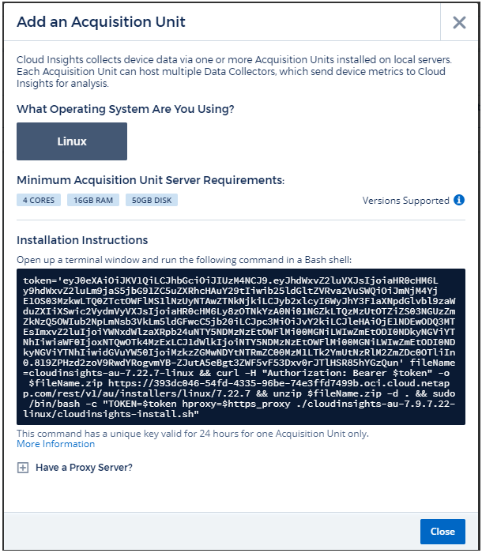

= Adding Acquisition Units

:toc: macro
:hardbreaks:
:toclevels: 1
:nofooter:
:icons: font
:linkattrs:
:imagesdir: ./media/

[.lead]

Cloud Insights collects device data using one or more Acquisition Units installed on local servers. Each Acquisition Unit can host multiple Data Collectors, which send device metrics to Cloud Insights for analysis. 

This topic describes how to add Acquisition Units and describes additional steps required when your environment uses a proxy. 

== Adding a Linux Acquisition Unit

.Before you begin

* If your system is using a proxy, you must set the proxy environment variables before the acquisition unit is installed. For more information, see <<Setting proxy environment variables>>.
* You must have an unzip program to unzip the downloaded files.

.Steps for Linux Acquisition Unit Installation 

. Log in as Administrator or Account Owner to your Cloud Insights environment. 
. Click *Admin > Data Collectors > Acquisition Units > +Acquisition Unit* 
+
The system displays the _Add Acquisition Unit_ dialog.

. Verify that the server or VM hosting the Acquisition Unit meets the minimum system requirements. 
. Verify that the server is running a supported version of Linux, click _Versions Supported (i)_.

. Copy the Installation command displayed in the dialog into a terminal window on the server or VM that will host the Acquisition unit.  
. Execute the command in the Bash shell. 

.After you finish

* Click *Admin > Data Collectors > Acquisition units* to check the status of Acquisition Units. 
* You can access the Acquisition Unit logs at /var/log/netapp/cloudinsights/acq/acq.log
* Use the following script to control the Acquisition Unit:
** cloudinsights-service.sh (stop, start, restart, check the status)
* Use the following script to uninstall the Acquisition Unit:
** cloudinsights-uninstall.sh

=== Setting proxy environment variables

For environments that use a proxy, you must set the proxy environment variables before you add the Acquisition Unit. The instructions for configuring the proxy are provided on the _Add Acquisition Unit_  dialog. 

. Click + in Have a Proxy Server?
. Copy the commands to a text editor and set your proxy variables as needed.
+ Note: Restrictions on special characters in proxy username and password fields:  '%' and '!' are allowed in the  username filed. ':', '%', and '!' are allowed in the password field. 
. Run the edited command in a terminal using the Bash shell.
. Install the Acquisition Unit software.

== Reinstalling and Acquisition Unit

To re-install an Acquisition Unit on the same server/VM, you must follow these steps:

* You must have a temporary Acquisition Unit configured before re-installing an Acquisition Unit.

. Log in to the Acquisition Unit server/VM and uninstall the AU software.
. Log into your Cloud Insights environment and go to *Admin > Data Collectors*. 
. For each data collector, click the Options menu on the right and select _Edit_. Assign the data collector to the temporary Acquisition Unit and click *Save*.
+
You can also select multiple data collectors of the same type and click the *Bulk Actions* button. Choose _Edit_ and assign the data collectors to the temporary Acquisition Unit.

. After all of the data collectors have been moved to the temporary Acquisition Unit, go to *Admin > Data Collectors* and select the *Acquisition Units* tab.

. Click the Options button to the right of the Acquisition Unit you wish to re-install, and select _Delete_. You can delete an Acquisition Unit only if there are no data collectors assigned to it.

. You can now re-install the Acquisition Unit software on the original server/VM. Click *+Acquisition Unit* and follow the instructions above to install the Acquisition Unit.  

. Once the Acquisition Unit has been re-installed, assign your data collectors back to the Acquisition Unit.
