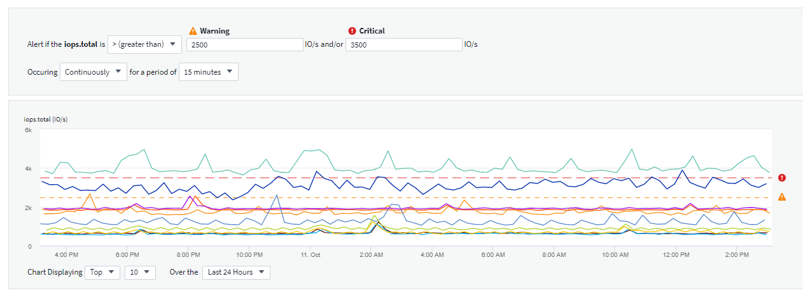
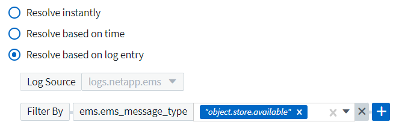

= Alerting with Monitors
:toc: macro
:hardbreaks:
:toclevels: 1
:nofooter:
:icons: font
:linkattrs:
:imagesdir: ./media/

[.lead]
You create monitors to set thresholds that trigger alerts to notify you about issues related to the resources in your network. For example, you can create a monitor to alert for _node write latency_ for any of a multitude of protocols.

TIP: Monitors and Alerting is available in all Data Infrastructure Insights Editions, however, Basic Edition is subject to the following:
* You may only have up to five custom monitors active at a time. Any monitors beyond five will be created in or moved to _Paused_ state. 
* VMDK, Virtual Machine, Host, and DataStore metrics monitors are not supported. If you have monitors created for these metrics, they will be paused and cannot be resumed when downgrading to Basic Edition.

toc::[]

//When the monitored threshold and conditions are reached or exceeded, Data Infrastructure Insights creates an alert. A Monitor can have a _Warning_ threshold, a _Critical_ threshold, or both. Log Monitors can also have an _Informational_ alert level.

Monitors allow you to set thresholds on metrics generated by "infrastructure" objects such as storage, VM, EC2, and ports, as well as for "integration" data such as those collected for Kubernetes, ONTAP advanced metrics, and Telegraf plugins. These _metric_ monitors alert you when warning-level or critical-level thresholds are crossed.

You can also create monitors to trigger warning-, critical-, or informational-level alerts when specified _log events_ are detected.

Data Infrastructure Insights provides a number of link:task_system_monitors.html[System-Defined Monitors] as well, based on your environment. 

== Security Best Practice

Data Infrastructure Insights alerts are designed to highlight data points and trends on your tenant, and Data Infrastructure Insights allows you to enter any valid email address as an alert recipient. If you are working in a secure environment, be especially mindful of who is receiving the notification or otherwise has access to the alert. 

== Metric or Log Monitor? 

. From the Data Infrastructure Insights menu, click *Alerts > Manage Monitors*
+
The Monitors list page is displayed, showing currently configured monitors. 

. To modify an existing monitor, click the monitor name in the list.

. To add a monitor, Click *+ Monitor*. 
+
image:Monitor_log_or_metric.png[Choose system or log monitor]
+
When you add a new monitor, you are prompted to create a Metric Monitor or a Log Monitor.

* _Metric_ monitors alert on infrastructure- or performance-related triggers
* _Log_ monitors alert on log-related activity

+
After you choose your monitor type, the Monitor Configuration dialog is displayed. Configuration varies depending on which type of monitor you are creating.

=== Metric Monitor

. In the drop-down, search for and choose an object type and metric to monitor.

You can set filters to narrow down which object attributes or metrics to monitor. 

//image:select_metric_to_monitor.png[Select Metric]

image:MonitorMetricFilter.png[Metrics Filtering]

//When working with integration data (Kubernetes, ONTAP Advanced Data, etc.), metric filtering works against the data samples themselves, not the objects as with infrastructure data (storage, VMs, ports, etc.).

When working with integration data (Kubernetes, ONTAP Advanced Data, etc.), metric filtering removes the individual/unmatched data points from the plotted data series, unlike infrastructure data (storage, VM, ports etc.) where filters work on the aggregated value of the data series and potentially remove the entire object from the chart.

//image:IntegrationMetricFilterExample.png[Integration Metric Filtering]

TIP: To create a multi-condition monitor (e.g., IOPS > X and latency > Y), define the first condition as a threshold and the second condition as a filter.

==== Define the Conditions of the Monitor. 

. After choosing the object and metric to monitor, set the Warning-level and/or Critical-level thresholds.
. For the _Warning_ level, enter 200 for our example. The dashed line indicating this Warning level displays in the example graph.
. For the _Critical_ level, enter 400. The dashed line indicating this Critical level displays in the example graph.
+
The graph displays historical data. The Warning and Critical level lines on the graph are a visual representation of the Monitor, so you can easily see when the Monitor might trigger an alert in each case. 

. For the occurence interval, choose _Continuously_ for a period of _15 Minutes_.
+
You can choose to trigger an alert the moment a threshold is breached, or wait until the threshold has been in continuous breach for a period of time. In our example, we do not want to be alerted every time the Total IOPS peaks above the Warning or Critical level, but only when a monitored object continuously exceeds one of these levels for at least 15 minutes.
+
//image:define_monitor_conditions.png[Define Conditions]

==== Define the alert resolution behavior

You can choose how a metric monitor alert is resolved. You are presented with two choices:

* Resolve when the metric returns to the acceptable range. 
* Resolve when the metric is within the acceptable range for a specified amount of time, from 1 minute to 7 days.

=== Log Monitor

When creating a *Log monitor*, first choose which log to monitor from the available log list. You can then filter based on the available attributes as above. You can also choose one or more "Group By" attributes.

NOTE: The Log Monitor filter cannot be empty. 

//image:Monitor_log_monitor_filter.png[choose which log to monitor, and set a filter]
image:Monitor_Group_By_Example.png[Choose log to monitor, set a filter, and select group by method, if desired]

==== Define the alert Behavior

You can create the monitor to alert with a severity level of _Critical_, _Warning_, or _Informational_, when the conditions you defined above occur once (i.e.  immediately), or wait to alert until the conditions occur 2 times or more.

==== Define the alert resolution behavior

You can choose how a log monitor alert is resolved. You are presented with three choices:

////
* Resolve instantly
* Purge after the data retention period (please refer to the Editions Page for details). Note that the Monitor has no resolution condition by definition, so an Alert will stay _active_ and suppress all subsequent alerts with matching _group_by_ generated by this monitor, until the data retention period has passed.
* Resolve based on log entry: Resolve alert when the log line is discovered as outlined in the following definition, or purge after the data retention period. 

image:LogMonitorAlertResolution.png[Alert Resolution Options]
////

* *Resolve instantly*: The alert is immediately resolved with no further action needed
* *Resolve based on time*: The alert is resolved after the specified time has passed
* *Resolve based on log entry*: The alert is resolved when a subsequent log activity has occurred. For example, when an object is logged as "available".

=== Anomaly Detection Monitor

. In the drop-down, search for and choose an object type and metric to monitor.

You can set filters to narrow down which object attributes or metrics to monitor. 

image:AnomalyDetectionMonitorMetricChoosing.png[Metrics Filtering for anomaly detection]

==== Define the Conditions of the Monitor. 

. After choosing the object and metric to monitor, yous et the conditions under which an anomaly is detected.

* Choose whether to detect an anomaly when the chosen metric *spikes above* the predicted bounds, *drops below* those bounds, or *spikes above or drops below* the bounds.

* Set the *sensitivity* of detection. *Low* (fewer anomalies are detcted), *Medium*, or *High* (more anomalies are detected). 

* Set the alerts to be wither *Warning* or *Critical*.

* If desired, you can choose to reduce noise, ignoring anomalies when the chosen metric is below a threshold that you set.

image:AnomalyDetectionMonitorDefineConditions.png[Defining the conditions to trigger an anomaly detection]

////
==== Define the alert resolution behavior

You can choose how a metric monitor alert is resolved. You are presented with two choices:

* Resolve when the metric returns to the acceptable range. 
* Resolve when the metric is within the acceptable range for a specified amount of time, from 1 minute to 7 days.

////

=== Select notification type and recipients

In the _Set up team notification(s)_ section, you can choose whether to alert your team via email or Webhook.

image:Webhook_Choose_Monitor_Notification.png[Choose alerting method]

*Alerting via Email:*

Specify the email recipients for alert notifications. If desired, you can choose different recipients for warning or critical alerts.

image:email_monitor_alerts.png[Email Alert Recipients]

*Alerting via Webhook:*

Specify the webhook(s) for alert notifications. If desired, you can choose different webhooks for warning or critical alerts.

image:Webhook_Monitor_Notifications.png[Webhook Alerting]

NOTE: ONTAP Data Collector notifications take precedence over any specific Monitor notifications that are relevant to the cluster/data collector. The recipient list you set for the Data Collector itself will receive the data collector alerts. If there are no active data collector alerts, then monitor-generated alerts will be sent to specific monitor recipients.

=== Setting Corrective Actions or Additional Information

You can add an optional description as well as additional insights and/or corrective actions by filling in the *Add an Alert Description* section. The description can be up to 1024 characters and will be sent with the alert. The insights/corrective action field can be up to 67,000 characters and will be displayed in the summary section of the alert landing page.

In these fields you can provide notes, links, or steps to take to correct or otherwise address the alert.

image:Monitors_Alert_Description.png[Alert Corrective Actions and Description]

=== Save your Monitor

. If desired, you can add a description of the monitor. 
+
. Give the Monitor a meaningful name and click *Save*.
+
Your new monitor is added to the list of active Monitors.

== Monitor List

The Monitor page lists the currently configured monitors, showing the following:

* Monitor Name
* Status 
* Object/metric being monitored
* Conditions of the Monitor

You can choose to temporarily pause monitoring of an object type by clicking the menu to the right of the monitor and selecting *Pause*. When you are ready to resume monitoring, click *Resume*.

You can copy a monitor by selecting *Duplicate* from the menu. You can then modify the new monitor and change the object/metric, filter, conditions, email recipients, etc.

If a monitor is no longer needed, you can delete it by selecting *Delete* from the menu.

== Monitor Groups

Grouping allows you to view and manage related monitors. For example, you can have a monitor group dedicated to the storage on your tenant, or monitors relevant to a certain recipient list. 

image:Monitors_GroupList.png[Monitor Grouping]

The following monitor groups are shown. The number of monitors contained in a group is shown next to the group name.

* *All Monitors* lists all monitors.
* *Custom Monitors* lists all user-created monitors.
* *Suspended Monitors* will list any system monitors that have been suspended by Data Infrastructure Insights.
* Data Infrastructure Insights will also show a number of *System Monitor Groups*, which will list one or more groups of link:task_system_monitors.html[system-defined monitors], including ONTAP Infrastructure and Workload monitors. 
//* *Data Collection* monitors will alert on Data Collector or Acquisition Unit issues.

NOTE: Custom monitors can be paused, resumed, deleted, or moved to another group. System-defined monitors can be paused and resumed but can not be deleted or moved. 

=== Suspended Monitors

This group will only be shown if Data Infrastructure Insights has suspended one or more monitors. A monitor may be suspended if it is generating excessive or continuous alerts. If the monitor is a custom monitor, modify the conditions to prevent the continuous alerting, and then resume the monitor. The monitor will be removed from the Suspended Monitors group when the issue causing the suspension is resolved.

////
=== Data Collection Monitors

This group will show monitors 
////

=== System-Defined Monitors

These groups will show monitors provided by Data Infrastructure Insights, as long as your environment contains the devices and/or log availability required by the monitors.

System-Defined monitors cannot be modified, moved to another group, or deleted. However, you can duplicate a system monitor and modify or move the duplicate. 

System monitors may include monitors for ONTAP Infrastructure (storage, volume, etc.) or Workloads (i.e. log monitors), or other groups. NetApp is constantly evaluating customer need and product functionality, and will update or add to system monitors and groups as needed.

=== Custom Monitor Groups

You can create your own groups to contain monitors based on your needs. For example, you may want a group for all of your storage-related monitors.

To create a new custom monitor group, click the *"+" Create New Monitor Group* button. Enter a name for the group and click *Create Group*. An empty group is created with that name. 

To add monitors to the group, go to the _All Monitors_ group (recommended) and do one of the following:

* To add a single monitor, click the menu to the right of the monitor and select _Add to Group_. Choose the group to which to add the monitor.
* Click on the monitor name to open the monitor's edit view, and select a group in the _Associate to a monitor group_ section.
+
image:Monitors_AssociateToGroup.png[Associate to group]

//* To add multiple monitors to a group, select them by clicking the checkbox next to each monitor, then click the *Bulk Actions* button and select _Move to Group_.

Remove monitors by clicking on a group and selecting _Remove from Group_ from the menu. You can not remove monitors from the _All Monitors_ or _Custom Monitors_ group. To delete a monitor from these groups, you must delete the monitor itself.

//To remove a monitor from a group while editing the monitor, in the _Associate with a group_ section, click the *X* next to the group name.

NOTE: Removing a monitor from a group does not delete the monitor from Data Infrastructure Insights. To completely remove a monitor, select the monitor and click _Delete_. This also removes it from the group to which it belonged and it is no longer available to any user.

You can also move a monitor to a different group in the same manner, selecting _Move to Group_. 

//NOTE: Each monitor can belong to only a single group at any given time (in addition to belonging to "All Monitors" and "Custom Monitors"). 

To pause or resume all monitors in a group at once, select the menu for the group and click _Pause_ or _Resume_. 

Use the same menu to rename or delete a group. Deleting a group does not delete the monitors from Data Infrastructure Insights; they are still available in _All Monitors_.

image:Monitors_PauseGroup.png[Pause a group]

== System-Defined Monitors

Data Infrastructure Insights includes a number of system-defined monitors for both metrics and logs. The system monitors available are dependent on the data collectors present on your tenant. Because of that, the monitors available in Data Infrastructure Insights may change as data collectors are added or their configurations changed.

View the link:task_system_monitors.html[System-Defined Monitors] page for descriptions of monitors included with Data Infrastructure Insights.

=== More Information

* link:task_view_and_manage_alerts.html[Viewing and Dismissing Alerts]

