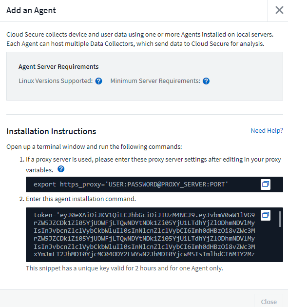

= Workload Security Agent Installation
:toc: macro
:hardbreaks:
:toclevels: 1
:nofooter:
:icons: font
:linkattrs:
:imagesdir: ./media/

[.lead]
Workload Security (formerly Cloud Secure) collects user activity data using one or more agents. Agents connect to devices on your tenant and collect data that is sent to the Workload Security SaaS layer for analysis. See link:concept_cs_agent_requirements.html[Agent Requirements] to configure an agent VM.

== Before You Begin

* The sudo privilege is required for installation, running scripts, and uninstall. 
* While installing the agent, a local user _cssys_ and a local group _cssys_ are created on the machine. If permission settings do not allow creation of a local user, and instead require Active Directory, a user with the username _cssys_ must be created in the Active Directory server.
* You can read about Data Infrastructure Insights security link:security_overview.html[here].

== Steps to Install Agent 

. Log in as Administrator or Account Owner to your Workload Security environment. 
. Select *Collectors > Agents > +Agent*
+ 
The system displays the Add an Agent page:
+
image::Add-agent-1.png[Adding a workload security agent]

. Verify that the agent server meets the minimum system requirements. 

. To verify that the agent server is running a supported version of Linux, click _Versions Supported (i)_.

. If your network is using proxy server, please set the proxy server details by following the instructions in the Proxy section.
+

. Click the Copy to Clipboard icon to copy the installation command. 
. Run the installation command in a terminal window.  

. The system displays the following message when the installation completes successfully:
+ 
image::new-agent-detect.png[Message for successful agent installation]

//cd /var NEW
//Grep /var/

.After You Finish

//. Verify that the agent is installed using the following command:
//`sudo grep -irn register agent.log`

. You need to configure a link:task_config_user_dir_connect.html[User Directory Collector ].
. You need to configure one or more Data Collectors.  

////
== Files Created During Installation

* Installation directory: 
+
/opt/netapp/cloudsecure/agent

* Installation logs: 
+
/var/log/netapp/cloudsecure/install
/opt/netapp/cloud-secure/logs 

* Agent Logs:         

* You can use the following command to verify the agent installed correctly: 
`sudo grep -irn register /opt/netapp/cloudsecure/agent/logs/agent.log`

//* Use the following script to control the Workload Security service:
//`sudo cloud-secure-agent-service.sh --help`

* Use the following script to uninstall the agent:
`sudo cloudsecure-agent-uninstall.sh`
////

== Network Configuration

Run the following commands on the local system to open ports that will be used by Workload Security. If there is a security concern regarding the port range, you can use a lesser port range, for example _35000:35100_. Each SVM uses two ports. 

.Steps

. `sudo firewall-cmd --permanent --zone=public --add-port=35000-55000/tcp` 
. `sudo firewall-cmd --reload` 

Follow the next steps according to your platform:

*CentOS 7.x / RHEL 7.x*:

. `sudo iptables-save | grep 35000` 

Sample output:

 -A IN_public_allow -p tcp -m tcp --dport 35000:55000 -m conntrack -ctstate NEW,UNTRACKED -j ACCEPT

*CentOS 8.x / RHEL 8.x*:

. `sudo firewall-cmd --zone=public --list-ports | grep 35000` (for CentOS 8)

Sample output:

 35000-55000/tcp

== "Pinning" an Agent at the current version

By default, Data Infrastructure Insights Workload Security updates agents automatically. Some customers may wish to pause automatic updating, which leaves an Agent at its current version until one of the following occurs:

* The customer resumes automatic Agent updates. 
* 30 days have passed. Note that the 30 days starts on the day of the most recent Agent update, not at the day the Agent is paused.

In each of these cases, the agent will be updated at the next Workload Security refresh.

To pause or resume automatic agent updates, use the _cloudsecure_config.agents_ APIs:

image:ws_pin_agent_apis.png[cloudsecure agent APIs to pin and unpin agents]

Note that it may take up to five minutes for the pause or resume action to take effect.

You can view your current Agent versions on the *Workload Security > Collectors* page, in the *Agents* tab.

image:ws_agent_version.png[WS Agent versions shown in the agents table]

== Troubleshooting Agent Errors

Known problems and their resolutions are described in the following table. 

[cols=2*, options="header", cols"30,70"]

|===
|Problem: | Resolution:

|Agent installation fails to create the /opt/netapp/cloudsecure/agent/logs/agent.log folder and the install.log file provides no relevant information.|This error occurs during bootstrapping of the agent. The error is not logged in log files because it occurs before logger is initialized. 
The error is redirected to standard output, and is visible in the service log using the `journalctl -u cloudsecure-agent.service` command. This command can be used for troubleshooting the issue further.
est
|Agent installation fails with ‘This linux distribution is not supported. Exiting the installation’.|This error appears when you attempt to install the Agent on an unsupported system. See link:concept_cs_agent_requirements.html[Agent Requirements].

|Agent Installation failed with the error: 
"-bash: unzip: command not found"
|Install unzip and then run the installation command again. If Yum is installed on the machine, try “yum install unzip” to install unzip software. 
After that, re-copy the command from the Agent installation UI and paste it in the CLI to execute the installation again.

|Agent was installed and was running. However agent has stopped suddenly.
|SSH to the Agent machine. Check the status of the agent service via `sudo systemctl status cloudsecure-agent.service`. 
1. Check if the logs shows a message“Failed to start Workload Security daemon service” . 
2. Check if cssys user exists in the Agent machine or not. Execute the following commands one by one with root permission and check if the cssys user and group exists. 
`sudo id cssys`
`sudo groups cssys`
3. If none exists, then a centralized monitoring policy may have deleted the cssys user.
4. Create cssys user and group manually by executing the following commands.
`sudo useradd cssys`
`sudo groupadd cssys`
5. Restart the agent service after that by executing the following command:
`sudo systemctl restart cloudsecure-agent.service`
6. If it is still not running, please check the other troubleshooting options.

|Unable to add more than 50 Data collectors to an Agent.
|Only 50 Data collectors can be added to an Agent. This can be a combination of all the collector types, for example, Active Directory, SVM and other collectors.

|UI shows Agent is in NOT_CONNECTED state.
|Steps to restart the Agent.
1. SSH to the Agent machine.
2. Restart the agent service after that by executing the following command:
`sudo systemctl restart cloudsecure-agent.service`
3. Check the status of the agent service via `sudo systemctl status cloudsecure-agent.service`.
4. Agent should go to CONNECTED state.

|Agent VM is behind Zscaler proxy and the agent installation is failing. Because of Zscaler proxy’s SSL inspection, the Workload Security certificates are presented as it is signed by Zscaler CA so the agent is not trusting the communication.
|Disable SSL inspection in the Zscaler proxy for the *.cloudinsights.netapp.com url. If Zscaler does SSL inspection and replaces the certificates, Workload Security will not work.

|While installing the agent, the installation hangs after unzipping.
|“chmod 755 -Rf” command is failing. 
The command fails when the agent installation command is being run by a non-root sudo user that has files in the working directory, belonging to another user, and permissions of those files cannot be changed. Because of the failing chmod command, the rest of the installation does not execute.

1.	Create a new directory named “cloudsecure”.
2.	Go to that directory.
3.	Copy and paste the full “token=…… … ./cloudsecure-agent-install.sh" installation command and press enter.
4.	Installation should be able to proceed.

|If the Agent is still not able to connect to Saas, please open a case with NetApp Support. Provide the Data Infrastructure Insights serial number to open a case, and attach logs to the case as noted.
|To attach logs to the case:
 1.	Execute the following script with root permission and share the output file (cloudsecure-agent-symptoms.zip).
    a.	/opt/netapp/cloudsecure/agent/bin/cloudsecure-agent-symptom-collector.sh
 2.	Execute the following commands one by one with root permission and share the output.
    a.	id cssys
    b.	groups cssys
    c.	cat /etc/os-release
    
|The cloudsecure-agent-symptom-collector.sh script fails with the following error.

[root@machine tmp]# /opt/netapp/cloudsecure/agent/bin/cloudsecure-agent-symptom-collector.sh
Collecting service log
Collecting application logs
Collecting agent configurations
Taking service status snapshot
Taking agent directory structure snapshot
………………….
………………….
/opt/netapp/cloudsecure/agent/bin/cloudsecure-agent-symptom-collector.sh: line 52: zip: command not found
ERROR: Failed to create /tmp/cloudsecure-agent-symptoms.zip

|Zip tool is not installed..
Install the zip tool by running the command “yum install zip”.
Then run the cloudsecure-agent-symptom-collector.sh again. 

    
|Agent installation Fails with useradd: cannot create directory /home/cssys
|This error can occur if user's login directory cannot be created under /home, due to lack of permissions.

The workaround would be to create cssys user and add its login directory manually using the following command:

_sudo useradd user_name -m -d HOME_DIR_

-m :Create the user's home directory if it does not exist.
-d : The new user is created using HOME_DIR as the value for the user's login directory.

For instance, _sudo useradd cssys -m -d /cssys_, adds a user _cssys_ and creates its login directory under root.

|Agent is not running after installation. 
_Systemctl status cloudsecure-agent.service_ shows the following:

[root@demo ~]# systemctl status cloudsecure-agent.service 
agent.service – Workload Security Agent Daemon Service 
Loaded: loaded (/usr/lib/systemd/system/cloudsecure-agent.service; enabled; vendor preset: disabled) 
Active: activating (auto-restart) (Result: exit-code) since Tue 2021-08-03 21:12:26 PDT; 2s ago 
Process: 25889 ExecStart=/bin/bash /opt/netapp/cloudsecure/agent/bin/cloudsecure-agent (code=exited status=126) 
Main PID: 25889 (code=exited, status=126), 

Aug 03 21:12:26 demo systemd[1]: cloudsecure-agent.service: main process exited, code=exited, status=126/n/a 
Aug 03 21:12:26 demo systemd[1]: Unit cloudsecure-agent.service entered failed state. 
Aug 03 21:12:26 demo systemd[1]: cloudsecure-agent.service failed. 

|This can be failing because _cssys_ user may not have permission to install.

If /opt/netapp is an NFS mount and if _cssys_ user does not have access to this folder, installation will fail. _cssys_ is a local user created by the Workload Security installer that may not have permission to access the mounted share. 

You can check this by attempting to access /opt/netapp/cloudsecure/agent/bin/cloudsecure-agent using _cssys_ user.
If it returns “Permission denied”, installation permission is not present.

Instead of a mounted folder, install on a directory local to the machine.

|Agent was initially connected via a proxy server and the proxy was set during Agent installation. Now the proxy server has changed. How can the Agent’s proxy configuration be changed?
|You can edit the agent.properties to add the proxy details. Follow these steps:

1.	Change to the folder containing the properties file:
 
cd /opt/netapp/cloudsecure/conf
 
2.	Using your favorite text editor, open the _agent.properties_ file for editing.
 
3.	Add or modify the following lines:
 
AGENT_PROXY_HOST=scspa1950329001.vm.netapp.com  
AGENT_PROXY_PORT=80
AGENT_PROXY_USER=pxuser
AGENT_PROXY_PASSWORD=pass1234
 
4.	Save the file.
 
5.	Restart the agent:
 
sudo systemctl restart cloudsecure-agent.service
 

|===

